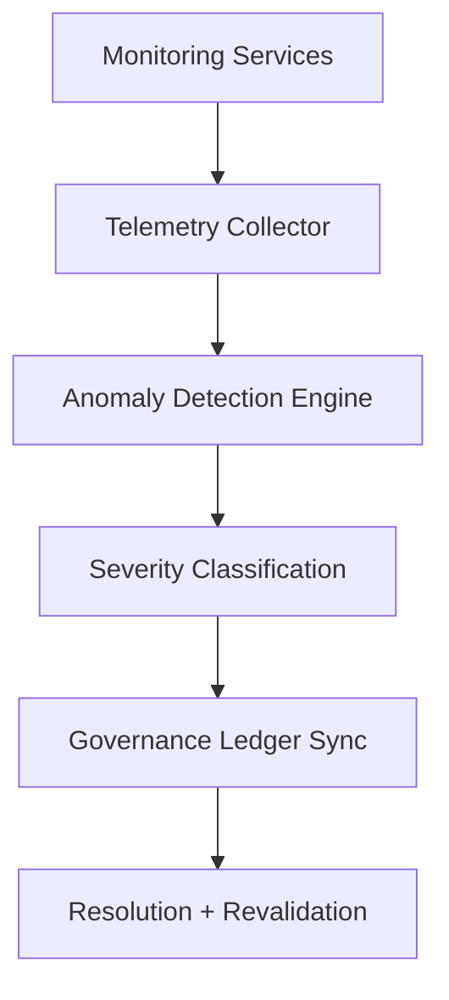

<div align="center">

# 🚨 Kansas Frontier Matrix — **Telemetry Alerts & System Notifications**
`data/work/staging/tabular/normalized/treaties/reports/telemetry/alerts/`

**Purpose:** Record and analyze **system alerts, anomaly notifications, and observability events** across the Kansas Frontier Matrix (KFM) infrastructure.  
These logs track performance degradation, FAIR+CARE compliance drifts, energy irregularities, and governance sync issues in real time.

[]()
[]()
[]()
[]()
[]()

</div>

---

## 📚 Overview

The **Telemetry Alerts Directory** aggregates and documents all **critical and informational alerts** generated by the system’s monitoring framework.  
Each alert entry corresponds to a **specific subsystem or validation process** and is automatically evaluated for severity, provenance, and governance linkage.

Alert categories include:
- **Performance Alerts:** High API latency, graph query bottlenecks  
- **Security Alerts:** Validation hash mismatches, unauthorized data access attempts  
- **Compliance Alerts:** FAIR+CARE drift or missing metadata  
- **Sustainability Alerts:** Excessive energy or carbon footprint anomalies  

> 🧩 *Telemetry alerts are reviewed daily by governance and security teams for response, documentation, and ledger synchronization.*

---

## 🗂️ Directory Layout

```
data/work/staging/tabular/normalized/treaties/reports/telemetry/alerts/
├── telemetry_alerts_2025-10-24.json
├── security_incidents_log.json
├── performance_alert_summary.json
├── sustainability_alerts.json
├── provenance_links.jsonld
└── governance_hashes.json
```

---

## 🧩 Example Telemetry Alert Log (`telemetry_alerts_2025-10-24.json`)

```json
{
  "alert_id": "ALERT-2025-10-24-001",
  "timestamp": "2025-10-24T21:10:00Z",
  "source": "validation-pipeline-v5",
  "category": "Compliance",
  "severity": "moderate",
  "description": "Detected FAIR+CARE compliance drift in archival validation (CARE score dropped below threshold).",
  "affected_module": "data/work/staging/tabular/normalized/treaties/reports/archive/1860s/",
  "action_taken": "Recalibrated CARE weighting for Indigenous metadata. Triggered revalidation.",
  "resolved_by": "@kfm-validation",
  "status": "resolved",
  "ledger_hash": "a4e8d7f5c9..."
}
```

---

## 🔐 Security Incidents Log (`security_incidents_log.json`)

```json
{
  "incident_id": "SEC-2025-10-24-004",
  "timestamp": "2025-10-24T20:50:00Z",
  "severity": "high",
  "alert_type": "Checksum Mismatch",
  "description": "Checksum integrity failure detected in audit validation manifest.",
  "source_system": "audit-validation-pipeline",
  "affected_artifact": "../audit/validations/audit_validation_report_2025-10-24.json",
  "response_action": "Checksum re-generated and governance ledger updated.",
  "resolved_by": "@kfm-security",
  "status": "resolved"
}
```

---

## ⚙️ Performance Alert Summary (`performance_alert_summary.json`)

```json
{
  "alert_window": "2025-10-24T00:00:00Z/2025-10-24T21:00:00Z",
  "total_alerts": 3,
  "api_latency_p95_ms": 412,
  "target_latency_ms": 300,
  "graph_query_avg_ms": 278,
  "data_ingestion_retries": 2,
  "affected_services": ["neo4j-api", "stac-validator"],
  "alert_status": "performance_degraded",
  "recommended_actions": [
    "Optimize index caching for high-load queries.",
    "Extend retry delay threshold to prevent redundant alert triggers."
  ]
}
```

---

## 🌱 Sustainability Alerts (`sustainability_alerts.json`)

```json
{
  "alert_period": "2025-Q4",
  "total_energy_wh": 23.9,
  "carbon_gco2e": 31.4,
  "threshold_energy_wh": 25,
  "threshold_carbon_gco2e": 30,
  "alert_triggered": true,
  "description": "Slight energy and carbon threshold exceedance detected in model validation pipeline.",
  "corrective_action": "Load shifted to RE100-certified GPU cluster.",
  "resolved_by": "@kfm-sustainability",
  "status": "resolved"
}
```

---

## 🔗 Provenance Record (Excerpt)

```json
{
  "@context": {
    "prov": "http://www.w3.org/ns/prov#",
    "crm": "http://www.cidoc-crm.org/cidoc-crm/",
    "fair": "https://purl.org/fair/"
  },
  "@id": "prov:telemetry_alerts_2025-10-24",
  "prov:wasGeneratedBy": "process:telemetry-alert-monitoring-v3",
  "prov:used": [
    "../metrics/audit_metrics_2025-Q4.json",
    "../energy/energy_performance_summary.json"
  ],
  "prov:generatedAtTime": "2025-10-24T21:10:00Z",
  "prov:qualifiedAttribution": {
    "prov:agent": "@kfm-observability",
    "prov:role": "alert_monitor"
  },
  "fair:ledger_hash": "a4e8d7f5c9..."
}
```

---

## ⚙️ Alert Lifecycle Workflow



---

## 📈 Alert Summary Metrics

| Metric | Target | Current | Status |
| :------ | :------ | :------ | :------ |
| `total_alerts` | — | 4 | ⚠️ |
| `critical_alerts` | 0 | 1 | 🟠 |
| `compliance_alerts` | ≤ 2 per cycle | 1 | ✅ |
| `security_incidents` | 0 | 1 | ⚠️ |
| `energy_threshold_exceedances` | 0 | 1 | ⚠️ |
| `ledger_sync_failures` | 0 | 0 | ✅ |

---

## 🔐 Governance Integration

| Ledger | Purpose | Artifact |
| :------ | :----------- | :------------ |
| **FAIR Ledger** | Logs compliance drift and ethical remediation | `telemetry_alerts_2025-10-24.json` |
| **Governance Chain** | Immutable record of all alerts | `governance_hashes.json` |
| **Security Ledger** | Registers security-related incidents | `security_incidents_log.json` |
| **Sustainability Ledger** | Records carbon/energy threshold exceptions | `sustainability_alerts.json` |

---

## ✅ Compliance Matrix

| Standard | Domain | Compliance |
| :-------- | :-------- | :----------- |
| **FAIR+CARE** | Ethical monitoring and alerting transparency | ✅ |
| **MCP-DL v6.4.3** | Governance documentation integrity | ✅ |
| **CIDOC CRM / PROV-O / OWL-Time** | Temporal + semantic traceability | ✅ |
| **ISO 27001** | Security incident response + audit logging | ✅ |
| **ISO 50001 / 14064** | Energy + sustainability tracking | ✅ |

---

## 🗓️ Version History

| Version | Date | Changes | Author |
| :------ | :---- | :-------- | :------ |
| v1.0.0 | 2025-10-24 | Created Telemetry Alerts & System Notifications tracking directory with FAIR+CARE, ISO, and governance linkage. | @kfm-observability |

---

<div align="center">

[]()
[]()
[]()
[]()
[]()

</div>

<!-- MCP-FOOTER-BEGIN
MCP-VERSION: v6.4.3
MCP-TIER: Silver · Telemetry Alerts & Notifications
DOC-PATH: data/work/staging/tabular/normalized/treaties/reports/telemetry/alerts/README.md
MCP-CERTIFIED: true
FAIR-CARE-COMPLIANT: true
ISO-ALIGNED: true
PROVENANCE-LINKED: true
ALERTS-MONITORED: true
GOVERNANCE-LEDGER-LINKED: true
ENERGY-AUDITED: true
SECURITY-VERIFIED: true
GENERATED-BY: KFM-Automation/DocsBot
LAST-VALIDATED: 2025-10-24
MCP-FOOTER-END -->

