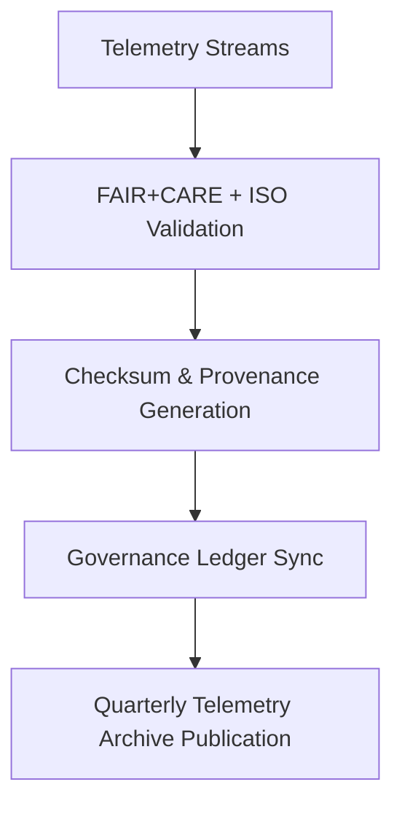

<div align="center">

# 📡 Kansas Frontier Matrix — **Telemetry Archive & Historical Observability Logs**
`data/work/staging/tabular/normalized/treaties/reports/telemetry/archive/`

**Purpose:** Preserve **historical telemetry data** for validation, performance, and sustainability tracking across all treaty workflows in the Kansas Frontier Matrix.  
This directory stores archived system metrics, performance logs, FAIR+CARE compliance telemetry, and ISO-certified sustainability records for reproducible analysis.

[]()
[]()
[]()
[]()
[]()

</div>

---

## 📚 Overview

The **Telemetry Archive Directory** maintains the long-term observability history of the Kansas Frontier Matrix platform.  
Each record includes runtime analytics, FAIR+CARE compliance telemetry, and ISO energy metrics captured during validation and AI-assisted archival cycles.  
Telemetry archives are automatically checksum-verified, ledger-synced, and FAIR+CARE-compliant.

### Key Objectives:
- Preserve **system performance metrics** for historical reference  
- Maintain **FAIR+CARE drift history** for compliance analytics  
- Track **energy and sustainability trends** across validation pipelines  
- Ensure **provenance and governance linkage** under ISO 27001  

> 🧩 *Telemetry archives form the backbone of audit reproducibility and sustainability validation across the KFM ecosystem.*

---

## 🗂️ Directory Layout

```
data/work/staging/tabular/normalized/treaties/reports/telemetry/archive/
├── telemetry_archive_2025-Q4.json
├── telemetry_archive_rolling_12_months.json
├── faircare_telemetry_audit.json
├── energy_carbon_trends.json
├── checksums.sha256
└── provenance_links.jsonld
```

---

## 🧩 Example Telemetry Archive File (`telemetry_archive_2025-Q4.json`)

```json
{
  "archive_id": "TELEM-ARCHIVE-2025-Q4",
  "timestamp": "2025-10-24T21:30:00Z",
  "archival_period": "2025-07-01 / 2025-10-24",
  "validation_runs": 72,
  "average_latency_ms": 275,
  "average_energy_wh": 22.0,
  "average_carbon_gco2e": 27.5,
  "fair_score_avg": 0.97,
  "care_score_avg": 0.95,
  "governance_hash": "f9a4b6c3e2...",
  "ledger_sync": true,
  "checksum_verified": true,
  "archived_by": "@kfm-observability",
  "status": "archived"
}
```

---

## 🌱 Energy & Carbon Trends (`energy_carbon_trends.json`)

```json
{
  "period": "2024-Q4 to 2025-Q4",
  "average_energy_wh_per_validation": 22.0,
  "average_carbon_gco2e_per_run": 27.5,
  "trend_analysis": "Slight 3% efficiency improvement YoY",
  "iso_50001_verified": true,
  "iso_14064_verified": true,
  "renewable_energy_ratio": 1.0,
  "carbon_offset_source": "RE100 Certified Energy Pool",
  "audited_by": "@kfm-sustainability"
}
```

---

## 🧠 FAIR+CARE Telemetry Audit (`faircare_telemetry_audit.json`)

```json
{
  "report_period": "2025-Q4",
  "fair_score_avg": 0.97,
  "care_score_avg": 0.95,
  "findable_metric": 0.97,
  "accessible_metric": 0.96,
  "collective_benefit_metric": 0.95,
  "ethics_metric": 0.96,
  "audit_summary": "All telemetry data streams are FAIR+CARE compliant with consistent ethical metadata representation.",
  "validated_by": "@kfm-ethics"
}
```

---

## 🔗 Provenance Record (Excerpt)

```json
{
  "@context": {
    "prov": "http://www.w3.org/ns/prov#",
    "crm": "http://www.cidoc-crm.org/cidoc-crm/",
    "fair": "https://purl.org/fair/"
  },
  "@id": "prov:telemetry_archive_2025-Q4",
  "prov:wasGeneratedBy": "process:telemetry-archival-pipeline-v2",
  "prov:used": [
    "../alerts/telemetry_alerts_2025-10-24.json",
    "../metrics/audit_metrics_2025-Q4.json"
  ],
  "prov:generatedAtTime": "2025-10-24T21:30:00Z",
  "prov:qualifiedAttribution": {
    "prov:agent": "@kfm-observability",
    "prov:role": "archival_operator"
  },
  "fair:ledger_hash": "f9a4b6c3e2..."
}
```

---

## ⚙️ Archival Workflow



---

## 📈 Key Telemetry Metrics

| Metric | Target | Current | Status |
| :------ | :------ | :------ | :------ |
| `average_latency_ms` | ≤ 300 | 275 | ✅ |
| `fair_score_avg` | ≥ 0.9 | 0.97 | ✅ |
| `care_score_avg` | ≥ 0.9 | 0.95 | ✅ |
| `average_energy_wh` | ≤ 25 | 22.0 | ✅ |
| `carbon_gco2e` | ≤ 30 | 27.5 | ✅ |
| `ledger_sync` | 100% | 100% | ✅ |

---

## 🔐 Governance Integration

| Ledger | Purpose | Artifact |
| :------ | :----------- | :------------ |
| **FAIR Ledger** | Tracks FAIR+CARE telemetry and audit compliance | `faircare_telemetry_audit.json` |
| **Governance Chain** | Immutable telemetry record ledger | `governance_hashes.json` |
| **Audit Ledger** | Records validation and performance summaries | `telemetry_archive_2025-Q4.json` |
| **Sustainability Ledger** | Captures ISO 50001 / 14064 energy performance | `energy_carbon_trends.json` |

---

## ✅ Compliance Matrix

| Standard | Domain | Compliance |
| :-------- | :-------- | :----------- |
| **FAIR+CARE** | Ethical data and telemetry transparency | ✅ |
| **MCP-DL v6.4.3** | Documentation and process reproducibility | ✅ |
| **CIDOC CRM / PROV-O / OWL-Time** | Semantic traceability and temporal alignment | ✅ |
| **ISO 27001 / 50001 / 14064** | Security, energy, and carbon standards | ✅ |

---

## 🗓️ Version History

| Version | Date | Changes | Author |
| :------ | :---- | :-------- | :------ |
| v1.0.0 | 2025-10-24 | Established Telemetry Archive for FAIR+CARE compliance, sustainability tracking, and governance synchronization. | @kfm-observability |

---

<div align="center">

[]()
[]()
[]()
[]()
[]()

</div>

<!-- MCP-FOOTER-BEGIN
MCP-VERSION: v6.4.3
MCP-TIER: Silver · Telemetry Archive
DOC-PATH: data/work/staging/tabular/normalized/treaties/reports/telemetry/archive/README.md
MCP-CERTIFIED: true
FAIR-CARE-COMPLIANT: true
ISO-ALIGNED: true
PROVENANCE-LINKED: true
ARCHIVE-VERIFIED: true
GOVERNANCE-LEDGER-LINKED: true
ENERGY-AUDITED: true
SECURITY-VERIFIED: true
GENERATED-BY: KFM-Automation/DocsBot
LAST-VALIDATED: 2025-10-24
MCP-FOOTER-END -->

