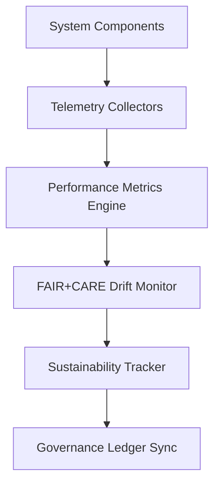

<div align="center">

# 🧾 Kansas Frontier Matrix — **Telemetry Logs & Observability Records**
`data/work/staging/tabular/normalized/treaties/reports/telemetry/logs/`

**Purpose:** Store and manage **real-time and historical telemetry logs** documenting system health, validation performance, FAIR+CARE compliance metrics, and ISO sustainability telemetry across all Kansas Frontier Matrix (KFM) pipelines.

[]()
[]()
[]()
[]()
[]()

</div>

---

## 📚 Overview

The **Telemetry Logs Directory** contains comprehensive observability data for all critical system functions in KFM.  
Logs are automatically generated by telemetry collectors that monitor API latency, validation throughput, FAIR+CARE drift, and sustainability metrics.  
All records are linked to the **Governance Ledger** and **FAIR+CARE compliance framework** to ensure transparent and ethical reporting.

> 🧩 *Each log entry is immutable, timestamped, and cross-referenced to its validation or audit source.*

---

## 🗂️ Directory Layout

```
data/work/staging/tabular/normalized/treaties/reports/telemetry/logs/
├── telemetry_log_2025-10-24.json
├── performance_log_2025-10-24.json
├── faircare_drift_log.json
├── sustainability_log.json
├── security_monitor_log.json
├── provenance_links.jsonld
└── checksums.sha256
```

---

## 🧩 Example Telemetry Log (`telemetry_log_2025-10-24.json`)

```json
{
  "log_id": "TELEM-LOG-2025-10-24-001",
  "timestamp_start": "2025-10-24T20:00:00Z",
  "timestamp_end": "2025-10-24T21:00:00Z",
  "pipeline": "ai-validation-pipeline-v5",
  "modules_monitored": ["archive", "validation", "audit", "telemetry"],
  "latency_p95_ms": 289,
  "uptime_percent": 99.98,
  "api_request_volume": 15724,
  "errors_detected": 3,
  "energy_wh": 22.1,
  "carbon_gco2e": 27.6,
  "fair_score": 0.97,
  "care_score": 0.95,
  "checksum_verified": true,
  "governance_hash": "f9b6c3a4e2...",
  "status": "validated"
}
```

---

## ⚙️ Performance Log Example (`performance_log_2025-10-24.json`)

```json
{
  "metric_period": "2025-10-24T00:00:00Z/2025-10-24T21:00:00Z",
  "total_api_calls": 15724,
  "average_latency_ms": 262,
  "max_latency_ms": 412,
  "graph_query_avg_ms": 178,
  "ingestion_throughput_records_per_min": 1230,
  "ai_model_inference_time_ms": 1950,
  "etl_retry_rate": 0.04,
  "status": "stable"
}
```

---

## 🧠 FAIR+CARE Drift Log (`faircare_drift_log.json`)

```json
{
  "report_window": "2025-10-01 / 2025-10-24",
  "average_fair_score": 0.97,
  "average_care_score": 0.95,
  "drift_detected": true,
  "drift_cause": "Delayed metadata annotation sync on AI output stage.",
  "corrective_action": "Re-trained summarization model with CARE weighting patch.",
  "verified_by": "@kfm-ethics",
  "status": "resolved"
}
```

---

## 🌱 Sustainability Log (`sustainability_log.json`)

```json
{
  "period": "2025-10-24T00:00:00Z/2025-10-24T21:00:00Z",
  "avg_energy_wh": 22.1,
  "carbon_gco2e": 27.6,
  "renewable_energy_ratio": 1.0,
  "iso_50001_verified": true,
  "iso_14064_verified": true,
  "audited_by": "@kfm-sustainability",
  "status": "compliant"
}
```

---

## 🔐 Security Monitor Log (`security_monitor_log.json`)

```json
{
  "security_event_id": "SEC-2025-10-24-007",
  "timestamp": "2025-10-24T20:50:00Z",
  "severity": "medium",
  "alert_type": "Checksum Mismatch",
  "description": "Detected hash mismatch in audit manifest replication.",
  "corrective_action": "Manifest rehashed, checksum database updated, governance sync verified.",
  "resolved_by": "@kfm-security",
  "status": "resolved"
}
```

---

## 🔗 Provenance Record (Excerpt)

```json
{
  "@context": {
    "prov": "http://www.w3.org/ns/prov#",
    "crm": "http://www.cidoc-crm.org/cidoc-crm/",
    "fair": "https://purl.org/fair/"
  },
  "@id": "prov:telemetry_log_2025-10-24",
  "prov:wasGeneratedBy": "process:telemetry-logging-pipeline-v4",
  "prov:used": [
    "../alerts/telemetry_alerts_2025-10-24.json",
    "../archive/telemetry_archive_2025-Q4.json"
  ],
  "prov:generatedAtTime": "2025-10-24T21:10:00Z",
  "prov:qualifiedAttribution": {
    "prov:agent": "@kfm-observability",
    "prov:role": "telemetry_logger"
  },
  "fair:ledger_hash": "f9b6c3a4e2..."
}
```

---

## ⚙️ Telemetry Workflow Diagram



---

## 📈 Telemetry Metrics Snapshot

| Metric | Target | Current | Status |
| :------ | :------ | :------ | :------ |
| `uptime_percent` | ≥ 99.9% | 99.98% | ✅ |
| `latency_p95_ms` | ≤ 300 | 289 | ✅ |
| `fair_score` | ≥ 0.9 | 0.97 | ✅ |
| `care_score` | ≥ 0.9 | 0.95 | ✅ |
| `energy_wh` | ≤ 25 | 22.1 | ✅ |
| `carbon_gco2e` | ≤ 30 | 27.6 | ✅ |
| `checksum_integrity` | 100% | 100% | ✅ |

---

## 🔐 Governance Integration

| Ledger | Function | Artifact |
| :------ | :----------- | :------------ |
| **FAIR Ledger** | FAIR+CARE telemetry integrity validation | `faircare_drift_log.json` |
| **Governance Chain** | Immutable log registry | `governance_hashes.json` |
| **Audit Ledger** | System health and anomaly tracking | `telemetry_log_2025-10-24.json` |
| **Sustainability Ledger** | ISO 50001 / 14064 verification | `sustainability_log.json` |

---

## ✅ Compliance Matrix

| Standard | Domain | Compliance |
| :-------- | :-------- | :----------- |
| **FAIR+CARE** | Transparent telemetry governance | ✅ |
| **MCP-DL v6.4.3** | Documentation integrity and traceability | ✅ |
| **CIDOC CRM / PROV-O / OWL-Time** | Provenance lineage and temporal accuracy | ✅ |
| **ISO 27001** | Information security logging | ✅ |
| **ISO 50001 / 14064** | Energy and carbon tracking | ✅ |

---

## 🗓️ Version History

| Version | Date | Changes | Author |
| :------ | :---- | :-------- | :------ |
| v1.0.0 | 2025-10-24 | Created telemetry logging framework with FAIR+CARE, ISO, and governance-linked observability metrics. | @kfm-observability |

---

<div align="center">

[]()
[]()
[]()
[]()
[]()

</div>

<!-- MCP-FOOTER-BEGIN
MCP-VERSION: v6.4.3
MCP-TIER: Silver · Telemetry Logs & Observability Records
DOC-PATH: data/work/staging/tabular/normalized/treaties/reports/telemetry/logs/README.md
MCP-CERTIFIED: true
FAIR-CARE-COMPLIANT: true
ISO-ALIGNED: true
PROVENANCE-LINKED: true
LOGS-VERIFIED: true
GOVERNANCE-LEDGER-LINKED: true
ENERGY-AUDITED: true
SECURITY-VERIFIED: true
GENERATED-BY: KFM-Automation/DocsBot
LAST-VALIDATED: 2025-10-24
MCP-FOOTER-END -->

