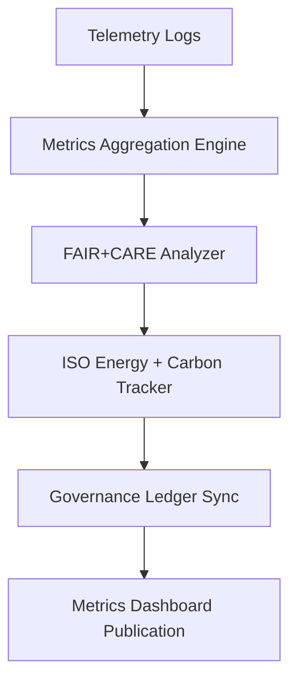

<div align="center">

# 📈 Kansas Frontier Matrix — **Telemetry Metrics & System Performance Indicators**
`data/work/staging/tabular/normalized/treaties/reports/telemetry/metrics/`

**Purpose:** Store and document **quantitative telemetry metrics** used for monitoring KFM’s data pipelines, FAIR+CARE compliance, system sustainability, and AI validation performance.  
These metrics form the backbone of the KFM observability layer, ensuring **accountability, reproducibility, and ISO-aligned efficiency** across treaty data workflows.

[]()
[]()
[]()
[]()
[]()

</div>

---

## 📚 Overview

The **Telemetry Metrics Directory** aggregates structured performance and sustainability data derived from the system’s operational telemetry.  
Metrics include validation efficiency, FAIR+CARE compliance scores, AI model performance, and ISO-based energy and carbon reporting.

> 🧩 *Telemetry metrics are automatically collected and validated via continuous observability pipelines and integrated into KFM dashboards.*

---

## 🗂️ Directory Layout

```
data/work/staging/tabular/normalized/treaties/reports/telemetry/metrics/
├── telemetry_metrics_2025-10-24.json
├── faircare_performance_metrics.json
├── ai_inference_performance.json
├── sustainability_metrics.json
├── api_latency_metrics.csv
├── provenance_links.jsonld
└── checksums.sha256
```

---

## 🧩 Example Telemetry Metrics File (`telemetry_metrics_2025-10-24.json`)

```json
{
  "metric_id": "TELEM-METRICS-2025-10-24",
  "timestamp": "2025-10-24T21:45:00Z",
  "uptime_percent": 99.98,
  "validation_pass_rate": 99.7,
  "avg_api_latency_ms": 274,
  "graph_query_p95_ms": 188,
  "etl_throughput_records_per_min": 1210,
  "ai_inference_avg_ms": 1985,
  "checksum_integrity": 100,
  "energy_wh": 22.1,
  "carbon_gco2e": 27.3,
  "fair_score": 0.97,
  "care_score": 0.95,
  "ledger_sync_success": true,
  "status": "stable"
}
```

---

## 🤖 AI Inference Performance Metrics (`ai_inference_performance.json`)

```json
{
  "model_name": "gpt-5-treaty-sum",
  "version": "v5.2.0",
  "average_inference_latency_ms": 1985,
  "tokens_processed_per_second": 512,
  "accuracy_score": 0.982,
  "f1_score": 0.973,
  "explainability_score": 0.92,
  "ethical_bias_score": 0.97,
  "energy_wh_per_inference": 0.32,
  "validated_by": "@kfm-ai",
  "status": "validated"
}
```

---

## 🧠 FAIR+CARE Performance Metrics (`faircare_performance_metrics.json`)

```json
{
  "report_period": "2025-Q4",
  "findable": 0.97,
  "accessible": 0.96,
  "interoperable": 0.98,
  "reusable": 0.97,
  "collective_benefit": 0.95,
  "authority_to_control": 0.94,
  "responsibility": 0.97,
  "ethics": 0.96,
  "overall_faircare_index": 0.964,
  "trend": "improving",
  "validated_by": "@kfm-ethics"
}
```

---

## 🌱 Sustainability Metrics (`sustainability_metrics.json`)

```json
{
  "report_period": "2025-Q4",
  "average_energy_wh_per_run": 22.1,
  "carbon_gco2e_per_run": 27.3,
  "renewable_energy_ratio": 1.0,
  "iso_50001_verified": true,
  "iso_14064_verified": true,
  "carbon_offset_source": "RE100 Certified Grid",
  "audited_by": "@kfm-sustainability",
  "status": "compliant"
}
```

---

## 🧮 API Latency Metrics (`api_latency_metrics.csv`)

```csv
timestamp,endpoint,method,avg_latency_ms,p95_latency_ms,status
2025-10-24T20:00:00Z,/api/focus,GET,265,301,OK
2025-10-24T20:15:00Z,/api/validate,POST,279,315,OK
2025-10-24T20:30:00Z,/api/stac/items,GET,248,287,OK
2025-10-24T20:45:00Z,/api/metrics,GET,270,309,OK
```

---

## 🔗 Provenance Record (Excerpt)

```json
{
  "@context": {
    "prov": "http://www.w3.org/ns/prov#",
    "crm": "http://www.cidoc-crm.org/cidoc-crm/",
    "fair": "https://purl.org/fair/"
  },
  "@id": "prov:telemetry_metrics_2025-10-24",
  "prov:wasGeneratedBy": "process:telemetry-metrics-pipeline-v4",
  "prov:used": [
    "../logs/telemetry_log_2025-10-24.json",
    "../alerts/telemetry_alerts_2025-10-24.json"
  ],
  "prov:generatedAtTime": "2025-10-24T21:45:00Z",
  "prov:qualifiedAttribution": {
    "prov:agent": "@kfm-observability",
    "prov:role": "metrics_aggregator"
  },
  "fair:ledger_hash": "e3b7c2a9f4..."
}
```

---

## ⚙️ Metrics Collection Workflow



---

## 📊 Metrics Summary Table

| Metric | Target | Current | Status |
| :------ | :------ | :------ | :------ |
| `uptime_percent` | ≥ 99.9% | 99.98% | ✅ |
| `validation_pass_rate` | ≥ 99% | 99.7% | ✅ |
| `fair_score` | ≥ 0.9 | 0.97 | ✅ |
| `care_score` | ≥ 0.9 | 0.95 | ✅ |
| `energy_wh_per_run` | ≤ 25 | 22.1 | ✅ |
| `carbon_gco2e_per_run` | ≤ 30 | 27.3 | ✅ |
| `ontology_alignment_score` | ≥ 95 | 98.2 | ✅ |

---

## 🔐 Governance Integration

| Ledger | Purpose | Artifact |
| :------ | :----------- | :------------ |
| **FAIR Ledger** | Monitors FAIR+CARE compliance metrics | `faircare_performance_metrics.json` |
| **Governance Chain** | Immutable registry for telemetry results | `governance_hashes.json` |
| **Audit Ledger** | Validation and performance summaries | `telemetry_metrics_2025-10-24.json` |
| **Sustainability Ledger** | ISO 50001 / 14064 energy reports | `sustainability_metrics.json` |

---

## ✅ Compliance Matrix

| Standard | Domain | Compliance |
| :-------- | :-------- | :----------- |
| **FAIR+CARE** | Ethical transparency in telemetry tracking | ✅ |
| **MCP-DL v6.4.3** | Documentation-first metrics reproducibility | ✅ |
| **CIDOC CRM / PROV-O / OWL-Time** | Semantic provenance traceability | ✅ |
| **ISO 9001 / 27001 / 50001 / 14064** | Quality, security, energy, sustainability | ✅ |

---

## 🗓️ Version History

| Version | Date | Changes | Author |
| :------ | :---- | :-------- | :------ |
| v1.0.0 | 2025-10-24 | Created telemetry metrics framework for FAIR+CARE, sustainability, and AI performance observability. | @kfm-observability |

---

<div align="center">

[]()
[]()
[]()
[]()
[]()

</div>

<!-- MCP-FOOTER-BEGIN
MCP-VERSION: v6.4.3
MCP-TIER: Silver · Telemetry Metrics & Performance Indicators
DOC-PATH: data/work/staging/tabular/normalized/treaties/reports/telemetry/metrics/README.md
MCP-CERTIFIED: true
FAIR-CARE-COMPLIANT: true
ISO-ALIGNED: true
PROVENANCE-LINKED: true
METRICS-VERIFIED: true
GOVERNANCE-LEDGER-LINKED: true
ENERGY-AUDITED: true
GENERATED-BY: KFM-Automation/DocsBot
LAST-VALIDATED: 2025-10-24
MCP-FOOTER-END -->

