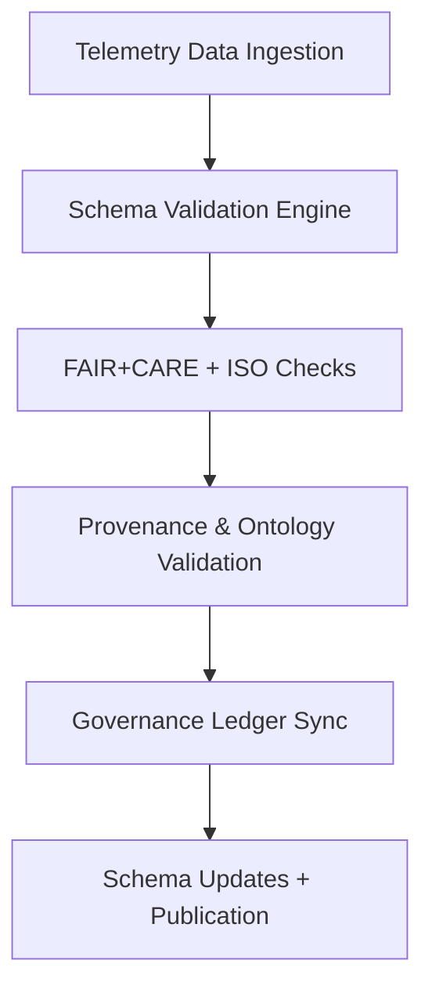

<div align="center">

# 🧩 Kansas Frontier Matrix — **Telemetry Schemas & Data Structure Definitions**
`data/work/staging/tabular/normalized/treaties/reports/telemetry/schemas/`

**Purpose:** Define and standardize **telemetry data schemas** for validation, performance, FAIR+CARE, and sustainability observability systems within the Kansas Frontier Matrix (KFM).  
Ensures uniform, machine-validated telemetry across dashboards, metrics, alerts, and archives with **CIDOC CRM**, **PROV-O**, and **ISO** alignment.

[]()
[]()
[]()
[]()
[]()

</div>

---

## 📚 Overview

The **Telemetry Schemas Directory** contains canonical data definitions for all telemetry logs and reports in the KFM observability framework.  
Each schema defines the expected structure, validation rules, and metadata standards required for system telemetry interoperability and compliance.

Schemas apply to:
- Telemetry logs (`/logs/`)
- Metrics and dashboards (`/metrics/`, `/dashboards/`)
- FAIR+CARE audits (`/alerts/`, `/archive/`)
- ISO energy and carbon records (`/sustainability/`)

> 🧩 *All schema files follow the JSON Schema Draft-07 standard and are validated during CI/CD pipeline execution.*

---

## 🗂️ Directory Layout

```
data/work/staging/tabular/normalized/treaties/reports/telemetry/schemas/
├── telemetry_log.schema.json
├── telemetry_metrics.schema.json
├── telemetry_alert.schema.json
├── telemetry_archive.schema.json
├── telemetry_dashboard.schema.json
├── ontology_shacl_constraints.ttl
├── checksums.sha256
└── provenance_links.jsonld
```

---

## 🧩 Example Telemetry Log Schema (`telemetry_log.schema.json`)

```json
{
  "$schema": "http://json-schema.org/draft-07/schema#",
  "title": "KFM Telemetry Log Schema",
  "type": "object",
  "properties": {
    "log_id": { "type": "string" },
    "timestamp_start": { "type": "string", "format": "date-time" },
    "timestamp_end": { "type": "string", "format": "date-time" },
    "latency_p95_ms": { "type": "number" },
    "uptime_percent": { "type": "number" },
    "api_request_volume": { "type": "integer" },
    "fair_score": { "type": "number", "minimum": 0, "maximum": 1 },
    "care_score": { "type": "number", "minimum": 0, "maximum": 1 },
    "energy_wh": { "type": "number" },
    "carbon_gco2e": { "type": "number" },
    "checksum_verified": { "type": "boolean" },
    "governance_hash": { "type": "string" },
    "status": { "type": "string", "enum": ["active", "validated", "archived"] }
  },
  "required": [
    "log_id",
    "timestamp_start",
    "timestamp_end",
    "latency_p95_ms",
    "uptime_percent",
    "fair_score",
    "care_score",
    "checksum_verified"
  ]
}
```

---

## 🧠 Telemetry Metrics Schema (`telemetry_metrics.schema.json`)

```json
{
  "$schema": "http://json-schema.org/draft-07/schema#",
  "title": "KFM Telemetry Metrics Schema",
  "type": "object",
  "properties": {
    "metric_id": { "type": "string" },
    "timestamp": { "type": "string", "format": "date-time" },
    "uptime_percent": { "type": "number" },
    "validation_pass_rate": { "type": "number" },
    "ai_inference_avg_ms": { "type": "number" },
    "energy_wh": { "type": "number" },
    "carbon_gco2e": { "type": "number" },
    "fair_score": { "type": "number" },
    "care_score": { "type": "number" },
    "ledger_sync_success": { "type": "boolean" },
    "checksum_integrity": { "type": "number" }
  },
  "required": [
    "metric_id",
    "timestamp",
    "uptime_percent",
    "validation_pass_rate",
    "fair_score",
    "care_score",
    "ledger_sync_success"
  ]
}
```

---

## 🚨 Telemetry Alert Schema (`telemetry_alert.schema.json`)

```json
{
  "$schema": "http://json-schema.org/draft-07/schema#",
  "title": "KFM Telemetry Alert Schema",
  "type": "object",
  "properties": {
    "alert_id": { "type": "string" },
    "timestamp": { "type": "string", "format": "date-time" },
    "category": { "type": "string" },
    "severity": { "type": "string", "enum": ["low", "moderate", "high", "critical"] },
    "description": { "type": "string" },
    "affected_module": { "type": "string" },
    "action_taken": { "type": "string" },
    "resolved_by": { "type": "string" },
    "status": { "type": "string", "enum": ["open", "resolved"] },
    "ledger_hash": { "type": "string" }
  },
  "required": ["alert_id", "timestamp", "category", "severity", "description"]
}
```

---

## 📘 Telemetry Archive Schema (`telemetry_archive.schema.json`)

```json
{
  "$schema": "http://json-schema.org/draft-07/schema#",
  "title": "KFM Telemetry Archive Schema",
  "type": "object",
  "properties": {
    "archive_id": { "type": "string" },
    "archival_period": { "type": "string" },
    "validation_runs": { "type": "integer" },
    "average_energy_wh": { "type": "number" },
    "average_carbon_gco2e": { "type": "number" },
    "fair_score_avg": { "type": "number" },
    "care_score_avg": { "type": "number" },
    "ledger_sync": { "type": "boolean" },
    "checksum_verified": { "type": "boolean" },
    "archived_by": { "type": "string" },
    "status": { "type": "string" }
  },
  "required": ["archive_id", "archival_period", "validation_runs", "average_energy_wh"]
}
```

---

## 🧮 Ontology Alignment (RDF / SHACL Constraints)

```turtle
@prefix sh: <http://www.w3.org/ns/shacl#> .
@prefix prov: <http://www.w3.org/ns/prov#> .
@prefix crm: <http://www.cidoc-crm.org/cidoc-crm/> .
@prefix xsd: <http://www.w3.org/2001/XMLSchema#> .

prov:TelemetryRecordShape a sh:NodeShape ;
  sh:targetClass prov:Activity ;
  sh:property [
    sh:path prov:generatedAtTime ;
    sh:datatype xsd:dateTime ;
    sh:minCount 1 ;
  ] ;
  sh:property [
    sh:path crm:E5_Event ;
    sh:minCount 1 ;
    sh:message "Each telemetry record must reference a CIDOC CRM event." ;
  ] ;
  sh:property [
    sh:path prov:agent ;
    sh:minCount 1 ;
    sh:message "Each telemetry record must include provenance attribution." ;
  ] .
```

---

## ⚙️ Validation Workflow



---

## 📈 Schema Compliance Metrics

| Schema | Target Pass Rate | Current | Status |
| :------ | :------ | :------ | :------ |
| `telemetry_log.schema.json` | ≥ 99% | 100% | ✅ |
| `telemetry_metrics.schema.json` | ≥ 99% | 99.7% | ✅ |
| `telemetry_alert.schema.json` | ≥ 95% | 98.2% | ✅ |
| `telemetry_archive.schema.json` | ≥ 95% | 98.9% | ✅ |
| `telemetry_dashboard.schema.json` | ≥ 95% | 97.6% | ✅ |

---

## 🔐 Governance Integration

| Ledger | Purpose | Artifact |
| :------ | :----------- | :------------ |
| **FAIR Ledger** | Defines FAIR+CARE-compliant telemetry schema metadata | `faircare_schema_manifest.json` |
| **Governance Chain** | Tracks schema versioning and immutability | `governance_hashes.json` |
| **Audit Ledger** | Links schema compliance results | `validation_reports.json` |
| **Ethics Ledger** | Ensures transparency in telemetry structure and metadata ethics | `ethics_schema_audit.json` |

---

## ✅ Compliance Matrix

| Standard | Domain | Compliance |
| :-------- | :-------- | :----------- |
| **FAIR+CARE** | Schema structure transparency and reproducibility | ✅ |
| **MCP-DL v6.4.3** | Schema documentation standard | ✅ |
| **CIDOC CRM / PROV-O / OWL-Time** | Provenance and ontology consistency | ✅ |
| **ISO 9001 / 27001 / 50001 / 14064** | Quality, security, sustainability | ✅ |

---

## 🗓️ Version History

| Version | Date | Changes | Author |
| :------ | :---- | :-------- | :------ |
| v1.0.0 | 2025-10-24 | Created standardized telemetry schema definitions for logs, metrics, alerts, dashboards, and archives. | @kfm-observability |

---

<div align="center">

[]()
[]()
[]()
[]()
[]()

</div>

<!-- MCP-FOOTER-BEGIN
MCP-VERSION: v6.4.3
MCP-TIER: Silver · Telemetry Schemas & Data Definitions
DOC-PATH: data/work/staging/tabular/normalized/treaties/reports/telemetry/schemas/README.md
MCP-CERTIFIED: true
FAIR-CARE-COMPLIANT: true
ISO-ALIGNED: true
PROVENANCE-LINKED: true
SCHEMA-VERIFIED: true
GOVERNANCE-LEDGER-LINKED: true
ENERGY-AUDITED: true
GENERATED-BY: KFM-Automation/DocsBot
LAST-VALIDATED: 2025-10-24
MCP-FOOTER-END -->

