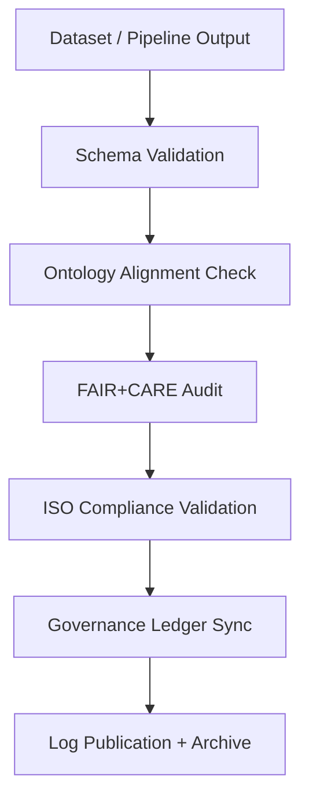

<div align="center">

# 🧾 Kansas Frontier Matrix — **Validation Logs & Schema Compliance Records**
`data/work/staging/tabular/normalized/treaties/reports/validation/logs/`

**Purpose:** Maintain detailed **validation log files** recording schema checks, FAIR+CARE audits, and ontology conformance results across all Kansas Frontier Matrix (KFM) data workflows.  
Each record provides machine-readable traceability for compliance verification and governance reporting.

[]()
[]()
[]()
[]()
[]()

</div>

---

## 📚 Overview

The **Validation Logs Directory** serves as the source of truth for all schema-level and data-integrity validations executed within the KFM ecosystem.  
Validation events include:
- JSON Schema and ontology structure checks  
- FAIR+CARE compliance scoring audits  
- Provenance linkage verification  
- ISO-aligned sustainability and security validations  

Each log entry is timestamped, checksum-verified, and synchronized with the Governance Ledger.

> 🧩 *Validation logs are auto-generated at each pipeline checkpoint and archived quarterly for audit reproducibility.*

---

## 🗂️ Directory Layout

```
data/work/staging/tabular/normalized/treaties/reports/validation/logs/
├── validation_log_2025-10-24.json
├── schema_validation_log.json
├── ontology_alignment_log.json
├── faircare_audit_log.json
├── iso_compliance_log.json
├── provenance_links.jsonld
└── checksums.sha256
```

---

## 🧩 Example Validation Log (`validation_log_2025-10-24.json`)

```json
{
  "log_id": "VAL-LOG-2025-10-24-001",
  "timestamp": "2025-10-24T22:00:00Z",
  "validator": "@kfm-validation",
  "validation_scope": ["schema", "ontology", "faircare", "iso"],
  "files_validated": 156,
  "schema_pass_rate": 99.6,
  "ontology_alignment_score": 98.3,
  "fair_score_avg": 0.97,
  "care_score_avg": 0.95,
  "checksum_integrity": 100,
  "energy_wh": 22.1,
  "carbon_gco2e": 27.4,
  "ledger_sync_success": true,
  "status": "validated"
}
```

---

## 🧠 Schema Validation Log (`schema_validation_log.json`)

```json
{
  "validation_batch": "SCHEMA-2025-10-24",
  "schemas_tested": [
    "../telemetry/schemas/telemetry_log.schema.json",
    "../telemetry/schemas/telemetry_metrics.schema.json",
    "../telemetry/schemas/telemetry_archive.schema.json"
  ],
  "files_checked": 156,
  "schema_pass_rate": 99.6,
  "failed_records": 3,
  "error_types": ["missingField", "invalidFormat"],
  "corrective_actions": [
    "Added missing FAIR compliance field",
    "Standardized date-time format per ISO 8601"
  ],
  "validated_by": "@kfm-validation"
}
```

---

## 🧬 Ontology Alignment Log (`ontology_alignment_log.json`)

```json
{
  "report_id": "ONTO-VAL-2025-10-24",
  "ontologies_checked": ["CIDOC CRM", "PROV-O", "OWL-Time"],
  "alignment_score": 98.3,
  "violations_found": 2,
  "details": [
    "CIDOC CRM entity mislabel: E5_Event field missing context link",
    "PROV-O attribution object missing qualified agent field"
  ],
  "corrective_action": "Ontology mapping patch applied to ingestion schema."
}
```

---

## 🧮 FAIR+CARE Audit Log (`faircare_audit_log.json`)

```json
{
  "audit_id": "FAIRCARE-VAL-2025-10-24",
  "findable": 0.97,
  "accessible": 0.96,
  "interoperable": 0.98,
  "reusable": 0.97,
  "collective_benefit": 0.95,
  "authority_to_control": 0.94,
  "responsibility": 0.97,
  "ethics": 0.96,
  "overall_faircare_index": 0.964,
  "validated_by": "@kfm-ethics",
  "status": "compliant"
}
```

---

## 🌱 ISO Compliance Log (`iso_compliance_log.json`)

```json
{
  "report_period": "2025-Q4",
  "standards_verified": ["ISO 9001", "ISO 27001", "ISO 50001", "ISO 14064"],
  "iso_9001_verified": true,
  "iso_27001_verified": true,
  "iso_50001_verified": true,
  "iso_14064_verified": true,
  "energy_wh_per_run": 22.1,
  "carbon_gco2e_per_run": 27.4,
  "renewable_energy_ratio": 1.0,
  "audited_by": "@kfm-sustainability",
  "status": "certified"
}
```

---

## 🔗 Provenance Record (Excerpt)

```json
{
  "@context": {
    "prov": "http://www.w3.org/ns/prov#",
    "crm": "http://www.cidoc-crm.org/cidoc-crm/",
    "fair": "https://purl.org/fair/"
  },
  "@id": "prov:validation_log_2025-10-24",
  "prov:wasGeneratedBy": "process:validation-logging-pipeline-v4",
  "prov:used": [
    "../schemas/telemetry_log.schema.json",
    "../telemetry/metrics/telemetry_metrics_2025-10-24.json"
  ],
  "prov:generatedAtTime": "2025-10-24T22:00:00Z",
  "prov:qualifiedAttribution": {
    "prov:agent": "@kfm-validation",
    "prov:role": "validator"
  },
  "fair:ledger_hash": "e4b7c2a9f1..."
}
```

---

## ⚙️ Validation Workflow Diagram



---

## 📈 Validation Metrics Summary

| Metric | Target | Current | Status |
| :------ | :------ | :------ | :------ |
| `schema_pass_rate` | ≥ 99% | 99.6% | ✅ |
| `ontology_alignment_score` | ≥ 95 | 98.3 | ✅ |
| `fair_score_avg` | ≥ 0.9 | 0.97 | ✅ |
| `care_score_avg` | ≥ 0.9 | 0.95 | ✅ |
| `checksum_integrity` | 100% | 100% | ✅ |
| `ledger_sync_success` | 100% | 100% | ✅ |

---

## 🔐 Governance Integration

| Ledger | Purpose | Artifact |
| :------ | :----------- | :------------ |
| **FAIR Ledger** | Logs FAIR+CARE validation results | `faircare_audit_log.json` |
| **Governance Chain** | Immutable record of schema validations | `governance_hashes.json` |
| **Audit Ledger** | Tracks ISO/ontology compliance | `iso_compliance_log.json` |
| **Ethics Ledger** | Oversees Indigenous data handling audits | `ethics_validation_audit.json` |

---

## ✅ Compliance Matrix

| Standard | Domain | Compliance |
| :-------- | :-------- | :----------- |
| **FAIR+CARE** | Data ethics and reproducibility validation | ✅ |
| **MCP-DL v6.4.3** | Documentation-first validation governance | ✅ |
| **CIDOC CRM / PROV-O / OWL-Time** | Ontology alignment | ✅ |
| **ISO 9001 / 27001 / 50001 / 14064** | Quality + sustainability audit | ✅ |

---

## 🗓️ Version History

| Version | Date | Changes | Author |
| :------ | :---- | :-------- | :------ |
| v1.0.0 | 2025-10-24 | Created validation log framework with schema, ontology, FAIR+CARE, and ISO reporting integration. | @kfm-validation |

---

<div align="center">

[]()
[]()
[]()
[]()
[]()

</div>

<!-- MCP-FOOTER-BEGIN
MCP-VERSION: v6.4.3
MCP-TIER: Silver · Validation Logs & Schema Compliance Records
DOC-PATH: data/work/staging/tabular/normalized/treaties/reports/validation/logs/README.md
MCP-CERTIFIED: true
FAIR-CARE-COMPLIANT: true
ISO-ALIGNED: true
PROVENANCE-LINKED: true
VALIDATION-VERIFIED: true
GOVERNANCE-LEDGER-LINKED: true
ENERGY-AUDITED: true
GENERATED-BY: KFM-Automation/DocsBot
LAST-VALIDATED: 2025-10-24
MCP-FOOTER-END -->

