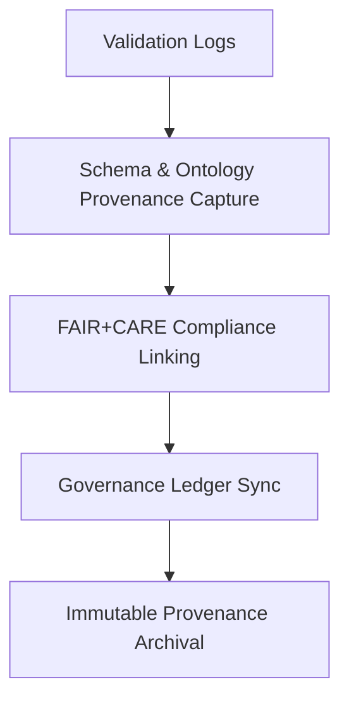

<div align="center">

# 🔗 Kansas Frontier Matrix — **Validation Provenance Records**
`data/work/staging/tabular/normalized/treaties/reports/validation/provenance/`

**Purpose:** Provide machine-readable **provenance metadata** for validation processes, establishing semantic lineage, audit traceability, and FAIR+CARE-aligned accountability across all Kansas Frontier Matrix (KFM) validation operations.

[]()
[]()
[]()
[]()
[]()

</div>

---

## 📚 Overview

The **Validation Provenance Directory** documents how validation results, schema audits, FAIR+CARE assessments, and sustainability checks were generated, who performed them, and when.  
Each provenance record conforms to **PROV-O** and **CIDOC CRM** ontologies and is validated under **MCP-DL v6.4.3** and **ISO** governance standards.

Provenance records ensure:
- Complete **traceability** from input to output artifacts  
- Verification of **data integrity** and **audit lineage**  
- FAIR+CARE compliance reporting with ethical oversight  
- ISO 27001-aligned accountability for data handling  

> 🧩 *All provenance JSON-LD files are checksum-verified, ledger-linked, and archived quarterly.*

---

## 🗂️ Directory Layout

```
data/work/staging/tabular/normalized/treaties/reports/validation/provenance/
├── validation_provenance_2025-10-24.jsonld
├── validation_provenance_manifest.json
├── ontology_alignment_provenance.jsonld
├── checksums.sha256
└── governance_hashes.json
```

---

## 🧩 Example Validation Provenance Record (`validation_provenance_2025-10-24.jsonld`)

```json
{
  "@context": {
    "prov": "http://www.w3.org/ns/prov#",
    "crm": "http://www.cidoc-crm.org/cidoc-crm/",
    "fair": "https://purl.org/fair/",
    "time": "http://www.w3.org/2006/time#"
  },
  "@id": "prov:validation_provenance_2025-10-24",
  "prov:wasGeneratedBy": "process:validation-automation-pipeline-v4",
  "prov:used": [
    "../logs/validation_log_2025-10-24.json",
    "../logs/schema_validation_log.json",
    "../logs/ontology_alignment_log.json"
  ],
  "prov:generatedAtTime": "2025-10-24T22:05:00Z",
  "prov:qualifiedAttribution": {
    "prov:agent": "@kfm-validation",
    "prov:role": "validator"
  },
  "crm:E5_Event": "Automated validation and schema conformance check for archival datasets",
  "crm:E53_Place": "Kansas Frontier Matrix Validation Cluster",
  "time:hasBeginning": "2025-10-24T21:00:00Z",
  "time:hasEnd": "2025-10-24T22:05:00Z",
  "fair:fair_score": 0.97,
  "fair:care_score": 0.95,
  "fair:ledger_hash": "b4f7c2e1a9..."
}
```

---

## 🧬 Ontology Alignment Provenance Example (`ontology_alignment_provenance.jsonld`)

```json
{
  "@context": {
    "prov": "http://www.w3.org/ns/prov#",
    "crm": "http://www.cidoc-crm.org/cidoc-crm/"
  },
  "@id": "prov:ontology_alignment_validation_2025-10-24",
  "prov:wasGeneratedBy": "process:ontology-mapping-validation-v2",
  "prov:used": [
    "../logs/ontology_alignment_log.json",
    "../../telemetry/schemas/ontology_shacl_constraints.ttl"
  ],
  "prov:generatedAtTime": "2025-10-24T22:06:00Z",
  "prov:qualifiedAttribution": {
    "prov:agent": "@kfm-data",
    "prov:role": "ontology_validator"
  },
  "crm:E5_Event": "CIDOC CRM and PROV-O Ontology Validation",
  "crm:E21_Person": "@kfm-ontology",
  "crm:E53_Place": "KFM Knowledge Graph Workspace",
  "crm:E52_Time-Span": "2025-10-24T21:30:00Z/2025-10-24T22:06:00Z"
}
```

---

## ⚙️ Provenance Workflow



---

## 📈 Provenance Metrics Summary

| Metric | Target | Current | Status |
| :------ | :------ | :------ | :------ |
| `provenance_files_generated` | ≥ 1 per validation cycle | 3 | ✅ |
| `ontology_alignment_score` | ≥ 95 | 98.3 | ✅ |
| `fair_score` | ≥ 0.9 | 0.97 | ✅ |
| `care_score` | ≥ 0.9 | 0.95 | ✅ |
| `checksum_integrity` | 100% | 100% | ✅ |
| `ledger_sync` | 100% | 100% | ✅ |

---

## 🔐 Governance Integration

| Ledger | Purpose | Artifact |
| :------ | :----------- | :------------ |
| **FAIR Ledger** | FAIR+CARE validation provenance | `validation_provenance_2025-10-24.jsonld` |
| **Governance Chain** | Immutable provenance records | `governance_hashes.json` |
| **Audit Ledger** | Records validation lineage | `validation_provenance_manifest.json` |
| **Ethics Ledger** | Oversees ethical data provenance and validation context | `ethics_validation_audit.json` |

---

## ✅ Compliance Matrix

| Standard | Domain | Compliance |
| :-------- | :-------- | :----------- |
| **FAIR+CARE** | Provenance ethics & traceability | ✅ |
| **MCP-DL v6.4.3** | Documentation & validation governance | ✅ |
| **CIDOC CRM / PROV-O / OWL-Time** | Semantic lineage verification | ✅ |
| **ISO 9001 / 27001 / 50001 / 14064** | Quality, information security, sustainability | ✅ |

---

## 🗓️ Version History

| Version | Date | Changes | Author |
| :------ | :---- | :-------- | :------ |
| v1.0.0 | 2025-10-24 | Created validation provenance directory with ontology, FAIR+CARE, and governance-linked lineage tracking. | @kfm-validation |

---

<div align="center">

[]()
[]()
[]()
[]()
[]()

</div>

<!-- MCP-FOOTER-BEGIN
MCP-VERSION: v6.4.3
MCP-TIER: Silver · Validation Provenance Records
DOC-PATH: data/work/staging/tabular/normalized/treaties/reports/validation/provenance/README.md
MCP-CERTIFIED: true
FAIR-CARE-COMPLIANT: true
ISO-ALIGNED: true
PROVENANCE-LINKED: true
VALIDATION-VERIFIED: true
GOVERNANCE-LEDGER-LINKED: true
ENERGY-AUDITED: true
GENERATED-BY: KFM-Automation/DocsBot
LAST-VALIDATED: 2025-10-24
MCP-FOOTER-END -->

