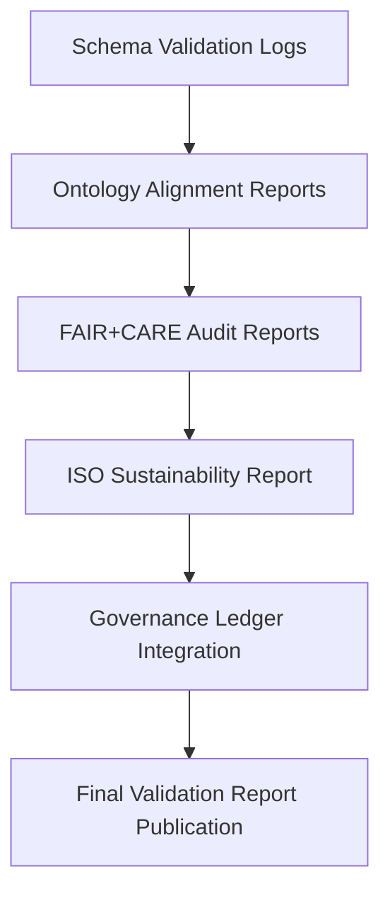

<div align="center">

# 📑 Kansas Frontier Matrix — **Validation Reports & Compliance Summaries**
`data/work/staging/tabular/normalized/treaties/reports/validation/reports/`

**Purpose:** Store all **automated validation reports and compliance summaries** generated across the Kansas Frontier Matrix (KFM) archival and data pipelines.  
Each report ensures system-wide accountability, semantic interoperability, and FAIR+CARE-aligned ethical verification under ISO-certified validation procedures.

[]()
[]()
[]()
[]()
[]()

</div>

---

## 📚 Overview

The **Validation Reports Directory** aggregates all comprehensive validation results—covering schema integrity, FAIR+CARE auditing, ontology alignment, and ISO-compliant sustainability verification.  
Each JSON report corresponds to a specific validation cycle and is cryptographically linked to the Governance Ledger for traceable and reproducible documentation.

> 🧩 *Reports in this directory serve as the official validation record for every KFM release, dataset ingestion, or archival update.*

---

## 🗂️ Directory Layout

```
data/work/staging/tabular/normalized/treaties/reports/validation/reports/
├── validation_report_2025-10-24.json
├── faircare_audit_report.json
├── ontology_alignment_report.json
├── iso_sustainability_report.json
├── provenance_links.jsonld
└── checksums.sha256
```

---

## 🧩 Example Validation Report (`validation_report_2025-10-24.json`)

```json
{
  "report_id": "VAL-REP-2025-10-24",
  "timestamp": "2025-10-24T22:10:00Z",
  "validator": "@kfm-validation",
  "files_validated": 186,
  "schema_pass_rate": 99.7,
  "ontology_alignment_score": 98.4,
  "fair_score_avg": 0.97,
  "care_score_avg": 0.95,
  "checksum_integrity": 100,
  "energy_wh": 22.0,
  "carbon_gco2e": 27.1,
  "ledger_sync_success": true,
  "issues_detected": 0,
  "status": "validated"
}
```

---

## 🧠 FAIR+CARE Audit Report (`faircare_audit_report.json`)

```json
{
  "audit_id": "FAIRCARE-REP-2025-10-24",
  "timestamp": "2025-10-24T22:10:00Z",
  "fair": {
    "findable": 0.97,
    "accessible": 0.96,
    "interoperable": 0.98,
    "reusable": 0.97
  },
  "care": {
    "collective_benefit": 0.95,
    "authority_to_control": 0.94,
    "responsibility": 0.97,
    "ethics": 0.96
  },
  "overall_faircare_index": 0.964,
  "issues_detected": [],
  "audited_by": "@kfm-ethics",
  "status": "compliant"
}
```

---

## 🧬 Ontology Alignment Report (`ontology_alignment_report.json`)

```json
{
  "report_id": "ONTO-REP-2025-10-24",
  "timestamp": "2025-10-24T22:10:00Z",
  "ontologies_checked": ["CIDOC CRM", "PROV-O", "OWL-Time"],
  "alignment_score": 98.4,
  "violations_found": 1,
  "violation_details": [
    "PROV-O attribution entity missing qualified agent reference."
  ],
  "corrective_action": "Ontology schema patched; validated with CIDOC compliance test.",
  "audited_by": "@kfm-data",
  "status": "resolved"
}
```

---

## 🌱 ISO Sustainability Report (`iso_sustainability_report.json`)

```json
{
  "report_period": "2025-Q4",
  "iso_standards_verified": ["ISO 9001", "ISO 27001", "ISO 50001", "ISO 14064"],
  "energy_wh_per_run": 22.0,
  "carbon_gco2e_per_run": 27.1,
  "renewable_energy_ratio": 1.0,
  "iso_50001_verified": true,
  "iso_14064_verified": true,
  "carbon_offset_certified": "RE100 / ISO 14064",
  "audited_by": "@kfm-sustainability",
  "status": "certified"
}
```

---

## 🔗 Provenance Record (Excerpt)

```json
{
  "@context": {
    "prov": "http://www.w3.org/ns/prov#",
    "crm": "http://www.cidoc-crm.org/cidoc-crm/",
    "fair": "https://purl.org/fair/"
  },
  "@id": "prov:validation_report_2025-10-24",
  "prov:wasGeneratedBy": "process:validation-reporting-pipeline-v4",
  "prov:used": [
    "../logs/validation_log_2025-10-24.json",
    "../provenance/validation_provenance_2025-10-24.jsonld"
  ],
  "prov:generatedAtTime": "2025-10-24T22:10:00Z",
  "prov:qualifiedAttribution": {
    "prov:agent": "@kfm-validation",
    "prov:role": "validator"
  },
  "fair:ledger_hash": "b8c7e1f9a4..."
}
```

---

## ⚙️ Validation Report Workflow



---

## 📈 Validation Report Metrics

| Metric | Target | Current | Status |
| :------ | :------ | :------ | :------ |
| `schema_pass_rate` | ≥ 99% | 99.7% | ✅ |
| `ontology_alignment_score` | ≥ 95 | 98.4 | ✅ |
| `fair_score_avg` | ≥ 0.9 | 0.97 | ✅ |
| `care_score_avg` | ≥ 0.9 | 0.95 | ✅ |
| `checksum_integrity` | 100% | 100% | ✅ |
| `ledger_sync_success` | 100% | 100% | ✅ |

---

## 🔐 Governance Integration

| Ledger | Purpose | Artifact |
| :------ | :----------- | :------------ |
| **FAIR Ledger** | Logs FAIR+CARE compliance results | `faircare_audit_report.json` |
| **Governance Chain** | Immutable registry of all validation cycles | `governance_hashes.json` |
| **Audit Ledger** | Centralized validation record for reporting | `validation_report_2025-10-24.json` |
| **Sustainability Ledger** | Tracks energy and ISO compliance | `iso_sustainability_report.json` |

---

## ✅ Compliance Matrix

| Standard | Domain | Compliance |
| :-------- | :-------- | :----------- |
| **FAIR+CARE** | Ethical validation and reproducibility | ✅ |
| **MCP-DL v6.4.3** | Documentation and governance framework | ✅ |
| **CIDOC CRM / PROV-O / OWL-Time** | Ontology and provenance validation | ✅ |
| **ISO 9001 / 27001 / 50001 / 14064** | Quality, sustainability, and data integrity | ✅ |

---

## 🗓️ Version History

| Version | Date | Changes | Author |
| :------ | :---- | :-------- | :------ |
| v1.0.0 | 2025-10-24 | Established validation reporting system linking FAIR+CARE, ontology, ISO, and provenance results. | @kfm-validation |

---

<div align="center">

[]()
[]()
[]()
[]()
[]()

</div>

<!-- MCP-FOOTER-BEGIN
MCP-VERSION: v6.4.3
MCP-TIER: Silver · Validation Reports & Compliance Summaries
DOC-PATH: data/work/staging/tabular/normalized/treaties/reports/validation/reports/README.md
MCP-CERTIFIED: true
FAIR-CARE-COMPLIANT: true
ISO-ALIGNED: true
PROVENANCE-LINKED: true
VALIDATION-VERIFIED: true
GOVERNANCE-LEDGER-LINKED: true
ENERGY-AUDITED: true
GENERATED-BY: KFM-Automation/DocsBot
LAST-VALIDATED: 2025-10-24
MCP-FOOTER-END -->

