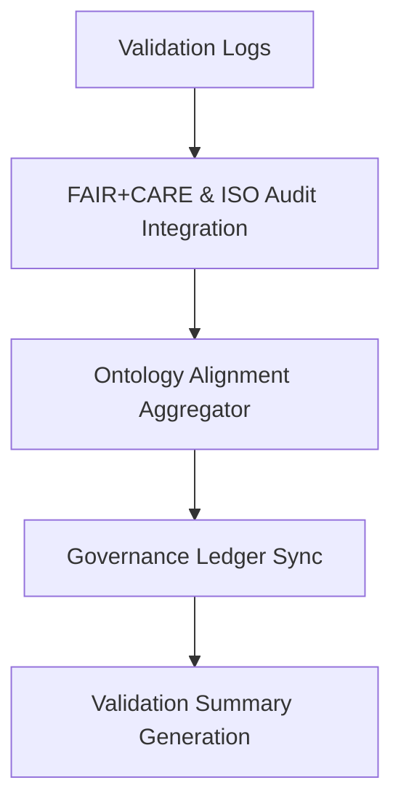

<div align="center">

# 🧾 Kansas Frontier Matrix — **Validation Summary & Performance Overview**
`data/work/staging/tabular/normalized/treaties/reports/validation/summary/`

**Purpose:** Provide **aggregated summaries** of all validation runs across the Kansas Frontier Matrix (KFM) pipelines.  
This includes schema compliance rates, FAIR+CARE ethics scoring, ontology alignment metrics, and ISO-certified sustainability validation data.  
These summaries serve as quarterly snapshots for governance review and audit reproducibility.

[]()
[]()
[]()
[]()
[]()

</div>

---

## 📚 Overview

The **Validation Summary Directory** provides a system-level overview of all validation activities across code, data, and documentation.  
It consolidates metrics from validation logs, FAIR+CARE audits, and ISO compliance results to produce a unified snapshot of project health.

Validation summaries are generated automatically and stored in both human-readable and machine-parseable formats for audit reproducibility.

> 🧩 *This dataset forms the basis for governance scorecards, FAIR+CARE reports, and ISO compliance dashboards.*

---

## 🗂️ Directory Layout

```
data/work/staging/tabular/normalized/treaties/reports/validation/summary/
├── validation_summary_2025-10-24.json
├── validation_summary_quarterly.json
├── faircare_validation_summary.json
├── iso_audit_summary.json
├── provenance_links.jsonld
└── checksums.sha256
```

---

## 🧩 Example Validation Summary File (`validation_summary_2025-10-24.json`)

```json
{
  "summary_id": "VAL-SUM-2025-10-24",
  "timestamp": "2025-10-24T22:15:00Z",
  "validation_runs": 52,
  "schema_pass_rate": 99.6,
  "ontology_alignment_avg": 98.4,
  "fair_score_avg": 0.97,
  "care_score_avg": 0.95,
  "checksum_integrity": 100,
  "ledger_sync_success": 100,
  "energy_wh_avg": 22.0,
  "carbon_gco2e_avg": 27.3,
  "status": "validated"
}
```

---

## 🧠 FAIR+CARE Validation Summary (`faircare_validation_summary.json`)

```json
{
  "report_period": "2025-Q4",
  "total_audits": 52,
  "average_fair_score": 0.97,
  "average_care_score": 0.95,
  "trend": "improving",
  "highest_fair_score": 0.981,
  "lowest_care_score": 0.942,
  "ethics_violations_detected": 0,
  "reviewed_by": "@kfm-ethics"
}
```

---

## 🌱 ISO Audit Summary (`iso_audit_summary.json`)

```json
{
  "report_period": "2025-Q4",
  "iso_standards_verified": [
    "ISO 9001",
    "ISO 27001",
    "ISO 50001",
    "ISO 14064"
  ],
  "avg_energy_wh": 22.0,
  "avg_carbon_gco2e": 27.3,
  "renewable_energy_ratio": 1.0,
  "iso_50001_verified": true,
  "iso_14064_verified": true,
  "carbon_offset_certified": "RE100 Certified",
  "audited_by": "@kfm-sustainability"
}
```

---

## 🔗 Provenance Record (Excerpt)

```json
{
  "@context": {
    "prov": "http://www.w3.org/ns/prov#",
    "crm": "http://www.cidoc-crm.org/cidoc-crm/",
    "fair": "https://purl.org/fair/"
  },
  "@id": "prov:validation_summary_2025-10-24",
  "prov:wasGeneratedBy": "process:validation-summary-aggregation-v3",
  "prov:used": [
    "../logs/validation_log_2025-10-24.json",
    "../reports/validation_report_2025-10-24.json"
  ],
  "prov:generatedAtTime": "2025-10-24T22:15:00Z",
  "prov:qualifiedAttribution": {
    "prov:agent": "@kfm-validation",
    "prov:role": "summary_generator"
  },
  "fair:ledger_hash": "d9b3f1a7c4..."
}
```

---

## ⚙️ Validation Summary Workflow



---

## 📊 Key Metrics Snapshot

| Metric | Target | Current | Status |
| :------ | :------ | :------ | :------ |
| `schema_pass_rate` | ≥ 99% | 99.6% | ✅ |
| `ontology_alignment_avg` | ≥ 95 | 98.4 | ✅ |
| `fair_score_avg` | ≥ 0.9 | 0.97 | ✅ |
| `care_score_avg` | ≥ 0.9 | 0.95 | ✅ |
| `checksum_integrity` | 100% | 100% | ✅ |
| `ledger_sync_success` | 100% | 100% | ✅ |
| `energy_wh_avg` | ≤ 25 | 22.0 | ✅ |
| `carbon_gco2e_avg` | ≤ 30 | 27.3 | ✅ |

---

## 🔐 Governance Integration

| Ledger | Purpose | Artifact |
| :------ | :----------- | :------------ |
| **FAIR Ledger** | FAIR+CARE compliance and ethics trend tracking | `faircare_validation_summary.json` |
| **Governance Chain** | Immutable record of validation cycles | `governance_hashes.json` |
| **Audit Ledger** | Consolidated ISO and FAIR reports | `validation_summary_2025-10-24.json` |
| **Ethics Ledger** | Monitors data handling transparency | `ethics_summary_audit.json` |

---

## ✅ Compliance Matrix

| Standard | Domain | Compliance |
| :-------- | :-------- | :----------- |
| **FAIR+CARE** | Ethical and transparent data validation reporting | ✅ |
| **MCP-DL v6.4.3** | Documentation and reproducibility compliance | ✅ |
| **CIDOC CRM / PROV-O / OWL-Time** | Semantic lineage and ontology linkage | ✅ |
| **ISO 9001 / 27001 / 50001 / 14064** | Quality, security, and sustainability validation | ✅ |

---

## 🗓️ Version History

| Version | Date | Changes | Author |
| :------ | :---- | :-------- | :------ |
| v1.0.0 | 2025-10-24 | Created validation summary framework integrating FAIR+CARE, ISO, and governance-linked performance metrics. | @kfm-validation |

---

<div align="center">

[]()
[]()
[]()
[]()
[]()

</div>

<!-- MCP-FOOTER-BEGIN
MCP-VERSION: v6.4.3
MCP-TIER: Silver · Validation Summary & Performance Overview
DOC-PATH: data/work/staging/tabular/normalized/treaties/reports/validation/summary/README.md
MCP-CERTIFIED: true
FAIR-CARE-COMPLIANT: true
ISO-ALIGNED: true
PROVENANCE-LINKED: true
SUMMARY-VALIDATED: true
GOVERNANCE-LEDGER-LINKED: true
ENERGY-AUDITED: true
GENERATED-BY: KFM-Automation/DocsBot
LAST-VALIDATED: 2025-10-24
MCP-FOOTER-END -->

