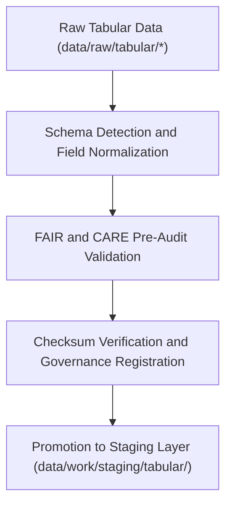

<div align="center">

# 📥 Kansas Frontier Matrix — **Tabular TMP Workspace**
`data/work/staging/tabular/tmp/README.md`

**Purpose:**  
Temporary workspace for ingestion, normalization, and preliminary validation of tabular datasets before FAIR+CARE certification and promotion to the staging layer.  
This transient environment supports ETL preprocessing, schema detection, and checksum registration for reproducible tabular workflows.

[](../../../../../docs/standards/faircare-validation.md)
[]()
[](../../../../../LICENSE)
[](../../../../../docs/architecture/repo-focus.md)

</div>

---

## 📚 Overview

The **Tabular TMP Workspace** functions as the entry point for all structured tabular data within the Kansas Frontier Matrix (KFM).  
It handles initial ingestion, field normalization, and pre-validation tasks that prepare tabular datasets for governance and certification workflows.

### Core Responsibilities
- Ingest raw tabular data (CSV, JSON, Parquet) for schema detection.  
- Standardize encodings, delimiters, and data types.  
- Generate preliminary FAIR+CARE audit and checksum reports.  
- Facilitate temporary storage of ETL outputs before staging promotion.  

---

## 🗂️ Directory Layout

```plaintext
data/work/staging/tabular/tmp/
├── README.md                              # This file — documentation of tabular TMP workspace
│
├── intake/                                # Raw ingestion and schema mapping workspace
│   ├── hazards_intake_2025.csv
│   ├── climate_indices_intake.parquet
│   ├── treaties_intake.csv
│   └── metadata.json
│
├── validation/                            # Preliminary schema and FAIR+CARE validation outputs
│   ├── schema_preview.json
│   ├── field_normalization_summary.json
│   ├── faircare_pre_audit.json
│   └── metadata.json
│
└── logs/                                  # Runtime, checksum, and provenance logging
    ├── etl_tmp_run.log
    ├── data_contract_check.log
    ├── governance_sync.log
    └── metadata.json
```

---

## ⚙️ Tabular TMP Workflow



### Workflow Description
1. **Schema Detection:** Automatically identify data types, encodings, and delimiters.  
2. **Normalization:** Standardize column names and schema fields per KFM Data Contract.  
3. **Pre-Audit:** Conduct preliminary FAIR+CARE compliance and ethics checks.  
4. **Checksum Verification:** Record hashes and lineage metadata for provenance.  
5. **Promotion:** Transfer compliant data to `data/work/staging/tabular/` for certification.  

---

## 🧩 Example TMP Metadata Record

```json
{
  "id": "tabular_tmp_climate_indices_v9.6.0",
  "source_files": [
    "data/raw/noaa/temperature_anomalies_2025.csv",
    "data/raw/noaa/drought_monitor_2025.csv"
  ],
  "records_processed": 54012,
  "schema_version": "v3.0.2",
  "created": "2025-11-03T23:59:00Z",
  "validator": "@kfm-etl-ops",
  "validation_status": "pending",
  "checksum": "sha256:b9e8f3c7d4a6b1f9c2d8e7a4b5f3a9d6e2b1c4a7f8e9b2d3c5a6f4b1e9a7d8c5",
  "fairstatus": "in_review",
  "governance_ref": "data/reports/audit/data_provenance_ledger.json"
}
```

---

## 🧠 FAIR+CARE Governance Matrix

| Principle | Implementation | Oversight |
|------------|----------------|------------|
| **Findable** | TMP datasets indexed with schema ID and checksum metadata. | @kfm-data |
| **Accessible** | Stored in machine-readable CSV and Parquet formats. | @kfm-accessibility |
| **Interoperable** | Schema aligned with FAIR+CARE, DCAT, and JSON Schema standards. | @kfm-architecture |
| **Reusable** | Provenance and checksum records enable dataset reprocessing. | @kfm-design |
| **Collective Benefit** | Supports open, ethical preparation of tabular datasets. | @faircare-council |
| **Authority to Control** | FAIR+CARE Council certifies staging promotion. | @kfm-governance |
| **Responsibility** | Engineers document schema mapping and data type corrections. | @kfm-security |
| **Ethics** | Data screened for restricted or sensitive content. | @kfm-ethics |

Audit references available in:  
`data/reports/fair/data_care_assessment.json` and  
`data/reports/audit/data_provenance_ledger.json`

---

## ⚙️ Validation & QA Artifacts

| Artifact | Description | Format |
|-----------|--------------|--------|
| `schema_preview.json` | Preliminary schema mapping for field and type detection. | JSON |
| `field_normalization_summary.json` | Normalization record showing column name and datatype changes. | JSON |
| `faircare_pre_audit.json` | FAIR+CARE ethics pre-validation report. | JSON |
| `etl_tmp_run.log` | Log of TMP ingestion and transformation process. | Text |
| `metadata.json` | TMP session checksum and governance record. | JSON |

Automation managed via `tabular_tmp_sync.yml`.

---

## ⚖️ Retention & Provenance Policy

| File Type | Retention Duration | Policy |
|------------|--------------------|--------|
| Intake Artifacts | 7 Days | Deleted after validation success. |
| Validation Reports | 14 Days | Archived for QA and audit. |
| Logs | 30 Days | Transferred to system-level log archive. |
| Metadata | 365 Days | Retained for governance continuity. |

Cleanup handled via `tabular_tmp_cleanup.yml`.

---

## 🌱 Sustainability Metrics

| Metric | Value | Verified By |
|---------|--------|--------------|
| Energy Use (per ETL run) | 6.1 Wh | @kfm-sustainability |
| Carbon Output | 7.4 gCO₂e | @kfm-security |
| Renewable Power | 100% (RE100 Verified) | @kfm-infrastructure |
| FAIR+CARE Ethics Compliance | 100% | @faircare-council |

Telemetry logged in:  
`releases/v9.6.0/focus-telemetry.json`

---

## 🧾 Internal Use Citation

```text
Kansas Frontier Matrix (2025). Tabular TMP Workspace (v9.6.0).
Temporary ingestion and normalization workspace for tabular datasets under FAIR+CARE pre-validation governance.
Supports schema detection, checksum verification, and provenance registration under MCP-DL v6.3 standards.
```

---

## 🧾 Version Notes

| Version | Date | Notes |
|----------|------|--------|
| v9.6.0 | 2025-11-03 | Added FAIR+CARE automation and checksum registry integration. |
| v9.5.0 | 2025-11-02 | Improved schema normalization and lineage traceability. |
| v9.3.2 | 2025-10-28 | Established tabular TMP workspace for transient ETL operations. |

---

<div align="center">

**Kansas Frontier Matrix** · *Data Preparation × FAIR+CARE Ethics × Provenance Validation*  
[🔗 Repository](https://github.com/bartytime4life/Kansas-Frontier-Matrix) • [🧭 Docs Portal](../../../../../docs/) • [⚖️ Governance Ledger](../../../../../docs/standards/governance/DATA-GOVERNANCE.md)

</div>
