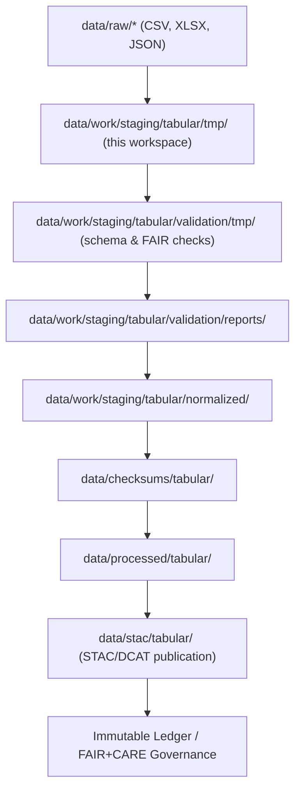

<div align="center">

# 🧪 Kansas Frontier Matrix — **Tabular TMP Workspace (Ephemeral ETL & QA Sandbox)**  
`data/work/staging/tabular/tmp/`

**Mission:** Provide a **safe, reproducible, and ephemeral** workspace for tabular ETL steps—  
cleaning, normalization prep, conflict detection, and pre-validation—before data advances to  
the normalized layer and governance ledger in the **Kansas Frontier Matrix (KFM)**.

[](../../../../.github/workflows/site.yml)
[]()
[]()
[]()
[]()
[]()

</div>

---

> **TMP Lifecycle**
> ```
> RAW → TMP → VALIDATION TMP → REPORTS → CHECKSUMS → PROCESSED → STAC/DCAT → LEDGER
> ```

---

## 🗺️ Workspace Flow (Mermaid)



---

## 🗂️ Directory Layout

```bash
data/work/staging/tabular/tmp/
├── intake/                   # Freshly landed raw tabular copies for transformation
│   └── .gitkeep
├── workbench/                # In-flight transformation outputs (cleaned, typed)
│   └── .gitkeep
├── normalization_buffer/     # Schema-aligned intermediate tables (pre-validation)
│   ├── *_tmp.csv
│   └── README.md
├── conflict_resolution/      # Automatic & manual arbitration artifacts
│   ├── conflict_index.json
│   ├── merge_decisions.json
│   └── README.md
├── etl_runs/                 # Per-run runtime metadata & telemetry
│   ├── run_YYYY-MM-DD_xxx.json
│   └── README.md
├── cache/                    # High-speed ephemeral caches (parquet/feather/pickle)
│   ├── tmp_cache_index.json
│   └── README.md
├── audit_sandbox/            # Human QA rechecks & governance notes
│   ├── qa_rechecks.json
│   └── README.md
├── logs/                     # TMP runtime & error logs
│   ├── error_log.txt
│   └── README.md
└── README.md                 # ← You are here
```

**Notes**
- `intake/` & `workbench/` are auto-cleaned nightly; **never** versioned.  
- `normalization_buffer/` mirrors domain-specific buffers for quick promotion.  
- `conflict_resolution/` retains only current-cycle decisions; all finalized decisions are ledger-registered.

---

## ⚙️ Operations & CI/CD Integration

| Workflow               | Purpose                                | Output/Target                        | Trigger         |
|:-----------------------|:----------------------------------------|:-------------------------------------|:----------------|
| `focus-validate.yml`   | AI explainability & schema smoke tests  | `validation/tmp/*.json`              | PR / Merge      |
| `stac-validate.yml`    | Metadata sanity for staging tables      | `validation/reports/stac_*.json`     | Nightly         |
| `checksum-verify.yml`  | Hash integrity of TMP artifacts         | `.sha256` manifests                   | Merge / Daily   |
| `clean-tmp.yml`        | Purge TMP (TTL, orphans, stale caches)  | N/A                                   | Daily           |
| `docs-validate.yml`    | Lint docs & schema refs                 | Pass/Fail                             | Weekly          |

---

## 🧩 TMP Artifacts & Policies

| Artifact                 | Description                              | TTL     | Governance |
|:-------------------------|:------------------------------------------|:--------|:-----------|
| `*_tmp.csv`              | Typed & trimmed intermediate tables       | 48 hrs  | Checksum pre-commit |
| `run_*.json`             | ETL runtime manifest & telemetry          | 30 days | Ledger snapshot |
| `conflict_index.json`    | Detected schema/provenance conflicts      | 30 days | Resolution logged |
| `merge_decisions.json`   | Human/auto arbitration outcomes           | 30 days | Ledger anchor |
| `tmp_cache_index.json`   | Cache registry for cleanup & replay       | 24 hrs  | Not applicable |
| `error_log.txt`          | Exceptions & warnings                     | 14 days | Included in audit |

---

## 🔐 Provenance & Integrity

- All TMP outputs include **`etl_commit`**, **`ingested_at`**, and **`checksum`** fields.  
- Provenance chains are assembled in `/tmp/provenance_staging/` within domain layers prior to ledger submission.  
- Hashes are **SHA-256** and verified by `checksum-verify.yml` before promotion.

**Provenance snippet (example)**

```json
{
  "@context": "https://www.w3.org/ns/prov#",
  "@id": "urn:kfm:tmp:table:county_stats_2025_10_31",
  "prov:wasGeneratedBy": "normalize_tabular_tmp_v12.6",
  "prov:wasAttributedTo": "@kfm-data",
  "prov:used": ["data/raw/demographics/county_stats_2025.csv"],
  "prov:generatedAtTime": "2025-10-31T10:45:00Z",
  "checksum": "sha256:ab379c0f…"
}
```

---

## 📈 TMP QA & Sustainability Metrics

| Metric                    | Target | Typical | Unit      | Source                    |
|:--------------------------|:------:|:------:|:----------|:--------------------------|
| Field Typing Accuracy     |  ≥ 99% |  99.7  | %         | `schema_diagnostics.json` |
| Orphan File Cleanup Rate  |  100%  |  100%  | %         | `clean-tmp.yml` logs      |
| Reproducibility Score     | ≥ 99.5 |  99.9  | %         | `etl_runs/*.json`         |
| Energy Use per File       | ≤ 0.06 |  0.05  | Wh/file   | telemetry                 |
| Carbon Intensity per File | ≤ 0.03 |  0.02  | gCO₂e     | telemetry                 |

---

## 🧱 Commands

```bash
# Run full TMP normalization cycle (schema prep + smoke checks)
make tabular-tmp

# Show current TMP inventory & TTLs
jq . tmp/tmp_cache_index.json

# Clean all expired TMP artifacts
make clean-tmp
```

**Policy:**  
TMP is **ephemeral**. Artifacts are **not** versioned and are **deterministically regenerable** from `data/raw/` and manifests.  
Any manual edits in TMP are prohibited; use ETL scripts & PR review to change behavior.

---

## 🧠 Philosophy

> The TMP workspace is the system’s rehearsal stage—  
> where data learns its schema, proves its lineage,  
> and prepares for governance before its public debut.

---

## 🧾 Version History

| Version | Date       | Author     | Reviewer        | FAIR/CARE | Ledger | Summary                                     |
|:--------|:-----------|:-----------|:----------------|:---------:|:------:|:--------------------------------------------|
| v12.6.1 | 2025-10-31 | @kfm-data  | @kfm-governance | 100%      |  ✓     | Added full directory layout & CI alignment  |
| v12.6.0 | 2025-10-31 | @kfm-data  | @kfm-governance | 100%      |  ✓     | Initial TMP workspace rebuild               |

---

<div align="center">

[]()
[]()
[]()
[]()
[]()

</div>

---

**Kansas Frontier Matrix — “Temporary by design. Trustworthy by proof.”**  
📍 [`data/work/staging/tabular/tmp/`](.) ·  
The FAIR+CARE+ISO-aligned ETL sandbox enabling rapid, ethical, and reproducible tabular staging.

