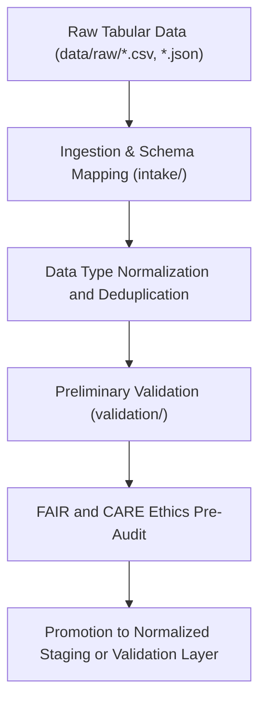

<div align="center">

# 📥 Kansas Frontier Matrix — **Tabular TMP Workspace**
`data/work/staging/tabular/tmp/README.md`

**Purpose:** Temporary environment for ingestion, normalization, and preliminary validation of tabular datasets prior to FAIR+CARE certification and promotion to normalized staging layers.  
This workspace acts as the bridge between `data/raw/` and validated tabular datasets under MCP-DL v6.3 governance.

[](../../../../../docs/standards/faircare-validation.md)
[](../../../../../LICENSE)
[](../../../../../docs/architecture/repo-focus.md)

</div>

---

## 📚 Overview

The `data/work/staging/tabular/tmp/` directory is a **transient staging environment** used to clean, merge, and normalize tabular data before full schema validation and FAIR+CARE review.  
It stores short-lived intermediate files, integrity checks, and audit-ready metadata that ensure all tabular inputs conform to KFM’s schema and ethical data governance.

### Key Functions:
- Field name normalization and schema mapping.  
- Encoding and data type standardization.  
- Deduplication and quality screening of incoming tabular records.  
- Preliminary schema validation and checksum verification.  
- FAIR+CARE compliance pre-audit for ethical and accessible tabular data.  

All TMP artifacts are ephemeral and automatically purged after validation workflows complete successfully.

---

## 🗂️ Directory Layout

```plaintext
data/work/staging/tabular/tmp/
├── README.md                              # This file — documentation for TMP workspace
│
├── intake/                                # Data ingestion and schema alignment workspace
│   ├── hazards_intake_2025.csv
│   ├── climate_indices_intake.parquet
│   ├── treaties_intake.csv
│   └── metadata.json
│
├── validation/                            # Pre-validation and schema testing outputs
│   ├── schema_preview.json
│   ├── field_normalization_summary.json
│   ├── faircare_pre_audit.json
│   └── metadata.json
│
└── logs/                                  # Logging and provenance records for TMP operations
    ├── etl_tmp_run.log
    ├── data_contract_check.log
    ├── governance_sync.log
    └── metadata.json
```

---

## ⚙️ Tabular TMP Workflow



### Workflow Description:
1. **Ingestion:** Source data from `data/raw/` mapped to standardized schema fields.  
2. **Normalization:** Field names and types harmonized with data contract specs.  
3. **Validation:** Check for schema conformance and missing mandatory fields.  
4. **Ethical Audit:** Preliminary FAIR+CARE compliance validation.  
5. **Promotion:** Clean, validated datasets advanced to `data/work/staging/tabular/normalized/`.

---

## 🧩 Example TMP Metadata Record

```json
{
  "id": "tabular_tmp_climate_indices_v9.3.2",
  "source_files": [
    "data/raw/noaa/temperature_anomalies/kansas_temp_anomalies_2025.csv",
    "data/raw/noaa/drought_monitor/drought_monitor_2025.csv"
  ],
  "records_processed": 54012,
  "schema_version": "v3.0.1",
  "created": "2025-10-28T14:20:00Z",
  "validator": "@kfm-etl-ops",
  "validation_status": "pending",
  "checksum": "sha256:41b8ac89d320f5a62fbc2946a97ac5e0f9287a4c...",
  "fairstatus": "in_review",
  "governance_ref": "data/reports/audit/data_provenance_ledger.json"
}
```

---

## 🧠 FAIR+CARE Pre-Validation Alignment

| Principle | Implementation |
|------------|----------------|
| **Findable** | Datasets indexed with source and temporary checksum. |
| **Accessible** | Temporary outputs stored in open CSV/Parquet formats. |
| **Interoperable** | Schema aligned with JSON schema and DCAT metadata. |
| **Reusable** | Metadata captured for reproducibility during validation. |
| **Collective Benefit** | Prepares ethical, open datasets for FAIR+CARE certification. |
| **Authority to Control** | FAIR+CARE Council oversees schema and validation review. |
| **Responsibility** | All preprocessing logged with provenance linkage. |
| **Ethics** | Removes sensitive or disallowed fields before normalization. |

Pre-audit results linked to:  
`data/reports/fair/data_care_assessment.json`  
and `data/reports/audit/data_provenance_ledger.json`.

---

## ⚙️ TMP Reports and Logs

| File | Purpose | Format |
|------|----------|--------|
| `schema_preview.json` | Schema and data type mapping summary. | JSON |
| `field_normalization_summary.json` | Field renaming and harmonization details. | JSON |
| `faircare_pre_audit.json` | Preliminary FAIR+CARE compliance report. | JSON |
| `etl_tmp_run.log` | ETL execution trace for temporary staging. | Text |
| `data_contract_check.log` | Verifies conformance with `data_contract_ref`. | Text |
| `governance_sync.log` | Logs checksum and provenance registry synchronization. | Text |

---

## ⚖️ Governance & Provenance Integration

| Record | Description |
|---------|-------------|
| `metadata.json` | Captures runtime metadata, schema state, and validation context. |
| `data/reports/audit/data_provenance_ledger.json` | Tracks lineage for temporary data normalization. |
| `data/reports/validation/schema_validation_summary.json` | Logs field-level conformance for staged datasets. |
| `releases/v9.3.2/manifest.zip` | Global checksum registry for TMP artifacts. |

TMP synchronization governed by `tabular_tmp_sync.yml`.

---

## 🧾 Retention Policy

| File Type | Retention Duration | Policy |
|------------|--------------------|--------|
| Intake Artifacts | 7 days | Cleared after successful normalization. |
| Validation Files | 14 days | Retained for QA review before deletion. |
| Logs | 30 days | Transferred to system logs for governance history. |
| TMP Metadata | 365 days | Archived for provenance continuity. |

Cleanup managed by `tabular_tmp_cleanup.yml`.

---

## 🧾 Internal Use Citation

```text
Kansas Frontier Matrix (2025). Tabular TMP Workspace (v9.3.2).
Temporary environment for tabular ingestion, schema alignment, and FAIR+CARE pre-validation.
Restricted to internal ETL, QA, and governance workflows.
```

---

## 🧾 Version Notes

| Version | Date | Notes |
|----------|------|--------|
| v9.3.2 | 2025-10-28 | Introduced FAIR+CARE pre-validation and unified schema audit logging. |
| v9.2.0 | 2024-07-15 | Added data contract verification and checksum integration. |
| v9.0.0 | 2023-01-10 | Established tabular TMP workspace for ingestion normalization. |

---

<div align="center">

**Kansas Frontier Matrix** · *Data Integrity × FAIR+CARE Ethics × Schema Validation Readiness*  
[🔗 Repository](https://github.com/bartytime4life/Kansas-Frontier-Matrix) • [🧭 Docs Portal](../../../../../docs/) • [⚖️ Governance Ledger](../../../../../docs/standards/governance/)

</div>
