<div align="center">

# 📥 Kansas Frontier Matrix — **Tabular TMP Workspace**
`data/work/staging/tabular/tmp/README.md`

**Purpose:**  
Temporary workspace for **ingestion, normalization, and preliminary validation** of tabular datasets prior to FAIR+CARE certification and staging promotion.  
Supports ETL preprocessing, schema detection, and checksum registration for fully reproducible tabular workflows.

[](../../../../../docs/architecture/README.md)
[](../../../../../docs/standards/faircare-validation.md)
[]()
[](../../../../../LICENSE)

</div>

---

## 📘 Overview

The **Tabular TMP Workspace** is the entry point for structured tabular data in KFM.  
It handles **initial ingestion**, **field normalization**, and **pre-validation** to prepare datasets for governance and certification workflows.

### Core Responsibilities
- Ingest raw tabular data (CSV/JSON/Parquet) and detect schema.  
- Standardize encodings, delimiters, and data types.  
- Generate preliminary FAIR+CARE audit + checksum reports.  
- Temporarily store ETL outputs before promotion to **staging/tabular**.  

---

## 🗂️ Directory Layout

```plaintext
data/work/staging/tabular/tmp/
├── README.md
├── intake/
│   ├── hazards_intake_2025.csv
│   ├── climate_indices_intake.parquet
│   ├── treaties_intake.csv
│   └── metadata.json
├── validation/
│   ├── schema_preview.json
│   ├── field_normalization_summary.json
│   ├── faircare_pre_audit.json
│   └── metadata.json
└── logs/
    ├── etl_tmp_run.log
    ├── data_contract_check.log
    ├── governance_sync.log
    └── metadata.json
```

---

## ⚙️ Tabular TMP Workflow

```mermaid
flowchart TD
    A["Raw Tabular (data/raw/tabular/*)"] --> B["Schema Detection + Field Normalization"]
    B --> C["FAIR + CARE Pre-Audit Validation"]
    C --> D["Checksum + Governance Registration"]
    D --> E["Promotion → Staging Layer (staging/tabular/)"]
```



### Steps
1. **Schema Detection** — Identify types, encodings, and delimiters.  
2. **Normalization** — Standardize column names & match the KFM Data Contract.  
3. **Pre-Audit** — Run preliminary FAIR+CARE checks.  
4. **Checksums** — Write integrity hashes and lineage metadata.  
5. **Promotion** — Move compliant data to **staging/tabular** for certification.

---

## 🧩 Example TMP Metadata Record

```json
{
  "id": "tabular_tmp_climate_indices_v9.7.0",
  "source_files": [
    "data/raw/noaa/temperature_anomalies_2025.csv",
    "data/raw/noaa/drought_monitor_2025.csv"
  ],
  "records_processed": 54012,
  "schema_version": "v3.1.1",
  "created": "2025-11-06T23:59:00Z",
  "validator": "@kfm-etl-ops",
  "validation_status": "pending",
  "checksum_sha256": "sha256:b9e8f3c7d4a6b1f9c2d8e7a4b5f3a9d6e2b1c4a7f8e9b2d3c5a6f4b1e9a7d8c5",
  "fairstatus": "in_review",
  "governance_ref": "data/reports/audit/data_provenance_ledger.json"
}
```

---

## 🧠 FAIR+CARE Governance Matrix

| Principle | Implementation | Oversight |
|-----------|----------------|-----------|
| **Findable** | TMP datasets indexed with schema ID and checksum. | `@kfm-data` |
| **Accessible** | CSV/Parquet maintained for machine readability. | `@kfm-accessibility` |
| **Interoperable** | Early alignment with FAIR+CARE, DCAT, and JSON Schema. | `@kfm-architecture` |
| **Reusable** | Provenance + checksum records enable reprocessing. | `@kfm-design` |
| **Collective Benefit** | Ethical preparation for equitable open data. | `@faircare-council` |
| **Authority to Control** | Council certifies promotion to staging. | `@kfm-governance` |
| **Responsibility** | Engineers document mappings and type corrections. | `@kfm-security` |
| **Ethics** | Screening for restricted or sensitive attributes. | `@kfm-ethics` |

**Audit refs:**  
`data/reports/fair/data_care_assessment.json` · `data/reports/audit/data_provenance_ledger.json`

---

## ⚙️ Validation & QA Artifacts

| Artifact                      | Description                                   | Format |
|------------------------------|-----------------------------------------------|--------|
| `schema_preview.json`        | Preliminary schema/type detection              | JSON   |
| `field_normalization_summary.json` | Column rename & datatype harmonization   | JSON   |
| `faircare_pre_audit.json`    | Pre-validation ethics + accessibility checks   | JSON   |
| `etl_tmp_run.log`            | TMP ingestion + transform runtime log          | Text   |
| `metadata.json`              | TMP session checksum + governance record       | JSON   |

**Automation:** `tabular_tmp_sync.yml`

---

## ♻️ Retention & Sustainability Policy

| File Type        | Retention | Policy                                        |
|------------------|----------:|-----------------------------------------------|
| Intake Artifacts | 7 Days    | Deleted after validation success.             |
| Validation Reps  | 14 Days   | Archived for QA and audit.                    |
| Logs             | 30 Days   | Transferred to system log archive.            |
| Metadata         | 365 Days  | Retained for governance continuity.           |

**Telemetry:** `../../../../../releases/v9.7.0/focus-telemetry.json`

---

## 🧾 Internal Citation

```text
Kansas Frontier Matrix (2025). Tabular TMP Workspace (v9.7.0).
Temporary ingestion and normalization workspace for tabular datasets under FAIR+CARE pre-validation—supporting schema detection, checksum verification, and provenance registration under MCP-DL v6.3.
```

---

## 🕰️ Version History

| Version | Date       | Author          | Summary |
|--------:|------------|-----------------|---------|
| v9.7.0  | 2025-11-06 | `@kfm-tabular`  | Upgraded to v9.7.0; telemetry/schema refs aligned; retention table clarified. |
| v9.6.0  | 2025-11-03 | `@kfm-tabular`  | Added FAIR+CARE automation & checksum registry integration. |

---

<div align="center">

**Kansas Frontier Matrix**  
*Data Preparation × FAIR+CARE Ethics × Provenance Validation*  
© 2025 Kansas Frontier Matrix — Internal · FAIR+CARE Certified · Diamond⁹ Ω / Crown∞Ω Ultimate Certified  

[Back to Tabular Staging](../README.md) · [Governance Charter](../../../../../docs/standards/governance/DATA-GOVERNANCE.md)

</div>