<div align="center">

# 📥 Kansas Frontier Matrix — **Tabular TMP Workspace**
`data/work/staging/tabular/tmp/README.md`

**Purpose:** Temporary environment for ingestion, normalization, and pre-validation of tabular datasets before FAIR+CARE certification and promotion to normalized staging layers.  
Acts as the controlled bridge between `data/raw/` ingestion and validated tabular staging datasets under MCP-DL v6.3 governance.

[](../../../../../docs/standards/faircare-validation.md)
[](../../../../../LICENSE)
[](../../../../../docs/architecture/repo-focus.md)

</div>

---

## 📚 Overview

The `data/work/staging/tabular/tmp/` directory serves as a **transient workspace** for cleaning, merging, and normalizing tabular data prior to full schema validation and FAIR+CARE ethics review.  
It provides short-lived intermediate artifacts and audit-ready metadata to ensure compliance with KFM’s data contract and governance policies.

### Key Responsibilities
- Normalize field names and align schema with **data contracts**.  
- Standardize encodings, data types, and controlled vocabularies.  
- Perform deduplication and structural QA on incoming tables.  
- Run preliminary schema validation and checksum verification.  
- Conduct FAIR+CARE pre-validation to verify ethical, transparent data handling.  
- Emit telemetry events for pipeline traceability and dashboard monitoring.  

All TMP files are **ephemeral** and automatically deleted after validation or promotion workflows complete successfully.

---

## 🗂️ Directory Layout

```plaintext
data/work/staging/tabular/tmp/
├── README.md
│
├── intake/                                # Raw-to-staging ETL transformation workspace
│   ├── hazards_intake_2025.csv
│   ├── climate_indices_intake.parquet
│   ├── treaties_intake.csv
│   └── metadata.json
│
├── validation/                            # Preliminary schema and ethics validation outputs
│   ├── schema_preview.json
│   ├── field_normalization_summary.json
│   ├── faircare_pre_audit.json
│   └── metadata.json
│
└── logs/                                  # TMP operation logs and governance metadata
    ├── etl_tmp_run.log
    ├── data_contract_check.log
    ├── governance_sync.log
    └── metadata.json
```

---

## ⚙️ Tabular TMP Workflow

```mermaid
flowchart TD
    A["Raw Tabular Data (data/raw/*.csv, *.json)"] --> B["Ingestion & Schema Mapping (intake/)"]
    B --> C["Type Normalization & Deduplication"]
    C --> D["Preliminary Schema Validation (validation/)"]
    D --> E["FAIR+CARE Ethics Pre-Audit"]
    E --> F["Promotion → Normalized Staging or Validation Layer + Telemetry"]
```



### Workflow Description
1. **Ingestion:** Map raw data to KFM schema fields and apply contract-level mappings.  
2. **Normalization:** Standardize field names, datatypes, encodings, and controlled vocabularies.  
3. **Validation:** Check for missing fields, null values, and contract conformance.  
4. **Ethics Audit:** Execute FAIR+CARE pre-validation for accessibility and ethical compliance.  
5. **Governance & Telemetry:** Sync provenance logs and validation outcomes to the ledger and telemetry record.

---

## 🧩 Example TMP Metadata Record

```json
{
  "id": "tabular_tmp_climate_indices_v9.4.0",
  "source_files": [
    "data/raw/noaa/temperature_anomalies/kansas_temp_anomalies_2025.csv",
    "data/raw/noaa/drought_monitor/drought_monitor_2025.csv"
  ],
  "records_processed": 56321,
  "schema_version": "v3.1.0",
  "created": "2025-11-02T15:45:00Z",
  "validator": "@kfm-etl-ops",
  "validation_status": "in_review",
  "checksum": "sha256:41b8ac89d320f5a62fbc2946a97ac5e0f9287a4c...",
  "fairstatus": "pending_certification",
  "telemetry_link": "releases/v9.4.0/focus-telemetry.json",
  "governance_ref": "data/reports/audit/data_provenance_ledger.json"
}
```

---

## 🧠 FAIR+CARE Pre-Validation Alignment

| Principle | Implementation |
|------------|----------------|
| **Findable** | TMP datasets indexed with temporary checksum and metadata. |
| **Accessible** | Stored in open, machine-readable CSV/Parquet formats. |
| **Interoperable** | Schema aligned with JSON Schema and DCAT/DCAT-AP specifications. |
| **Reusable** | Pre-validation ensures reproducibility before promotion. |
| **Collective Benefit** | Prepares ethically compliant datasets for FAIR+CARE certification. |
| **Authority to Control** | FAIR+CARE Council oversees schema mapping and pre-validation. |
| **Responsibility** | ETL maintainers document normalization and validation actions. |
| **Ethics** | Sensitive fields removed or anonymized during schema transformation. |

Pre-audit results stored in:  
`data/reports/fair/data_care_assessment.json` • `data/reports/audit/data_provenance_ledger.json`

---

## ⚙️ TMP Reports and Logs

| File | Purpose | Format |
|------|----------|--------|
| `schema_preview.json` | Preview of schema field mappings and data type analysis. | JSON |
| `field_normalization_summary.json` | Record of standardized field names and encodings. | JSON |
| `faircare_pre_audit.json` | Preliminary FAIR+CARE compliance results. | JSON |
| `etl_tmp_run.log` | ETL execution log for TMP operations. | Text |
| `data_contract_check.log` | Confirms adherence to data contract structure. | Text |
| `governance_sync.log` | Logs synchronization events with governance and telemetry. | Text |

---

## ⚖️ Governance & Provenance Integration

| Record | Description |
|---------|-------------|
| `metadata.json` | Tracks runtime context, checksum, and validation metadata. |
| `data/reports/audit/data_provenance_ledger.json` | Logs schema mapping lineage and audit trail. |
| `data/reports/validation/schema_validation_summary.json` | Aggregates pre-validation results. |
| `releases/v9.4.0/manifest.zip` | Maintains global checksum registry for TMP artifacts. |

Synchronization handled via **`tabular_tmp_sync.yml`** automation.

---

## 🧾 Retention Policy

| File Type | Retention Duration | Policy |
|------------|--------------------|--------|
| Intake Artifacts | 7 days | Purged post normalization success. |
| Validation Files | 14 days | Retained for QA and governance audit. |
| Logs | 30 days | Transferred to `data/work/logs/system/`. |
| TMP Metadata | 365 days | Archived for provenance and telemetry records. |

Cleanup automated by **`tabular_tmp_cleanup.yml`** workflow.

---

## 🧾 Internal Use Citation

```text
Kansas Frontier Matrix (2025). Tabular TMP Workspace (v9.4.0).
Temporary environment for tabular ingestion, schema alignment, and FAIR+CARE pre-validation with integrated telemetry tracking.
Restricted to internal ETL, QA, and governance workflows.
```

---

## 🧾 Version Notes

| Version | Date | Notes |
|----------|------|--------|
| v9.4.0 | 2025-11-02 | Added telemetry integration, enhanced FAIR+CARE pre-validation automation, and improved data contract enforcement. |
| v9.3.2 | 2025-10-28 | Introduced FAIR+CARE pre-validation and unified schema audit logging. |
| v9.2.0 | 2024-07-15 | Added data contract verification and checksum integration. |
| v9.0.0 | 2023-01-10 | Established tabular TMP workspace for ingestion normalization. |

---

<div align="center">

**Kansas Frontier Matrix** · *Data Integrity × FAIR+CARE Ethics × Schema Validation Readiness × Telemetry Traceability*  
[🔗 Repository](https://github.com/bartytime4life/Kansas-Frontier-Matrix) • [🧭 Docs Portal](../../../../../docs/) • [⚖️ Governance Ledger](../../../../../docs/standards/governance/)

</div>
