<div align="center">

# 🔍 Kansas Frontier Matrix — **Audit Sandbox**  
`data/work/staging/tabular/tmp/audit_sandbox/`

### *“Verification is science — audit is the proof that science behaves ethically.”*

**Purpose:**  
The **Audit Sandbox Layer** is KFM’s **controlled validation environment** for testing compliance, provenance, and FAIR+CARE audit workflows before full governance publication.  
It functions as a **forensic laboratory** where curators, engineers, and AI governance systems simulate audit conditions, test pipeline transparency, and verify documentation fidelity under MCP-DL protocols.

[](../../../../../../../../../docs/architecture/repo-focus.md)  
[](../../../../../../../../../LICENSE)  
[]()  
[]()  
[]()

</div>

---

## 🧭 Overview

The **Audit Sandbox** is a **temporary, governed workspace** used for pre-production testing of:
- Data provenance chain reconstruction  
- FAIR+CARE audit metric calibration  
- Documentation completeness checks  
- AI explainability and ethical transparency verification  
- Mock compliance assessments for CI/CD governance pipelines  

This environment mirrors production audit conditions while remaining fully **isolated**, **traceable**, and **reproducible** for forensic experimentation.

---

## 🗂️ Directory Layout

```text
data/work/staging/tabular/tmp/audit_sandbox/
├── audit_cases/                        # Individual FAIR+CARE or validation test scenarios
│   ├── faircare_case_001/
│   ├── provenance_trace_case_002/
│   └── schema_integrity_case_003/
├── audit_scripts/                      # Python & CLI automation for audit simulation
│   ├── run_audit_case.py
│   ├── verify_provenance_chain.py
│   └── faircare_compliance_test.py
├── audit_results/                      # Output reports from sandbox validation
│   ├── audit_case_manifest.json
│   ├── compliance_score_summary.json
│   └── audit_findings_log.json
├── audit_sandbox_manifest.json         # Registry of all sandbox audit runs and metadata
├── sandbox_activity.log                # Log of curator and AI audit simulation events
└── README.md                           # This document
```

---

## 🔁 Audit Sandbox Workflow

```mermaid
flowchart TD
    A["Select Audit Case or Dataset"] --> B["Run Automated or Manual Audit Script"]
    B --> C["Capture Results → audit_results/"]
    C --> D["Analyze FAIR+CARE Scores + Provenance"]
    D --> E["Log Process Metadata → audit_sandbox_manifest.json"]
    E --> F["Governance Review + Compliance Scoring"]
```



---

## 🧩 Audit Manifest Schema

| Field | Description | Example |
|-------|--------------|----------|
| `audit_id` | Unique audit simulation identifier | `audit_2025_10_26_003` |
| `case_name` | Audit case title | `Schema Integrity Test` |
| `curator` | Analyst or governance lead | `@kfm-audit` |
| `audit_type` | Category of audit | `FAIR+CARE / Provenance / Documentation` |
| `ai_support` | Whether AI analysis assisted audit | `true` |
| `compliance_score` | Final compliance score (0–1) | `0.96` |
| `issues_found` | Count of audit warnings or errors | `3` |
| `status` | Audit case result | `Passed / Warning / Failed` |
| `timestamp` | Time of audit completion | `2025-10-26T17:12:08Z` |
| `governance_link` | Provenance record linkage | `governance/audit_sandbox_ledger.jsonld#audit_2025_10_26_003` |

---

## ⚙️ Core Components

| Component | Function | Output |
|------------|-----------|---------|
| **Audit Script Runner** | Executes predefined or ad hoc audit scripts | `audit_results/` |
| **FAIR+CARE Compliance Engine** | Evaluates metadata and ethical conformance | `compliance_score_summary.json` |
| **Provenance Verifier** | Traces lineage and schema relationships | `audit_findings_log.json` |
| **AI Explainability Checker** | Audits model reasoning and transparency logs | `audit_case_manifest.json` |
| **Governance Integrator** | Registers audit case metadata into provenance ledger | `audit_sandbox_manifest.json` |

> 🧠 *The sandbox proves that documentation and ethics are more than policies — they’re measurable artifacts.*

---

## ⚙️ Curator & Governance Workflow

1. Create or select an audit scenario from `audit_cases/`.  
2. Execute audit simulation:
   ```bash
   python3 audit_scripts/run_audit_case.py --case faircare_case_001
   ```
3. Review FAIR+CARE and provenance outputs in `audit_results/`.  
4. Annotate curator notes in `sandbox_activity.log`.  
5. Update sandbox manifest and governance ledger:
   ```bash
   make governance-update
   ```

---

## 📈 Audit Sandbox Metrics

| Metric | Description | Target |
|---------|-------------|---------|
| **Audit Pass Rate** | % of audit cases meeting compliance | ≥ 95% |
| **Provenance Chain Integrity** | % of datasets with complete lineage verification | 100% |
| **FAIR+CARE Compliance Score** | Mean ethical and metadata quality | ≥ 0.9 |
| **Documentation Completeness** | % of experiments with full metadata coverage | 100% |
| **Governance Sync Accuracy** | % of audits published to ledger | 100% |

---

## 🧾 Compliance Matrix

| Standard | Scope | Validator |
|-----------|--------|-----------|
| **FAIR+CARE** | Ethical validation and governance testing | `fair-audit` |
| **MCP-DL v6.3** | Documentation-driven audit simulation | `docs-validate` |
| **CIDOC CRM / PROV-O** | Provenance structure and lineage testing | `graph-lint` |
| **ISO/IEC 23053:2022** | AI lifecycle compliance auditing | `ai-validate` |
| **STAC / DCAT 3.0** | Metadata discovery and interoperability | `stac-validate` |

---

## 🪶 Version History

| Version | Date | Author | Notes |
|----------|------|---------|-------|
| v9.0.0 | 2025-10-26 | `@kfm-architecture` | Initial creation of Audit Sandbox documentation under Diamond⁹ Ω / Crown∞Ω certification. |

---

<div align="center">

### 🜂 Kansas Frontier Matrix — *Verification · Ethics · Reproducibility*  
**“Auditing isn’t suspicion — it’s the science of trust.”**

[]()
[]()
[]()
[]()
[]()

<br><br>
<a href="#-kansas-frontier-matrix--audit-sandbox-validation-forensics--compliance-simulation-layer--diamond⁹-Ω--crown∞Ω-certified">⬆ Back to Top</a>

</div>
