<div align="center">

# 🧩 Kansas Frontier Matrix — **Audit Cases**  
`data/work/staging/tabular/tmp/audit_sandbox/audit_cases/`

### *“Every rule needs a test — every test proves accountability.”*

**Purpose:**  
The **Audit Cases Sub-Layer** serves as a **scenario library** of governance simulations designed to test FAIR+CARE compliance, schema validation, provenance integrity, and ethical AI governance mechanisms within the Kansas Frontier Matrix (KFM).  
Each case functions as a reproducible experiment for validating system behavior under real-world and stress-test audit conditions.

[](../../../../../../../../../../../../docs/architecture/repo-focus.md)  
[](../../../../../../../../../../../../LICENSE)  
[]()  
[]()  
[]()

</div>

---

## 🧭 Overview

The **Audit Cases Layer** is where governance simulations are constructed and validated.  
Each audit case is:
- A self-contained scenario with controlled datasets and rules.  
- A documented FAIR+CARE validation and provenance experiment.  
- Version-controlled and checksum-verified for reproducibility.  
- Used to train, test, and validate automated audit engines and curator workflows.  

Audit cases emulate real production data scenarios to ensure that **KFM’s ethical, structural, and operational validation systems** are resilient and transparent.

---

## 🗂️ Directory Layout

```text
data/work/staging/tabular/tmp/audit_sandbox/audit_cases/
├── faircare_case_001/                   # FAIR+CARE metadata compliance test
│   ├── dataset_sample.csv
│   ├── audit_case_config.yaml
│   ├── expected_results.json
│   ├── validation_report.json
│   └── README.md
├── provenance_trace_case_002/           # Provenance reconstruction test
│   ├── dataset_sample.json
│   ├── audit_case_config.yaml
│   ├── lineage_test_results.json
│   └── README.md
├── schema_integrity_case_003/           # Schema and ontology validation test
│   ├── input_dataset.csv
│   ├── audit_case_config.yaml
│   ├── schema_validation_output.json
│   └── README.md
├── audit_case_manifest.json             # Registry of all audit test cases and metadata
└── README.md                            # This document
```

---

## 🔁 Audit Case Execution Workflow

```mermaid
flowchart TD
    A["Select Audit Case"] --> B["Load Dataset & Configuration"]
    B --> C["Run Automated or Manual Validation Script"]
    C --> D["Generate FAIR+CARE & Schema Results"]
    D --> E["Store Outputs → validation_report.json / lineage_test_results.json"]
    E --> F["Compare Against Expected Results"]
    F --> G["Log Provenance & Audit Entry → audit_case_manifest.json"]
```



---

## 🧩 Audit Case Manifest Schema

| Field | Description | Example |
|-------|--------------|----------|
| `case_id` | Unique identifier for audit case | `faircare_case_001` |
| `case_type` | Type of audit scenario | `FAIR+CARE / Provenance / Schema` |
| `dataset_path` | Relative path to input dataset | `faircare_case_001/dataset_sample.csv` |
| `config_path` | Location of YAML configuration | `faircare_case_001/audit_case_config.yaml` |
| `expected_outcome` | Summary of audit goal | `"FAIR score ≥ 0.90; no critical schema errors"` |
| `result_file` | Output report generated by case | `validation_report.json` |
| `curator` | Person or system responsible | `@kfm-audit` |
| `timestamp` | Time case was last executed | `2025-10-26T17:14:44Z` |
| `status` | Case state | `Passed / Warning / Failed` |
| `governance_ref` | Ledger provenance reference | `governance/audit_cases_ledger.jsonld#faircare_case_001` |

---

## ⚙️ Core Components

| Component | Function | Output |
|------------|-----------|---------|
| **Audit Case Configurations** | Defines validation parameters and ethical criteria | `audit_case_config.yaml` |
| **Dataset Samples** | Example data for scenario testing | `dataset_sample.csv` |
| **Automated Validators** | Executes schema, FAIR+CARE, and provenance tests | `validation_report.json` |
| **Expected Results Benchmarks** | Stores target outcomes for comparison | `expected_results.json` |
| **Governance Mapper** | Logs case metadata and results to provenance ledger | `audit_case_manifest.json` |

> 🧠 *Audit cases make validation governance measurable — ethics and structure tested in tandem.*

---

## ⚙️ Curator Workflow

1. Initialize a new audit case structure:
   ```bash
   make audit-case-create CASE_NAME=faircare_case_004
   ```
2. Populate `audit_case_config.yaml` with validation rules.  
3. Run the audit case test:
   ```bash
   make audit-case-run CASE_NAME=faircare_case_004
   ```
4. Review outputs and compare against benchmarks.  
5. Register case outcome in governance ledger:
   ```bash
   make governance-update
   ```

---

## 📈 Audit Case Metrics

| Metric | Description | Target |
|---------|-------------|---------|
| **Audit Case Pass Rate** | % of cases that meet validation benchmarks | ≥ 95% |
| **Schema Validation Coverage** | % of test cases with schema validation | 100% |
| **Provenance Traceability** | % of cases linked to governance ledger | 100% |
| **FAIR+CARE Ethical Consistency** | % of metadata cases scoring ≥ 0.9 | ≥ 90% |
| **Curator Review Completion** | % of cases reviewed and approved | 100% |

---

## 🧾 Compliance Matrix

| Standard | Scope | Validator |
|-----------|--------|-----------|
| **FAIR+CARE** | Ethical and metadata governance testing | `fair-audit` |
| **MCP-DL v6.3** | Documentation-first audit scenario protocol | `docs-validate` |
| **CIDOC CRM / PROV-O** | Provenance tracking and lineage simulation | `graph-lint` |
| **ISO 9001:2015** | Quality and reproducibility testing | `quality-audit` |
| **STAC / DCAT 3.0** | Metadata interoperability and audit reproducibility | `stac-validate` |

---

## 🪶 Version History

| Version | Date | Author | Notes |
|----------|------|---------|-------|
| v9.0.0 | 2025-10-26 | `@kfm-architecture` | Initial creation of Audit Cases documentation under Diamond⁹ Ω / Crown∞Ω certification. |

---

<div align="center">

### 🜂 Kansas Frontier Matrix — *Simulation · Validation · Accountability*  
**“Each case tests not just the system — but our commitment to ethical reproducibility.”**

[]()
[]()
[]()
[]()
[]()

<br><br>
<a href="#-kansas-frontier-matrix--audit-cases-governance-validation-scenario-library--diamond⁹-Ω--crown∞Ω-certified">⬆ Back to Top</a>

</div>
