<div align="center">

# 🧭 Kansas Frontier Matrix — **FAIR+CARE Audit Case 001**  
`data/work/staging/tabular/tmp/audit_sandbox/audit_cases/faircare_case_001/`

### *“Ethical metadata isn’t optional — it’s the heartbeat of reproducibility.”*

**Purpose:**  
This case tests the **FAIR+CARE ethical compliance mechanisms** of the Kansas Frontier Matrix (KFM) data validation framework.  
Audit Case 001 verifies that the system properly scores, records, and governs metadata completeness, accessibility, provenance, and ethical accountability within a controlled sandbox scenario.

[](../../../../../../../../../../../../../docs/architecture/repo-focus.md)  
[](../../../../../../../../../../../../../LICENSE)  
[]()  
[]()  
[]()

</div>

---

## 🧭 Overview

**Audit Case 001: FAIR+CARE Compliance Test** simulates a validation cycle in which a dataset’s metadata completeness, accessibility, and ethical compliance are evaluated.  
This audit scenario tests:
- FAIR metadata scoring engine accuracy  
- CARE (Collective Benefit, Authority to Control, Responsibility, Ethics) metadata enrichment logic  
- Provenance and ledger traceability  
- Human and AI collaboration in ethical assessment  

The case ensures the **FAIR+CARE validator** operates deterministically and transparently across multiple iterations.

---

## 🗂️ Directory Layout

```text
data/work/staging/tabular/tmp/audit_sandbox/audit_cases/faircare_case_001/
├── dataset_sample.csv                    # Experimental dataset for FAIR+CARE testing
├── audit_case_config.yaml                # YAML defining test conditions and thresholds
├── expected_results.json                 # Benchmark outcomes for comparison
├── validation_report.json                # Generated FAIR+CARE results from audit run
├── ai_reasoning_log.json                 # AI explainability output and ethical context notes
├── curator_review_notes.log              # Manual auditor feedback and override decisions
└── README.md                             # This document
```

---

## 🔁 FAIR+CARE Audit Workflow

```mermaid
flowchart TD
    A["Load dataset_sample.csv"] --> B["Run FAIR+CARE Evaluator (v1.5)"]
    B --> C["Generate Validation Report → validation_report.json"]
    C --> D["Compare with Expected Outcomes → expected_results.json"]
    D --> E["Review AI Reasoning → ai_reasoning_log.json"]
    E --> F["Curator Oversight → curator_review_notes.log"]
    F --> G["Log Provenance → governance/audit_case_faircare_001_ledger.jsonld"]
```



---

## 🧩 Audit Configuration (audit_case_config.yaml)

```yaml
case_id: "faircare_case_001"
case_title: "FAIR+CARE Ethical Compliance Validation"
dataset: "dataset_sample.csv"
validators:
  - "FAIR+CARE Evaluator v1.5"
  - "Schema Compliance Validator v13"
expected_scores:
  fair_minimum: 0.90
  care_minimum: 0.85
audit_goals:
  - "Verify ethical completeness scoring consistency"
  - "Confirm deterministic scoring across re-runs"
  - "Ensure AI explanation text matches numeric outputs"
metadata_requirements:
  - "license"
  - "provenance_link"
  - "community_authority"
  - "checksum"
---
```

---

## 🧾 Expected FAIR+CARE Result Structure (expected_results.json)

| Field | Description | Example |
|-------|--------------|----------|
| `fair_score` | FAIR compliance metric | `0.94` |
| `care_score` | CARE compliance metric | `0.89` |
| `missing_fields` | Metadata elements not detected | `[ "community_authority" ]` |
| `ai_commentary` | Summary of ethical context evaluation | `"Dataset meets minimum FAIR+CARE thresholds; missing minor community authority tag."` |
| `pass_threshold` | Pass/fail condition met | `true` |

---

## ⚙️ Key Components

| Component | Function | Output |
|------------|-----------|---------|
| **FAIR+CARE Evaluator** | Performs ethical and metadata compliance validation | `validation_report.json` |
| **AI Explainability Engine** | Produces contextual analysis of scoring and ethics | `ai_reasoning_log.json` |
| **Curator Oversight Module** | Allows human review of AI audit results | `curator_review_notes.log` |
| **Threshold Configuration** | Defines acceptable FAIR/CARE compliance limits | `audit_case_config.yaml` |
| **Governance Logger** | Links audit outputs to provenance chain | `audit_case_faircare_001_ledger.jsonld` |

> 🧠 *FAIR+CARE compliance is both algorithmic and human — both must agree for validation to mean trust.*

---

## ⚙️ Curator Workflow

1. Execute the FAIR+CARE audit case:
   ```bash
   make audit-run CASE=faircare_case_001
   ```
2. Compare generated results to expected outcomes:
   ```bash
   diff validation_report.json expected_results.json
   ```
3. Review AI reasoning summaries for ethical interpretation:
   ```bash
   cat ai_reasoning_log.json
   ```
4. Document curator remarks in `curator_review_notes.log`.  
5. Finalize results and sync to the governance ledger:
   ```bash
   make governance-update
   ```

---

## 📈 Evaluation Metrics

| Metric | Description | Target |
|---------|-------------|---------|
| **FAIR Score Accuracy** | Difference between expected and observed FAIR scores | ≤ ±0.02 |
| **CARE Score Accuracy** | Difference between expected and observed CARE scores | ≤ ±0.02 |
| **AI-Human Agreement Rate** | % of AI decisions confirmed by human curator | ≥ 90% |
| **Reproducibility Rate** | % of identical results over multiple runs | 100% |
| **Governance Sync Completeness** | % of results registered to provenance ledger | 100% |

---

## 🧾 Compliance Matrix

| Standard | Scope | Validator |
|-----------|--------|-----------|
| **FAIR+CARE** | Ethical and metadata compliance auditing | `fair-audit` |
| **MCP-DL v6.3** | Documentation-driven audit reproducibility | `docs-validate` |
| **CIDOC CRM / DCAT 3.0** | Semantic and provenance linkage validation | `graph-lint` |
| **ISO/IEC 23053:2022** | AI ethical and lifecycle governance | `ai-validate` |
| **STAC / DCAT 3.0** | Metadata interoperability for FAIR datasets | `stac-validate` |

---

## 🪶 Version History

| Version | Date | Author | Notes |
|----------|------|---------|-------|
| v9.0.0 | 2025-10-26 | `@kfm-architecture` | Initial creation of FAIR+CARE Case 001 documentation under Diamond⁹ Ω / Crown∞Ω certification. |

---

<div align="center">

### 🜂 Kansas Frontier Matrix — *Ethics · Accuracy · Accountability*  
**“FAIR+CARE isn’t a checkbox — it’s a compass guiding how we steward data responsibly.”**

[]()
[]()
[]()
[]()
[]()

<br><br>
<a href="#-kansas-frontier-matrix--faircare-case-001-ethical-metadata-compliance-audit--diamond⁹-Ω--crown∞Ω-certified">⬆ Back to Top</a>

</div>
