<div align="center">

# 🔗 Kansas Frontier Matrix — **Provenance Trace Audit Case 002**  
`data/work/staging/tabular/tmp/audit_sandbox/audit_cases/provenance_trace_case_002/`

### *“Every dataset has a story — audit ensures we can read it backwards.”*

**Purpose:**  
**Audit Case 002** verifies the **provenance reconstruction and lineage validation** systems of the Kansas Frontier Matrix (KFM).  
It ensures that each transformation, AI action, and metadata change within the pipeline is **traceable, verifiable, and reversible**, consistent with FAIR+CARE and MCP-DL governance principles.

[](../../../../../../../../../../../../../docs/architecture/repo-focus.md)  
[](../../../../../../../../../../../../../LICENSE)  
[]()  
[]()  
[]()

</div>

---

## 🧭 Overview

**Provenance Trace Audit Case 002** tests the KFM’s **lineage tracking, semantic mapping, and change reconstruction mechanisms** by replaying data transformations and verifying that every provenance link remains intact.

This audit validates:
- PROV-O and CIDOC CRM semantic lineage graph integrity  
- Version tracking across ETL and normalization buffers  
- Checksum reconciliation between input/output stages  
- FAIR+CARE metadata propagation across transformations  
- Curator and AI agent attribution accuracy  

The goal is to demonstrate that **KFM can reconstruct any dataset’s full transformation history** from raw snapshot to normalized output with complete ethical traceability.

---

## 🗂️ Directory Layout

```text
data/work/staging/tabular/tmp/audit_sandbox/audit_cases/provenance_trace_case_002/
├── dataset_sample.json                    # Synthetic dataset representing multi-stage lineage
├── audit_case_config.yaml                 # Audit configuration (lineage, CIDOC mapping)
├── lineage_test_results.json              # Provenance validation results
├── expected_lineage_graph.json            # Baseline lineage graph for comparison
├── checksum_validation_report.json        # File integrity test results
├── curator_review_notes.log               # Manual annotations and audit adjustments
└── README.md                              # This document
```

---

## 🔁 Provenance Reconstruction Workflow

```mermaid
flowchart TD
    A["Load dataset_sample.json"] --> B["Rebuild Lineage Graph → expected_lineage_graph.json"]
    B --> C["Validate Semantic Links (PROV-O / CIDOC)"]
    C --> D["Compare Against Live Graph from Governance Ledger"]
    D --> E["Check Checksum Consistency Between Stages"]
    E --> F["Generate Report → lineage_test_results.json"]
    F --> G["Curator Verification + Comments → curator_review_notes.log"]
```



---

## 🧩 Audit Configuration (audit_case_config.yaml)

```yaml
case_id: "provenance_trace_case_002"
case_title: "Data Provenance and Lineage Integrity Audit"
dataset: "dataset_sample.json"
lineage_validation:
  - "Check all PROV-O relationships (wasGeneratedBy, used, derivedFrom)"
  - "Verify CIDOC CRM temporal and event mapping"
  - "Ensure transformation checkpoints align with recorded timestamps"
checksum_verification:
  - "Confirm hashes match across ETL, normalization, and cache layers"
expected_relationships:
  - "Dataset A wasDerivedFrom Dataset B"
  - "Dataset B wasGeneratedBy ETL_Run_007"
auditors:
  - "@kfm-provenance"
  - "@kfm-architecture"
---
```

---

## 🧾 Example Lineage Graph Structure (expected_lineage_graph.json)

```json
{
  "entities": [
    { "id": "dataset_raw", "label": "Raw Input Dataset", "checksum": "d4e9a1..." },
    { "id": "dataset_normalized", "label": "Normalized Output", "checksum": "e0a2b7..." }
  ],
  "activities": [
    { "id": "etl_run_007", "type": "ETL Transformation", "timestamp": "2025-10-26T16:30:00Z" }
  ],
  "relations": [
    { "subject": "dataset_normalized", "predicate": "prov:wasDerivedFrom", "object": "dataset_raw" },
    { "subject": "dataset_raw", "predicate": "prov:wasGeneratedBy", "object": "etl_run_007" }
  ]
}
```

---

## ⚙️ Core Components

| Component | Function | Output |
|------------|-----------|---------|
| **Lineage Validator** | Reconstructs provenance graph and verifies PROV-O integrity | `lineage_test_results.json` |
| **Checksum Verifier** | Validates hash consistency across pipeline stages | `checksum_validation_report.json` |
| **Semantic Mapper** | Checks CIDOC CRM and DCAT linkage integrity | `expected_lineage_graph.json` |
| **Governance Comparator** | Confirms audit results against ledger graph data | `lineage_test_results.json` |
| **Curator Oversight Module** | Records manual lineage interpretation and verdicts | `curator_review_notes.log` |

> 🧠 *Lineage verification is not just about history — it’s about ensuring every transformation was ethically and technically justified.*

---

## ⚙️ Curator Workflow

1. Run the provenance reconstruction audit:
   ```bash
   make audit-run CASE=provenance_trace_case_002
   ```
2. Verify generated lineage consistency:
   ```bash
   diff expected_lineage_graph.json lineage_test_results.json
   ```
3. Review checksum validation results:
   ```bash
   cat checksum_validation_report.json
   ```
4. Add curator commentary or override in `curator_review_notes.log`.  
5. Sync audit results to the governance ledger:
   ```bash
   make governance-update
   ```

---

## 📈 Evaluation Metrics

| Metric | Description | Target |
|---------|-------------|---------|
| **Lineage Integrity Score** | % of correctly reconstructed provenance links | ≥ 0.98 |
| **Checksum Match Rate** | % of file hashes consistent across layers | 100% |
| **FAIR+CARE Metadata Retention** | % of ethical metadata fields propagated | ≥ 0.95 |
| **Governance Ledger Alignment** | % of graph nodes matching governance ledger | 100% |
| **Audit Reproducibility** | Consistency of results across reruns | 100% |

---

## 🧾 Compliance Matrix

| Standard | Scope | Validator |
|-----------|--------|-----------|
| **FAIR+CARE** | Ethical and transparent provenance handling | `fair-audit` |
| **MCP-DL v6.3** | Documentation-based provenance reproducibility | `docs-validate` |
| **CIDOC CRM / PROV-O** | Semantic lineage and relationship verification | `graph-lint` |
| **ISO/IEC 23053:2022** | AI lifecycle and event traceability | `ai-validate` |
| **STAC / DCAT 3.0** | Metadata interoperability for lineage records | `stac-validate` |

---

## 🪶 Version History

| Version | Date | Author | Notes |
|----------|------|---------|-------|
| v9.0.0 | 2025-10-26 | `@kfm-architecture` | Initial creation of Provenance Trace Case 002 documentation under Diamond⁹ Ω / Crown∞Ω certification. |

---

<div align="center">

### 🜂 Kansas Frontier Matrix — *Lineage · Transparency · Trust*  
**“If you can’t trace it, you can’t trust it — provenance is the proof of integrity.”**

[]()
[]()
[]()
[]()
[]()

<br><br>
<a href="#-kansas-frontier-matrix--provenance-trace-case-002-lineage-reconstruction--data-integrity-audit--diamond⁹-Ω--crown∞Ω-certified">⬆ Back to Top</a>

</div>
