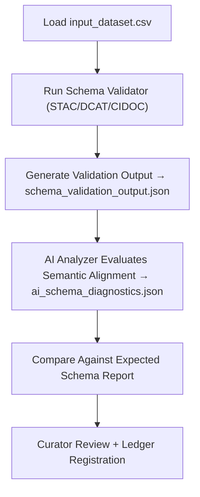

<div align="center">

# 🧩 Kansas Frontier Matrix — **Schema Integrity Audit Case 003**  
`data/work/staging/tabular/tmp/audit_sandbox/audit_cases/schema_integrity_case_003/`

### *“Structure defines truth — validation ensures it’s still aligned.”*

**Purpose:**  
**Audit Case 003** tests the **schema validation, ontology alignment, and field integrity enforcement mechanisms** within the Kansas Frontier Matrix (KFM).  
It verifies that data entering or exiting normalization conforms to declared STAC, DCAT, and CIDOC CRM standards while maintaining provenance and FAIR+CARE metadata consistency.

[](../../../../../../../../../../../../../docs/architecture/repo-focus.md)  
[](../../../../../../../../../../../../../LICENSE)  
[]()  
[]()  
[]()

</div>

---

## 🧭 Overview

**Schema Integrity Audit Case 003** simulates validation scenarios where dataset fields, relationships, and ontology mappings are tested against system schemas.  
This audit ensures:
- Complete JSON Schema compliance (STAC/DCAT validation)  
- Consistency in data type, enumeration, and regex patterns  
- CIDOC CRM class and property conformity  
- FAIR+CARE metadata propagation through schema transformations  
- AI-human agreement in schema drift identification  

The case proves that KFM’s validation pipeline maintains **structural fidelity and semantic alignment** across all schema versions.

---

## 🗂️ Directory Layout

```text
data/work/staging/tabular/tmp/audit_sandbox/audit_cases/schema_integrity_case_003/
├── input_dataset.csv                     # Sample dataset used for schema testing
├── audit_case_config.yaml                # Configuration defining validation thresholds
├── schema_validation_output.json         # Generated schema validation results
├── expected_schema_report.json           # Benchmark results for schema conformity
├── ai_schema_diagnostics.json            # AI analysis of field mismatches and ontology drift
├── curator_review_notes.log              # Curator commentary and override decisions
└── README.md                             # This document
```

---

## 🔁 Schema Integrity Workflow



---

## 🧩 Audit Configuration (audit_case_config.yaml)

```yaml
case_id: "schema_integrity_case_003"
case_title: "Schema Compliance and Ontology Alignment Validation"
dataset: "input_dataset.csv"
validators:
  - "STAC Schema Validator v1.0"
  - "CIDOC CRM Ontology Mapper v6.2"
  - "AI Schema Auditor v3.0"
validation_rules:
  required_fields:
    - "dataset_id"
    - "license"
    - "checksum"
    - "provenance_link"
  enum_fields:
    license: ["CC-BY 4.0", "MIT", "ODC-BY"]
  numeric_ranges:
    record_count: { min: 1, max: 1000000 }
tolerance_levels:
  schema_errors_allowed: 0
  ontology_mismatches_allowed: 2
audit_goals:
  - "Ensure field-level schema integrity"
  - "Verify ontology relationships via CIDOC CRM"
  - "Evaluate AI consistency in schema drift detection"
auditors:
  - "@kfm-schema"
  - "@kfm-architecture"
---
```

---

## 🧾 Example Schema Validation Output (schema_validation_output.json)

```json
{
  "dataset_id": "ks_census_1890",
  "validation_summary": {
    "schema_compliance": "Passed",
    "required_fields": ["dataset_id", "license", "checksum", "provenance_link"],
    "missing_fields": [],
    "enum_violations": [],
    "ontology_alignment": "CIDOC CRM compliant",
    "ai_drift_alert": false
  },
  "metrics": {
    "validation_time_sec": 3.84,
    "confidence_score": 0.992
  },
  "timestamp": "2025-10-26T17:17:11Z"
}
```

---

## ⚙️ Core Components

| Component | Function | Output |
|------------|-----------|---------|
| **Schema Validator** | Performs STAC/DCAT/CIDOC structural checks | `schema_validation_output.json` |
| **AI Schema Auditor** | Detects pattern drift or missing ontology fields | `ai_schema_diagnostics.json` |
| **Expected Schema Benchmark** | Stores baseline schema conformance metrics | `expected_schema_report.json` |
| **Curator Oversight Log** | Captures human review and validation notes | `curator_review_notes.log` |
| **Governance Logger** | Registers schema test results in provenance ledger | `audit_case_schema_003_ledger.jsonld` |

> 🧠 *Structural integrity is more than conformance — it’s the proof that semantics and ethics move together.*

---

## ⚙️ Curator Workflow

1. Execute schema integrity audit:
   ```bash
   make audit-run CASE=schema_integrity_case_003
   ```
2. Review schema validation results:
   ```bash
   cat schema_validation_output.json
   ```
3. Compare outputs to expected report:
   ```bash
   diff schema_validation_output.json expected_schema_report.json
   ```
4. Review AI schema diagnostics and curator notes.  
5. Register verified results with the governance ledger:
   ```bash
   make governance-update
   ```

---

## 📈 Evaluation Metrics

| Metric | Description | Target |
|---------|-------------|---------|
| **Schema Compliance Rate** | % of datasets passing validation | 100% |
| **Ontology Alignment Accuracy** | % of relationships correctly mapped | ≥ 0.95 |
| **AI Drift Detection Precision** | Accuracy of AI schema mismatch identification | ≥ 0.9 |
| **Human-AI Agreement Rate** | % of schema validations confirmed by curators | ≥ 90% |
| **Ledger Trace Completeness** | % of validated audits logged to governance | 100% |

---

## 🧾 Compliance Matrix

| Standard | Scope | Validator |
|-----------|--------|-----------|
| **FAIR+CARE** | Ethical metadata and schema documentation | `fair-audit` |
| **MCP-DL v6.3** | Documentation-driven structural validation | `docs-validate` |
| **CIDOC CRM / DCAT / STAC 1.0** | Ontology and schema compliance | `graph-lint` |
| **ISO 19115 / 19157** | Metadata completeness and data quality | `geojson-lint` |
| **STAC / DCAT 3.0** | Dataset structure and discoverability standards | `stac-validate` |

---

## 🪶 Version History

| Version | Date | Author | Notes |
|----------|------|---------|-------|
| v9.0.0 | 2025-10-26 | `@kfm-architecture` | Initial creation of Schema Integrity Case 003 documentation under Diamond⁹ Ω / Crown∞Ω certification. |

---

<div align="center">

### 🜂 Kansas Frontier Matrix — *Structure · Semantics · Trust*  
**“Schema integrity isn’t about restriction — it’s how knowledge stays aligned with meaning.”**

[]()
[]()
[]()
[]()
[]()

<br><br>
<a href="#-kansas-frontier-matrix--schema-integrity-case-003-structural-compliance--ontology-validation-audit--diamond⁹-Ω--crown∞Ω-certified">⬆ Back to Top</a>

</div>
