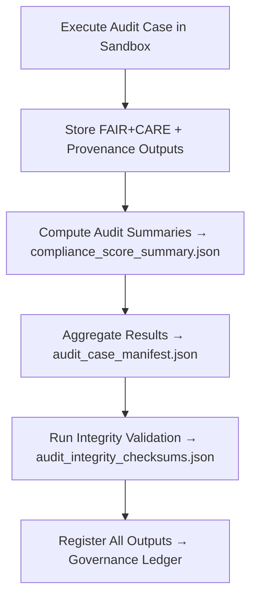

<div align="center">

# 📑 Kansas Frontier Matrix — **Audit Results**  
`data/work/staging/tabular/tmp/audit_sandbox/audit_results/`

### *“Audit isn’t where validation ends — it’s where accountability begins.”*

**Purpose:**  
The **Audit Results Layer** stores all finalized output data from governance simulations and compliance assessments executed in the Kansas Frontier Matrix (KFM) Audit Sandbox.  
It provides a **consolidated view of validation performance**, FAIR+CARE compliance, provenance verification, and ethical audit scoring across all sandbox cases.

[](../../../../../../../../../../../../../docs/architecture/repo-focus.md)  
[](../../../../../../../../../../../../../LICENSE)  
[]()  
[]()  
[]()

</div>

---

## 🧭 Overview

The **Audit Results Layer** acts as the final checkpoint of audit operations, where all outcomes, compliance metrics, and curator reviews are recorded.  
It consolidates results from multiple sources including:
- **FAIR+CARE compliance tests**  
- **Schema integrity validations**  
- **Provenance and lineage audits**  
- **AI ethics evaluations and human review alignment**  
- **Curator commentary and final governance ratings**

Each result file is **checksum-verified, timestamped, and ledger-linked** to ensure full transparency and historical auditability.

---

## 🗂️ Directory Layout

```text
data/work/staging/tabular/tmp/audit_sandbox/audit_results/
├── audit_case_manifest.json            # Registry of all completed audit cases and metadata
├── compliance_score_summary.json       # FAIR+CARE compliance and ethical scoring results
├── audit_findings_log.json             # List of detected issues, warnings, and resolutions
├── audit_outcome_report.json           # Consolidated summary of audit case results
├── curator_review_summary.json         # Aggregated curator evaluations and overrides
├── audit_integrity_checksums.json      # SHA-256 integrity log of all audit result files
└── README.md                           # This document
```

---

## 🔁 Audit Result Generation Workflow



---

## 🧩 Audit Result Manifest Schema

| Field | Description | Example |
|-------|--------------|----------|
| `audit_id` | Unique identifier for audit run | `audit_2025_10_26_015` |
| `case_name` | Audit case executed | `schema_integrity_case_003` |
| `result_status` | Outcome of audit | `Passed / Warning / Failed` |
| `fair_score` | FAIR compliance score | `0.94` |
| `care_score` | CARE ethical compliance score | `0.91` |
| `issues_detected` | Number of audit warnings or violations | `1` |
| `curator_decision` | Governance review verdict | `"Accepted with minor caveats"` |
| `checksum` | SHA-256 hash verifying report integrity | `b3c6f4b02f7b2b1e9a...` |
| `timestamp` | UTC time of audit completion | `2025-10-26T17:21:36Z` |
| `governance_ref` | Ledger linkage for audit record | `governance/audit_results_ledger.jsonld#audit_2025_10_26_015` |

---

## ⚙️ Core Components

| Component | Function | Output |
|------------|-----------|---------|
| **Audit Aggregator** | Collects and merges all case-level outputs | `audit_outcome_report.json` |
| **FAIR+CARE Compliance Analyzer** | Calculates average ethical and metadata scores | `compliance_score_summary.json` |
| **Provenance Verifier** | Confirms lineage traceability across audit runs | `audit_findings_log.json` |
| **Checksum Validator** | Ensures file integrity for audit reports | `audit_integrity_checksums.json` |
| **Governance Synchronizer** | Registers finalized audit results in ledger | `audit_case_manifest.json` |

> 🧠 *Audit results are living records — verifiable, reproducible, and ethically contextual.*

---

## ⚙️ Curator Workflow

1. Review compliance reports and findings:
   ```bash
   cat compliance_score_summary.json
   ```
2. Verify audit outcomes and curator feedback consistency:
   ```bash
   jq . audit_outcome_report.json
   ```
3. Run checksum validation:
   ```bash
   make audit-verify
   ```
4. Archive finalized reports and update governance ledger:
   ```bash
   make governance-update
   ```

---

## 📈 Audit Performance Metrics

| Metric | Description | Target |
|---------|-------------|---------|
| **Audit Completion Rate** | % of audit cases finalized successfully | 100% |
| **Checksum Validation Success** | Integrity verification rate | 100% |
| **FAIR+CARE Compliance** | Mean ethical and metadata completeness | ≥ 0.9 |
| **Curator Agreement Rate** | % of human–AI alignment on outcomes | ≥ 0.9 |
| **Governance Ledger Traceability** | % of audit results linked to provenance | 100% |

---

## 🧾 Compliance Matrix

| Standard | Scope | Validator |
|-----------|--------|-----------|
| **FAIR+CARE** | Ethical validation and audit transparency | `fair-audit` |
| **MCP-DL v6.3** | Documentation-based audit governance | `docs-validate` |
| **CIDOC CRM / PROV-O** | Provenance structure and lineage integrity | `graph-lint` |
| **ISO 9001:2015** | Audit quality and consistency assurance | `quality-audit` |
| **STAC / DCAT 3.0** | Interoperable metadata for audit outputs | `stac-validate` |

---

## 🪶 Version History

| Version | Date | Author | Notes |
|----------|------|---------|-------|
| v9.0.0 | 2025-10-26 | `@kfm-architecture` | Initial creation of Audit Results documentation under Diamond⁹ Ω / Crown∞Ω certification. |

---

<div align="center">

### 🜂 Kansas Frontier Matrix — *Verification · Accountability · Trust*  
**“Audit results aren’t just numbers — they’re the record of ethical transparency in motion.”**

[]()
[]()
[]()
[]()
[]()

<br><br>
<a href="#-kansas-frontier-matrix--audit-results-governance-verification--compliance-output-layer--diamond⁹-Ω--crown∞Ω-certified">⬆ Back to Top</a>

</div>
