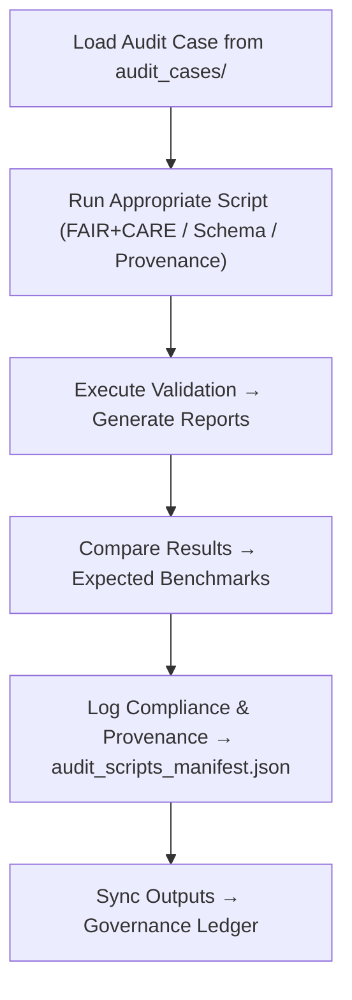

<div align="center">

# 🧠 Kansas Frontier Matrix — **Audit Scripts**  
`data/work/staging/tabular/tmp/audit_sandbox/audit_scripts/`

### *“Automation doesn’t replace oversight — it records it faster.”*

**Purpose:**  
This directory contains the **automated audit and compliance testing scripts** that drive the KFM Audit Sandbox environment.  
These tools execute FAIR+CARE audits, schema validations, and provenance chain verification processes programmatically — ensuring **repeatable, traceable, and ethical auditing at scale**.

[](../../../../../../../../../../../../../docs/architecture/repo-focus.md)  
[](../../../../../../../../../../../../../LICENSE)  
[]()  
[]()  
[]()

</div>

---

## 🧭 Overview

The **Audit Scripts Layer** provides automated utilities for conducting governance simulations, metadata verifications, and ethical compliance assessments across KFM’s datasets.  
Each script is designed to:
- Execute FAIR+CARE and provenance audits automatically  
- Generate standardized reports and compliance logs  
- Compare audit outputs to benchmark results  
- Integrate directly with the governance ledger for traceability  
- Support AI-curator collaborative review loops  

All scripts adhere to **MCP-DL v6.3 documentation standards** and are version-controlled for reproducibility.

---

## 🗂️ Directory Layout

```text
data/work/staging/tabular/tmp/audit_sandbox/audit_scripts/
├── run_audit_case.py                   # Executes selected audit scenario from audit_cases/
├── verify_provenance_chain.py          # Tests and validates provenance lineage integrity
├── faircare_compliance_test.py         # Runs FAIR+CARE metadata compliance scoring
├── schema_integrity_validator.py       # Checks schema alignment and ontology conformance
├── audit_scripts_manifest.json         # Registry of all audit automation tools
├── automation_policies.yaml            # Configuration of execution parameters and retention rules
└── README.md                           # This document
```

---

## 🔁 Automated Audit Workflow



---

## 🧩 Script Manifest Schema

| Field | Description | Example |
|-------|--------------|----------|
| `script_id` | Unique identifier for audit automation script | `audit_script_2025_10_26_001` |
| `script_name` | Script file name | `verify_provenance_chain.py` |
| `purpose` | Function of script | `"Verifies PROV-O / CIDOC CRM lineage integrity across datasets"` |
| `dependencies` | Required libraries | `[ "pandas", "jsonschema", "rdflib" ]` |
| `last_modified` | Timestamp of most recent edit | `2025-10-26T17:19:22Z` |
| `checksum` | SHA-256 integrity hash of script | `b91f2e4aa88d3a8f...` |
| `governance_ref` | Provenance linkage reference | `governance/audit_scripts_ledger.jsonld#audit_script_2025_10_26_001` |

---

## ⚙️ Core Audit Scripts

| Script | Function | Output |
|---------|-----------|---------|
| **run_audit_case.py** | Executes full audit case simulations | `audit_results/audit_case_manifest.json` |
| **verify_provenance_chain.py** | Checks PROV-O lineage integrity and CIDOC mappings | `audit_results/lineage_test_results.json` |
| **faircare_compliance_test.py** | Computes FAIR+CARE compliance and ethical metrics | `audit_results/compliance_score_summary.json` |
| **schema_integrity_validator.py** | Performs schema validation and ontology crosswalks | `audit_results/schema_validation_output.json` |

> 🧠 *Automation enhances reproducibility — every audit run becomes a permanent, ethical log.*

---

## ⚙️ Curator & Governance Workflow

1. Select or configure audit automation policies in `automation_policies.yaml`.  
2. Run specific audit tests via command line:
   ```bash
   python3 faircare_compliance_test.py --input ../../audit_cases/faircare_case_001/dataset_sample.csv
   ```
3. Review generated reports and logs in `../../audit_results/`.  
4. Record curator oversight in `sandbox_activity.log`.  
5. Sync execution metadata to the governance ledger:
   ```bash
   make governance-update
   ```

---

## 📈 Automation & Compliance Metrics

| Metric | Description | Target |
|---------|-------------|---------|
| **Audit Script Success Rate** | % of successful automated executions | ≥ 99% |
| **Checksum Verification Rate** | Integrity validation of scripts | 100% |
| **Automation Coverage** | % of audit cases executable via scripts | ≥ 95% |
| **Governance Synchronization** | Scripts linked to provenance ledger | 100% |
| **Reproducibility Index** | Repeatability of automated audit outcomes | 100% |

---

## 🧾 Compliance Matrix

| Standard | Scope | Validator |
|-----------|--------|-----------|
| **FAIR+CARE** | Ethical automation and documentation alignment | `fair-audit` |
| **MCP-DL v6.3** | Documentation-driven governance automation | `docs-validate` |
| **CIDOC CRM / PROV-O** | Provenance structure and semantic accuracy | `graph-lint` |
| **ISO/IEC 23053:2022** | AI lifecycle audit automation | `ai-validate` |
| **STAC / DCAT 3.0** | Interoperable metadata for automated reports | `stac-validate` |

---

## 🪶 Version History

| Version | Date | Author | Notes |
|----------|------|---------|-------|
| v9.0.0 | 2025-10-26 | `@kfm-architecture` | Initial creation of Audit Scripts documentation under Diamond⁹ Ω / Crown∞Ω certification. |

---

<div align="center">

### 🜂 Kansas Frontier Matrix — *Automation · Accountability · Assurance*  
**“Governance isn’t manual — it’s reproducible, documented, and ethically automated.”**

[]()
[]()
[]()
[]()
[]()

<br><br>
<a href="#-kansas-frontier-matrix--audit-scripts-automated-governance-testing--compliance-engine--diamond⁹-Ω--crown∞Ω-certified">⬆ Back to Top</a>

</div>
