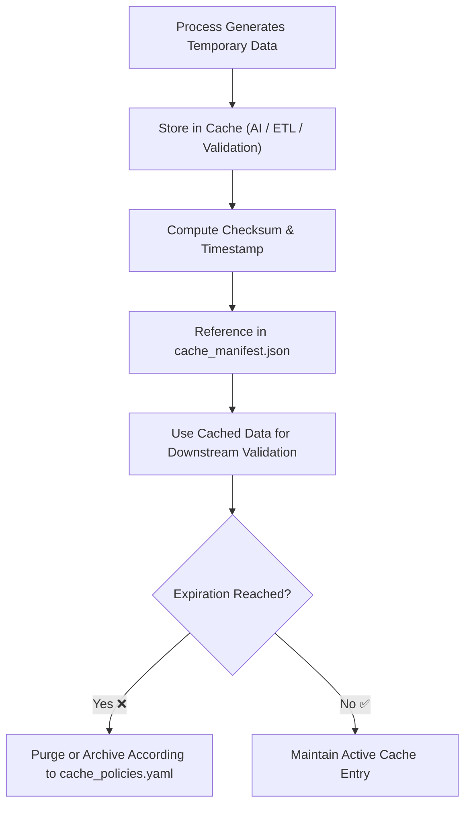

<div align="center">

# 🗄️ Kansas Frontier Matrix — **Cache**  
`data/work/staging/tabular/tmp/cache/`

### *“Speed is nothing without integrity — every cached byte has provenance.”*

**Purpose:**  
The **Cache Layer** acts as a **temporary high-speed storage zone** for intermediate tabular data, AI outputs, and validation artifacts generated within the Kansas Frontier Matrix (KFM) staging environment.  
It improves ETL performance, supports revalidation processes, and preserves short-lived computation results while maintaining FAIR+CARE alignment and complete traceability.

[](../../../../../../../../../docs/architecture/repo-focus.md)  
[](../../../../../../../../../LICENSE)  
[]()  
[]()  
[]()

</div>

---

## 🧭 Overview

The **Cache Layer** is designed to **accelerate data workflows** while preserving governance and reproducibility.  
It holds:
- AI intermediate inference results  
- Partial ETL and normalization computations  
- Temporary FAIR+CARE validation summaries  
- Pre-aggregation tables used for performance testing or visualization  
- Quick-access copies of frequently used tabular datasets  

Each cache entry is **checksum-verified, time-stamped, and auto-expired** under governance control.

---

## 🗂️ Directory Layout

```text
data/work/staging/tabular/tmp/cache/
├── etl_cache/                          # Temporary ETL intermediate tables
│   ├── etl_stage_buffer_001.parquet
│   ├── etl_temp_extract.csv
│   └── etl_cache_manifest.json
├── ai_cache/                           # AI inference and reasoning artifacts
│   ├── ai_inference_results.json
│   ├── ai_cache_manifest.json
│   └── model_response_cache.csv
├── validation_cache/                   # FAIR+CARE and schema validation precomputes
│   ├── faircare_temp_scores.json
│   ├── schema_diagnostics_snapshot.json
│   └── validation_cache_manifest.json
├── cache_policies.yaml                 # YAML policy defining TTL, retention, and auto-refresh
├── cache_manifest.json                 # Master index for all cache entities
└── README.md                           # This document
```

---

## 🔁 Cache Workflow



---

## 🧩 Cache Manifest Schema

| Field | Description | Example |
|-------|--------------|----------|
| `cache_id` | Unique cache entry identifier | `cache_ai_2025_10_26_001` |
| `category` | Cache layer type | `AI / ETL / Validation` |
| `file_path` | Path to cached artifact | `ai_cache/ai_inference_results.json` |
| `checksum` | SHA-256 integrity hash | `cf3d45e7a8812bb4e...` |
| `ttl_seconds` | Time-to-live before expiration | `86400` |
| `created_at` | Cache creation timestamp | `2025-10-26T17:04:31Z` |
| `last_accessed` | Most recent retrieval timestamp | `2025-10-26T17:10:02Z` |
| `status` | Cache state | `Active / Expired / Purged` |
| `provenance_link` | Governance record entry | `governance/cache_ledger.jsonld#cache_ai_2025_10_26_001` |

---

## ⚙️ Cache Management Components

| Component | Function | Output |
|------------|-----------|---------|
| **ETL Cache Manager** | Stores temporary ETL transformation data | `etl_cache_manifest.json` |
| **AI Cache Handler** | Saves AI inference and explainability outputs | `ai_cache_manifest.json` |
| **Validation Cache Engine** | Retains FAIR+CARE and schema test results | `validation_cache_manifest.json` |
| **Policy Controller** | Applies cache retention and auto-refresh rules | `cache_policies.yaml` |
| **Governance Registrar** | Logs cache creation and purges to provenance ledger | `cache_manifest.json` |

> 🧠 *Even transient data in KFM is accountable — caching is designed for speed with integrity.*

---

## ⚙️ Curator & Engineer Workflow

1. Configure cache parameters and TTL in `cache_policies.yaml`.  
2. When executing pipelines, direct temporary outputs to the cache:
   ```bash
   make cache-store
   ```
3. Review active cache entries:
   ```bash
   make cache-list
   ```
4. Validate checksum and expiry compliance:
   ```bash
   make cache-verify
   ```
5. Purge expired entries or archive as provenance records:
   ```bash
   make cache-purge
   ```

---

## 📈 Cache Performance Metrics

| Metric | Description | Target |
|---------|-------------|---------|
| **Cache Hit Rate** | % of requests served from cache | ≥ 0.85 |
| **Cache Expiry Compliance** | % of expired entries purged on schedule | 100% |
| **Checksum Verification Rate** | % of cache entries integrity-verified | 100% |
| **Average Retrieval Latency** | Mean access time per cached file | ≤ 50ms |
| **Governance Logging Rate** | Cache operations recorded in ledger | 100% |

---

## 🧾 Compliance Matrix

| Standard | Scope | Validator |
|-----------|--------|-----------|
| **FAIR+CARE** | Ethical transparency in temporary data handling | `fair-audit` |
| **MCP-DL v6.3** | Documentation-first ephemeral data management | `docs-validate` |
| **ISO/IEC 23053:2022** | AI operational lifecycle and cache control | `ai-validate` |
| **CIDOC CRM / PROV-O** | Provenance lineage for cached data artifacts | `graph-lint` |
| **STAC / DCAT 3.0** | Metadata and temporal indexing of cache contents | `stac-validate` |

---

## 🪶 Version History

| Version | Date | Author | Notes |
|----------|------|---------|-------|
| v9.0.0 | 2025-10-26 | `@kfm-architecture` | Initial creation of Cache documentation under Diamond⁹ Ω / Crown∞Ω certification. |

---

<div align="center">

### 🜂 Kansas Frontier Matrix — *Acceleration · Accountability · Ephemerality*  
**“Temporary doesn’t mean untraceable — speed and integrity can coexist.”**

[]()
[]()
[]()
[]()
[]()

<br><br>
<a href="#-kansas-frontier-matrix--cache-temporary-data-acceleration--reuse-layer--diamond⁹-Ω--crown∞Ω-certified">⬆ Back to Top</a>

</div>
