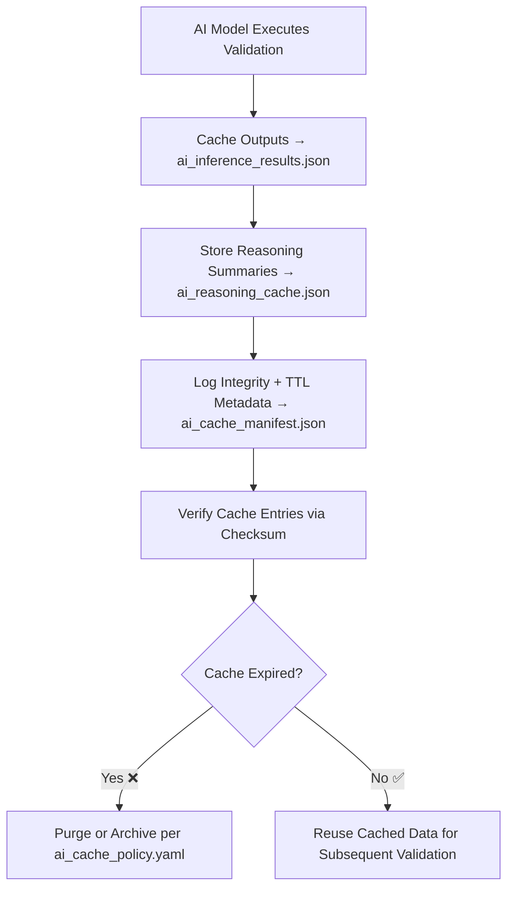

<div align="center">

# 🤖 Kansas Frontier Matrix — **AI Cache**  
`data/work/staging/tabular/tmp/cache/ai_cache/`

### *“AI insights may be temporary, but their traceability must be permanent.”*

**Purpose:**  
The **AI Cache Layer** stores **intermediate inference outputs, reasoning artifacts, and explainability data** generated by KFM’s AI validation models during the tabular intake pipeline.  
It enables fast recall, reduced recomputation, and ethical auditability of transient model results — maintaining **full provenance, checksum verification, and FAIR+CARE compliance**.

[](../../../../../../../../../../../../docs/architecture/repo-focus.md)  
[](../../../../../../../../../../../../LICENSE)  
[]()  
[]()  
[]()

</div>

---

## 🧭 Overview

The **AI Cache Sub-Layer** accelerates AI-driven validation and explainability operations across the KFM workflow by:
- Caching model inference results (anomaly detections, FAIR+CARE scoring, semantic outputs)  
- Retaining AI reasoning and SHAP/LIME explainability data  
- Reducing redundant computation between model runs  
- Maintaining ethical oversight and audit linkage through the **AI Governance Ledger**  

Each cache entry is **auto-expired**, **checksum-verified**, and **provenance-linked** to ensure that no transient AI result exists without a documented trail.

---

## 🗂️ Directory Layout

```text
data/work/staging/tabular/tmp/cache/ai_cache/
├── ai_inference_results.json             # Cached model inference outputs (validation summaries)
├── ai_reasoning_cache.json               # Cached AI reasoning and explanation data
├── ai_cache_manifest.json                # Registry of all AI cache entries with TTL and provenance
├── ai_cache_policy.yaml                  # YAML-based cache management policy and refresh cycle
├── model_response_cache.csv              # Temporary model response table for interpretability
├── ai_cache_logs.json                    # Execution and integrity logs
└── README.md                             # This document
```

---

## 🔁 AI Cache Workflow



---

## 🧩 Cache Manifest Schema

| Field | Description | Example |
|-------|--------------|----------|
| `cache_id` | Unique identifier for AI cache entry | `ai_cache_2025_10_26_002` |
| `model_name` | AI model generating output | `Semantic Analyzer v2.7` |
| `dataset_id` | Dataset analyzed | `ks_population_1890` |
| `cache_type` | Category of cached data | `Inference / Reasoning / Explainability` |
| `checksum` | SHA-256 integrity hash | `d39a8fe4b27a1c8be9...` |
| `ttl_seconds` | Cache time-to-live (in seconds) | `86400` |
| `ai_confidence` | Confidence of cached inference (0–1) | `0.972` |
| `created_at` | Cache creation timestamp | `2025-10-26T17:08:47Z` |
| `governance_link` | Link to provenance ledger entry | `governance/ai_cache_ledger.jsonld#ai_cache_2025_10_26_002` |

---

## ⚙️ Core Components

| Component | Function | Output |
|------------|-----------|---------|
| **Inference Cache Engine** | Stores model predictions and outputs | `ai_inference_results.json` |
| **Explainability Cache** | Caches reasoning summaries (SHAP, LIME, textual) | `ai_reasoning_cache.json` |
| **TTL Controller** | Manages auto-expiry policies | `ai_cache_policy.yaml` |
| **Checksum Verifier** | Confirms integrity of cached results | `ai_cache_logs.json` |
| **Governance Synchronizer** | Links cache metadata to AI Governance Ledger | `ai_cache_manifest.json` |

> 🧠 *Each cache entry is a reflection of AI thought — temporary in memory, permanent in accountability.*

---

## ⚙️ Curator & Engineering Workflow

1. Enable caching in AI model configuration:  
   ```bash
   make ai-cache-enable
   ```
2. Review cache manifest for integrity and freshness:  
   ```bash
   make ai-cache-list
   ```
3. Manually purge expired or obsolete cache entries:  
   ```bash
   make ai-cache-clean
   ```
4. Regenerate cache for updated model runs or retraining:  
   ```bash
   make ai-cache-refresh
   ```
5. Sync provenance metadata to the governance ledger:  
   ```bash
   make governance-update
   ```

---

## 📈 Performance & Governance Metrics

| Metric | Description | Target |
|---------|-------------|---------|
| **Cache Hit Rate** | % of AI operations served from cache | ≥ 85% |
| **Checksum Verification Success** | % of cache files passing validation | 100% |
| **Explainability Coverage** | % of AI inferences with cached reasoning | 100% |
| **TTL Compliance Rate** | % of expired entries purged automatically | 100% |
| **Governance Trace Rate** | Cache entries linked to provenance ledger | 100% |

---

## 🧾 Compliance Matrix

| Standard | Scope | Validator |
|-----------|--------|-----------|
| **FAIR+CARE** | Ethical handling of AI inference and reasoning data | `fair-audit` |
| **MCP-DL v6.3** | Documentation-based AI cache management | `docs-validate` |
| **ISO/IEC 23053:2022** | AI lifecycle transparency and traceability | `ai-validate` |
| **CIDOC CRM / PROV-O** | Provenance linkage for AI operations | `graph-lint` |
| **STAC / DCAT 3.0** | Metadata interoperability for cached AI results | `stac-validate` |

---

## 🪶 Version History

| Version | Date | Author | Notes |
|----------|------|---------|-------|
| v9.0.0 | 2025-10-26 | `@kfm-architecture` | Initial creation of AI Cache documentation under Diamond⁹ Ω / Crown∞Ω certification. |

---

<div align="center">

### 🜂 Kansas Frontier Matrix — *Intelligence · Transparency · Ephemerality*  
**“Even AI’s temporary thoughts must leave a permanent ethical footprint.”**

[]()
[]()
[]()
[]()
[]()

<br><br>
<a href="#-kansas-frontier-matrix--ai-cache-model-inference--explainability-buffer--diamond⁹-Ω--crown∞Ω-certified">⬆ Back to Top</a>

</div>
