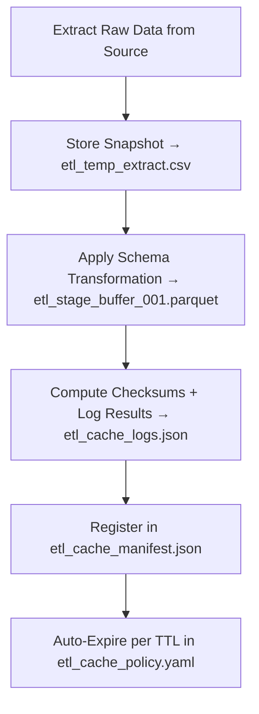

<div align="center">

# ⚙️ Kansas Frontier Matrix — **ETL Cache**  
`data/work/staging/tabular/tmp/cache/etl_cache/`

### *“Every extraction deserves a checkpoint — every transformation, a trace.”*

**Purpose:**  
The **ETL Cache Sub-Layer** functions as the **short-term buffer** for extracted and transformed data during Kansas Frontier Matrix (KFM) ETL pipelines.  
It stores intermediate tables, temporary transformations, and schema-mapped fragments used to accelerate multi-stage ingestion workflows — ensuring **speed, integrity, and provenance continuity**.

[](../../../../../../../../../../../../docs/architecture/repo-focus.md)  
[](../../../../../../../../../../../../LICENSE)  
[]()  
[]()  
[]()

</div>

---

## 🧭 Overview

The **ETL Cache Layer** is designed to support high-throughput ingestion workflows by retaining **intermediate transformation states**.  
It provides:
- Rapid access to extracted and partially transformed datasets  
- ETL checkpointing for resumable runs  
- FAIR+CARE-compliant metadata caching  
- Provenance continuity across extraction and transformation phases  
- Integration acceleration for repeated ingestion cycles  

All ETL cache entities are automatically **checksum-verified**, **time-stamped**, and **governance-logged** to preserve ethical and operational transparency.

---

## 🗂️ Directory Layout

```text
data/work/staging/tabular/tmp/cache/etl_cache/
├── etl_stage_buffer_001.parquet           # Intermediate Parquet buffer from active ETL job
├── etl_temp_extract.csv                   # Temporary extract file under transformation
├── etl_cache_manifest.json                # Registry of cached ETL tables and checkpoints
├── etl_cache_policy.yaml                  # TTL and auto-refresh settings for cached ETL data
├── etl_cache_logs.json                    # Execution logs and checksum validation history
└── README.md                              # This document
```

---

## 🔁 ETL Cache Workflow



---

## 🧩 Cache Manifest Schema

| Field | Description | Example |
|-------|--------------|----------|
| `cache_id` | Unique identifier for cached ETL entry | `etl_cache_2025_10_26_001` |
| `source_dataset` | Dataset under ETL processing | `ks_hydrology_streams` |
| `file_name` | Cached file name | `etl_stage_buffer_001.parquet` |
| `records_cached` | Number of records stored in cache | `480,512` |
| `checksum` | SHA-256 hash verifying cache integrity | `a3f9b8e715cd209cbbf...` |
| `cache_ttl_seconds` | Cache lifetime before purge | `86400` |
| `status` | Cache state | `Active / Expired / Purged` |
| `timestamp` | Time of creation or refresh | `2025-10-26T17:06:12Z` |
| `governance_ref` | Provenance ledger entry link | `governance/etl_cache_ledger.jsonld#etl_cache_2025_10_26_001` |

---

## ⚙️ Core Cache Components

| Component | Function | Output |
|------------|-----------|---------|
| **ETL Extractor** | Pulls raw datasets from source systems | `etl_temp_extract.csv` |
| **Transformer Buffer** | Stores schema-aligned intermediate results | `etl_stage_buffer_001.parquet` |
| **Checksum Validator** | Verifies cache integrity and log entries | `etl_cache_logs.json` |
| **TTL Controller** | Manages cache expiration and retention | `etl_cache_policy.yaml` |
| **Governance Integrator** | Registers ETL cache provenance and ledger linkage | `etl_cache_manifest.json` |

> 🧠 *Each cached ETL artifact represents a step in the reproducibility chain — transient, but traceable.*

---

## ⚙️ Curator & Engineer Workflow

1. Create ETL cache entry during pipeline execution:
   ```bash
   make etl-cache-store
   ```
2. Inspect manifest for cache health:
   ```bash
   make etl-cache-list
   ```
3. Validate checksum and expiration compliance:
   ```bash
   make etl-cache-verify
   ```
4. Manually purge expired entries or refresh active caches:
   ```bash
   make etl-cache-clean
   ```
5. Sync metadata to governance ledger:
   ```bash
   make governance-update
   ```

---

## 📈 Cache Performance Metrics

| Metric | Description | Target |
|---------|-------------|---------|
| **Cache Hit Rate** | % of ETL operations using cached data | ≥ 0.9 |
| **TTL Expiry Compliance** | % of expired entries purged on time | 100% |
| **Checksum Verification Success** | Integrity validation rate of cached files | 100% |
| **Revalidation Speed Gain** | Average speed increase from caching | ≥ 2× |
| **Governance Trace Coverage** | Cache operations linked to provenance records | 100% |

---

## 🧾 Compliance Matrix

| Standard | Scope | Validator |
|-----------|--------|-----------|
| **FAIR+CARE** | Ethical and transparent data handling in ETL | `fair-audit` |
| **MCP-DL v6.3** | Documentation-based cache reproducibility | `docs-validate` |
| **ISO/IEC 23053:2022** | AI & data lifecycle observability | `ai-validate` |
| **CIDOC CRM / PROV-O** | Provenance traceability for ETL checkpoints | `graph-lint` |
| **STAC / DCAT 3.0** | Metadata and schema compatibility | `stac-validate` |

---

## 🪶 Version History

| Version | Date | Author | Notes |
|----------|------|---------|-------|
| v9.0.0 | 2025-10-26 | `@kfm-architecture` | Initial creation of ETL Cache documentation under Diamond⁹ Ω / Crown∞Ω certification. |

---

<div align="center">

### 🜂 Kansas Frontier Matrix — *Speed · Provenance · Reproducibility*  
**“Temporary data should never mean temporary accountability.”**

[]()
[]()
[]()
[]()
[]()

<br><br>
<a href="#-kansas-frontier-matrix--etl-cache-intermediate-extraction--transformation-layer--diamond⁹-Ω--crown∞Ω-certified">⬆ Back to Top</a>

</div>
