<div align="center">

# ✅ Kansas Frontier Matrix — **Validation Cache**  
`data/work/staging/tabular/tmp/cache/validation_cache/`

### *“Validation speed means nothing without verifiable consistency.”*

**Purpose:**  
The **Validation Cache Layer** provides a high-performance staging zone for storing **intermediate schema, FAIR+CARE, and integrity validation results** generated across the Kansas Frontier Matrix (KFM) pipeline.  
It accelerates repeated validation workflows while preserving full **transparency, integrity, and ethical traceability**.

[](../../../../../../../../../../../../docs/architecture/repo-focus.md)  
[](../../../../../../../../../../../../LICENSE)  
[]()  
[]()  
[]()

</div>

---

## 🧭 Overview

The **Validation Cache Sub-Layer** enables rapid reuse of validation outcomes across multiple ETL and normalization jobs.  
It holds precomputed results from:
- **Schema Validation (STAC/DCAT/CIDOC compliance)**  
- **Checksum and Data Integrity Verification**  
- **FAIR+CARE Ethical and Metadata Scoring**  
- **AI-assisted validation diagnostics**  

Each cache record is versioned, checksum-verified, and registered in the governance ledger to ensure reproducibility and audit readiness.

---

## 🗂️ Directory Layout

```text
data/work/staging/tabular/tmp/cache/validation_cache/
├── faircare_temp_scores.json            # Cached FAIR+CARE evaluation summaries
├── schema_diagnostics_snapshot.json     # Cached results from schema validation engine
├── validation_cache_manifest.json       # Index of cached validation files and TTL metadata
├── validation_cache_policy.yaml         # Policy defining retention, refresh, and expiry cycles
├── integrity_results_cache.json         # Temporary checksum and hash comparison records
├── validation_cache_logs.json           # Performance and cache verification logs
└── README.md                            # This document
```

---

## 🔁 Validation Cache Workflow

```mermaid
flowchart TD
    A["Run Schema/FAIR+CARE Validation"] --> B["Store Results in Validation Cache"]
    B --> C["Compute Checksums + TTL Metadata"]
    C --> D["Update Cache Manifest → validation_cache_manifest.json"]
    D --> E["Use Cached Results for Repeated Jobs"]
    E --> F{"Cache Expired?"}
    F -- "Yes ❌" --> G["Purge According to validation_cache_policy.yaml"]
    F -- "No ✅" --> H["Maintain Active Validation Cache Entry"]
```



---

## 🧩 Validation Cache Manifest Schema

| Field | Description | Example |
|-------|--------------|----------|
| `cache_id` | Unique cache entry identifier | `validation_cache_2025_10_26_001` |
| `validation_type` | Type of validation performed | `FAIR+CARE / Schema / Checksum` |
| `file_path` | Cached validation file path | `schema_diagnostics_snapshot.json` |
| `ttl_seconds` | Time-to-live for cached entry | `86400` |
| `checksum` | SHA-256 integrity hash | `b2f1c983bd45e9a6a1b...` |
| `validation_status` | Status of cached result | `Valid / Outdated / Expired` |
| `created_at` | Cache creation timestamp | `2025-10-26T17:09:55Z` |
| `governance_link` | Provenance reference to ledger entry | `governance/validation_cache_ledger.jsonld#validation_cache_2025_10_26_001` |

---

## ⚙️ Core Cache Components

| Component | Function | Output |
|------------|-----------|---------|
| **Schema Validation Engine** | Generates cached schema diagnostics for reuse | `schema_diagnostics_snapshot.json` |
| **FAIR+CARE Evaluator** | Computes cached ethical and metadata scores | `faircare_temp_scores.json` |
| **Integrity Verifier** | Caches hash comparisons for rapid revalidation | `integrity_results_cache.json` |
| **TTL Controller** | Manages cache refresh, expiry, and purge schedule | `validation_cache_policy.yaml` |
| **Governance Registrar** | Logs cache creation and purges to provenance ledger | `validation_cache_manifest.json` |

> 🧠 *Caching validation results means faster science — without sacrificing reproducibility or ethical oversight.*

---

## ⚙️ Curator & Engineer Workflow

1. Enable validation caching in pipeline config:
   ```bash
   make validation-cache-enable
   ```
2. Run validations (schema, FAIR+CARE, checksum):
   ```bash
   make validate-data
   ```
3. Reuse cached results for subsequent runs:
   ```bash
   make validation-cache-restore
   ```
4. Purge or refresh expired caches:
   ```bash
   make validation-cache-clean
   ```
5. Sync all cached entries to governance ledger:
   ```bash
   make governance-update
   ```

---

## 📈 Validation Cache Metrics

| Metric | Description | Target |
|---------|-------------|---------|
| **Cache Reuse Rate** | % of validations completed from cache | ≥ 85% |
| **Checksum Verification Success** | Cache integrity validation rate | 100% |
| **TTL Compliance Rate** | Expired entries purged per policy | 100% |
| **Validation Speed Increase** | Time improvement using cache | ≥ 3× baseline |
| **Governance Traceability** | Cache-to-ledger record linkage rate | 100% |

---

## 🧾 Compliance Matrix

| Standard | Scope | Validator |
|-----------|--------|-----------|
| **FAIR+CARE** | Ethical reproducibility and validation governance | `fair-audit` |
| **MCP-DL v6.3** | Documentation-first validation traceability | `docs-validate` |
| **CIDOC CRM / DCAT 3.0** | Metadata and schema alignment documentation | `graph-lint` |
| **ISO/IEC 23053:2022** | AI and validation lifecycle observability | `ai-validate` |
| **STAC / DCAT 3.0** | Cached validation result interoperability | `stac-validate` |

---

## 🪶 Version History

| Version | Date | Author | Notes |
|----------|------|---------|-------|
| v9.0.0 | 2025-10-26 | `@kfm-architecture` | Initial creation of Validation Cache documentation under Diamond⁹ Ω / Crown∞Ω certification. |

---

<div align="center">

### 🜂 Kansas Frontier Matrix — *Verification · Efficiency · Provenance*  
**“Speed without transparency is a shortcut — validation cache ensures both.”**

[]()
[]()
[]()
[]()
[]()

<br><br>
<a href="#-kansas-frontier-matrix--validation-cache-schema--faircare-pre-validation-layer--diamond⁹-Ω--crown∞Ω-certified">⬆ Back to Top</a>

</div>
