<div align="center">

# ⚖️ Kansas Frontier Matrix — **Conflict Resolution**  
`data/work/staging/tabular/tmp/conflict_resolution/`

### *“Truth in data is rarely singular — resolution is how we make it shared.”*

**Purpose:**  
The **Conflict Resolution Layer** manages **semantic, structural, and provenance discrepancies** detected after normalization in the Kansas Frontier Matrix (KFM).  
It ensures that data inconsistencies — whether across temporal records, sources, or schemas — are **identified, adjudicated, and documented** transparently under FAIR+CARE governance.

[](../../../../../../../../../docs/architecture/repo-focus.md)  
[](../../../../../../../../../LICENSE)  
[]()  
[]()  
[]()

</div>

---

## 🧭 Overview

The **Conflict Resolution Layer** acts as KFM’s **data arbitration environment** — the ethical and technical buffer where contradictory or overlapping information is resolved through documented governance workflows.  
Conflicts may arise from:
- Duplicate or inconsistent records between sources  
- Schema field mismatches after normalization  
- AI or human disagreement in classification outcomes  
- Divergent temporal or spatial metadata alignment  

This layer enables KFM to achieve **consensus-driven truth** through **traceable, explainable, and auditable reconciliation logic**.

---

## 🗂️ Directory Layout

```text
data/work/staging/tabular/tmp/conflict_resolution/
├── detected_conflicts.json             # Catalog of all identified data inconsistencies
├── ai_conflict_analysis.json           # AI-generated semantic and statistical comparison reports
├── human_resolution_notes.json         # Curator and governance-led adjudication records
├── reconciliation_rules.yaml           # YAML-defined resolution logic and decision hierarchy
├── merged_resolutions.json             # Final resolved outputs (with provenance linkage)
├── conflict_manifest.json              # Registry of all conflict cases and outcomes
└── README.md                           # This document
```

---

## 🔁 Conflict Resolution Workflow

```mermaid
flowchart TD
    A["Normalized Outputs Loaded"] --> B["Run AI & Schema Conflict Detection"]
    B --> C["Log Findings → detected_conflicts.json"]
    C --> D["AI Generates Suggested Reconciliations → ai_conflict_analysis.json"]
    D --> E["Human Curator Reviews / Overrides via human_resolution_notes.json"]
    E --> F["Finalize Decisions → merged_resolutions.json"]
    F --> G["Record Provenance & Audit Trail → conflict_manifest.json + Governance Ledger"]
```



---

## 🧩 Conflict Manifest Schema

| Field | Description | Example |
|-------|--------------|----------|
| `conflict_id` | Unique identifier for conflict case | `conflict_2025_10_26_014` |
| `dataset_id` | Dataset(s) involved in conflict | `ks_treaty_records_1851` |
| `conflict_type` | Nature of conflict | `Field Mismatch / Temporal Discrepancy / Provenance Divergence` |
| `ai_recommendation` | AI-suggested resolution | `"Retain value from source with highest confidence weight (0.97)."` |
| `human_decision` | Curator or governance resolution | `"Merged sources A+B with averaged confidence; documented reasoning in notes."` |
| `resolution_confidence` | Final consensus confidence | `0.945` |
| `timestamp` | UTC time of conflict resolution | `2025-10-26T17:00:28Z` |
| `governance_ref` | Ledger provenance link | `governance/conflict_resolution_ledger.jsonld#conflict_2025_10_26_014` |

---

## ⚙️ Core Components

| Component | Function | Output |
|------------|-----------|---------|
| **Conflict Detector** | Identifies inconsistencies between normalized datasets | `detected_conflicts.json` |
| **AI Resolution Engine** | Suggests reconciliation paths using probabilistic reasoning | `ai_conflict_analysis.json` |
| **Human Oversight Module** | Records curator decisions and governance approvals | `human_resolution_notes.json` |
| **Rule Hierarchy System** | Defines deterministic resolution logic for recurring cases | `reconciliation_rules.yaml` |
| **Provenance Integrator** | Logs conflict outcomes and decisions in governance records | `conflict_manifest.json` |

> 🧠 *Resolution does not erase disagreement — it transforms uncertainty into accountable consensus.*

---

## ⚙️ Curator & Governance Workflow

1. Review detected discrepancies listed in `detected_conflicts.json`.  
2. Evaluate AI suggestions in `ai_conflict_analysis.json`.  
3. Apply or override recommendations using `human_resolution_notes.json`.  
4. Document reconciliation logic and reasoning under `reconciliation_rules.yaml`.  
5. Finalize merged results into `merged_resolutions.json`.  
6. Update governance ledger for traceability:
   ```bash
   make governance-update
   ```

---

## 📈 Resolution Metrics

| Metric | Description | Target |
|---------|-------------|---------|
| **Conflict Detection Accuracy** | Precision of AI conflict identification | ≥ 0.93 |
| **Human-AI Agreement Rate** | Ratio of accepted AI recommendations | ≥ 0.85 |
| **Resolution Completion Rate** | % of conflicts resolved and documented | 100% |
| **FAIR+CARE Compliance** | % of reconciliations with ethical metadata | 100% |
| **Governance Traceability** | % of cases recorded in provenance ledger | 100% |

---

## 🧾 Compliance Matrix

| Standard | Scope | Validator |
|-----------|--------|-----------|
| **FAIR+CARE** | Ethical and transparent conflict resolution framework | `fair-audit` |
| **MCP-DL v6.3** | Documentation-first governance and reconciliation | `docs-validate` |
| **CIDOC CRM / DCAT 3.0** | Semantic and metadata lineage verification | `graph-lint` |
| **ISO 19115 / 19157** | Data quality and consistency assurance | `geojson-lint` |
| **STAC / DCAT 3.0** | Cross-dataset interoperability and resolution metadata | `stac-validate` |

---

## 🪶 Version History

| Version | Date | Author | Notes |
|----------|------|---------|-------|
| v9.0.0 | 2025-10-26 | `@kfm-architecture` | Initial creation of Conflict Resolution documentation under Diamond⁹ Ω / Crown∞Ω certification. |

---

<div align="center">

### 🜂 Kansas Frontier Matrix — *Reconciliation · Transparency · Ethics*  
**“Resolution is not about removing differences — it’s about documenting how we learned from them.”**

[]()
[]()
[]()
[]()
[]()

<br><br>
<a href="#-kansas-frontier-matrix--conflict-resolution-data-reconciliation--provenance-integrity-layer--diamond⁹-Ω--crown∞Ω-certified">⬆ Back to Top</a>

</div>
