<div align="center">

# 🚀 Kansas Frontier Matrix — **ETL Runs**  
`data/work/staging/tabular/tmp/etl_runs/`

### *“Pipelines aren’t just processes — they’re documented acts of transformation.”*

**Purpose:**  
The **ETL Runs Layer** is the **operational heartbeat of data ingestion** within the Kansas Frontier Matrix (KFM).  
It captures every Extract, Transform, and Load (ETL) execution, logging its parameters, transformations, errors, and results — ensuring that every dataset movement is **traceable, reproducible, and ethically compliant**.

[](../../../../../../../../../docs/architecture/repo-focus.md)  
[](../../../../../../../../../LICENSE)  
[]()  
[]()  
[]()

</div>

---

## 🧭 Overview

The **ETL Runs Layer** records every data pipeline operation that moves or transforms datasets through the KFM system.  
This includes:
- Extraction from source repositories  
- Schema and metadata transformation  
- AI validation and FAIR+CARE enrichment  
- Loading of harmonized data into staging or normalized zones  

All ETL activities are **governance-tracked**, **checksum-verified**, and **timestamped**, forming an immutable chain of operational provenance.

---

## 🗂️ Directory Layout

```text
data/work/staging/tabular/tmp/etl_runs/
├── etl_run_history.json               # Chronological registry of all ETL runs
├── etl_run_trace.log                  # Human-readable execution log of ETL actions
├── etl_run_parameters.yaml            # Parameter configuration for current ETL job
├── etl_validation_report.json         # Post-run validation and FAIR+CARE compliance report
├── etl_performance_metrics.json       # Timing, success rates, and throughput statistics
├── etl_run_failures.log               # Captures pipeline errors and resolution status
├── etl_checkpoint_manifest.json       # Checkpoints for resumable ETL runs
└── README.md                          # This document
```

---

## 🔁 ETL Lifecycle Workflow

```mermaid
flowchart TD
    A["Extract Data from Source"] --> B["Transform → Schema, Metadata, FAIR+CARE"]
    B --> C["Run Validation + AI Enrichment"]
    C --> D["Load → Staging or Normalization Buffer"]
    D --> E["Record Process → etl_run_trace.log"]
    E --> F["Log Telemetry + Metrics → etl_performance_metrics.json"]
    F --> G["Register Provenance → etl_run_history.json + Governance Ledger"]
```



---

## 🧩 ETL Run History Schema

| Field | Description | Example |
|-------|--------------|----------|
| `run_id` | Unique identifier for ETL execution | `etl_2025_10_26_007` |
| `dataset_id` | Dataset being processed | `ks_population_1890` |
| `source` | Source repository or API | `data_sources/kansas_census_archive` |
| `etl_stage` | Processing phase | `Extraction / Transformation / Load` |
| `records_processed` | Total records handled in run | `285,402` |
| `status` | Final state of ETL run | `Completed / Failed / Partial` |
| `runtime_seconds` | Duration of ETL process | `126.47` |
| `checksum` | Hash for run integrity | `e48aa2dfc915fe2c6a...` |
| `timestamp` | UTC time of ETL completion | `2025-10-26T17:02:14Z` |
| `governance_ref` | Linked provenance record | `governance/etl_runs_ledger.jsonld#etl_2025_10_26_007` |

---

## ⚙️ ETL Run Components

| Component | Function | Output |
|------------|-----------|---------|
| **Extractor Module** | Ingests datasets from registered sources | Raw or intermediate files |
| **Transformer Module** | Applies schema, ontology, and FAIR+CARE harmonization | Normalized datasets |
| **Validator Module** | Executes schema, checksum, and ethical validations | `etl_validation_report.json` |
| **Loader Module** | Loads processed data into staging or graph nodes | `etl_run_history.json` |
| **Metrics Tracker** | Logs timing and performance telemetry | `etl_performance_metrics.json` |
| **Failure Monitor** | Records pipeline errors and retries | `etl_run_failures.log` |

> 🧠 *Each ETL run is a reproducible, documented workflow — no transformations occur outside the governance trail.*

---

## ⚙️ Curator & Engineering Workflow

1. Configure ETL parameters for dataset extraction:
   ```bash
   make etl-configure
   ```
2. Run ETL job with validation and telemetry logging:
   ```bash
   make etl-run
   ```
3. Review `etl_validation_report.json` and `etl_run_trace.log`.  
4. Validate FAIR+CARE compliance scores.  
5. Sync run metadata and metrics with governance ledger:
   ```bash
   make governance-update
   ```

---

## 📈 ETL Performance & Audit Metrics

| Metric | Description | Target |
|---------|-------------|---------|
| **ETL Success Rate** | % of completed ETL runs without error | ≥ 98% |
| **FAIR+CARE Compliance** | Average ethical and metadata completeness score | ≥ 0.95 |
| **Checksum Integrity** | Verification rate of output data hashes | 100% |
| **Throughput Efficiency** | Average data processed per second | ≥ 1,000 records/s |
| **Governance Traceability** | % of ETL runs linked to provenance ledger | 100% |

---

## 🧾 Compliance Matrix

| Standard | Scope | Validator |
|-----------|--------|-----------|
| **FAIR+CARE** | Ethical and transparent ETL governance | `fair-audit` |
| **MCP-DL v6.3** | Documentation-first data pipeline compliance | `docs-validate` |
| **ISO 9001:2015** | Process quality and reproducibility assurance | `quality-audit` |
| **CIDOC CRM / DCAT 3.0** | Metadata and schema standardization | `graph-lint` |
| **STAC / DCAT 3.0** | Cataloging and interoperability standards | `stac-validate` |

---

## 🪶 Version History

| Version | Date | Author | Notes |
|----------|------|---------|-------|
| v9.0.0 | 2025-10-26 | `@kfm-architecture` | Initial creation of ETL Runs documentation under Diamond⁹ Ω / Crown∞Ω certification. |

---

<div align="center">

### 🜂 Kansas Frontier Matrix — *Automation · Transparency · Provenance*  
**“A pipeline without provenance is just a guess — this is where the truth is logged.”**

[]()
[]()
[]()
[]()
[]()

<br><br>
<a href="#-kansas-frontier-matrix--etl-runs-data-pipeline-execution--provenance-tracking-layer--diamond⁹-Ω--crown∞Ω-certified">⬆ Back to Top</a>

</div>
