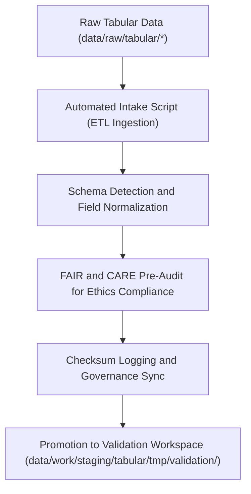

<div align="center">

# 📥 Kansas Frontier Matrix — **Tabular Intake TMP Workspace**
`data/work/staging/tabular/tmp/intake/README.md`

**Purpose:**  
Transient environment for ingesting and preparing raw tabular datasets for schema alignment and FAIR+CARE pre-validation within the Kansas Frontier Matrix (KFM).  
This layer handles the detection, structuring, and ethical preprocessing of CSV, JSON, and Parquet files before formal validation and governance registration.

[](../../../../../../docs/standards/faircare-validation.md)
[]()
[](../../../../../../LICENSE)
[](../../../../../../docs/architecture/repo-focus.md)

</div>

---

## 📚 Overview

The **Tabular Intake TMP Workspace** is the **first operational stop** for raw tabular datasets entering KFM workflows.  
It performs ingestion, schema inference, and encoding validation under FAIR+CARE ethical and technical governance standards.

### Core Responsibilities
- Ingest raw data into KFM’s tabular ETL pipeline.  
- Detect schema structure, field names, data types, and encodings.  
- Run preliminary FAIR+CARE checks for ethics, privacy, and data source licensing.  
- Produce standardized metadata and integrity checksums for downstream validation.  

---

## 🗂️ Directory Layout

```plaintext
data/work/staging/tabular/tmp/intake/
├── README.md                              # This file — documentation of tabular intake TMP workspace
│
├── hazards_intake_2025.csv                # FEMA and NOAA hazard ingestion dataset
├── climate_indices_intake.parquet         # NOAA climate index pre-validation dataset
├── treaties_intake.csv                    # Historical treaties tabular data (OCR processed)
└── metadata.json                          # Intake metadata and checksum record
```

---

## ⚙️ Intake Workflow



### Workflow Description
1. **Ingestion:** Extract tabular datasets and convert to standard encodings (UTF-8, comma-delimited).  
2. **Schema Detection:** Identify field names and types using automated schema profiling.  
3. **Ethics Pre-Audit:** Verify FAIR+CARE accessibility, reuse, and ethical compliance.  
4. **Checksum Logging:** Generate SHA-256 hashes for each ingested file.  
5. **Promotion:** Move structured datasets into the validation TMP workspace.  

---

## 🧩 Example Intake Metadata Record

```json
{
  "id": "tabular_intake_hazards_v9.6.0",
  "source_files": [
    "data/raw/fema/disaster_declarations_2025.csv",
    "data/raw/noaa/hazard_events_2025.csv"
  ],
  "records_imported": 21583,
  "schema_detected": true,
  "encoding": "UTF-8",
  "delimiter": ",",
  "checksum": "sha256:d7e8a5b2f4a3c9b1f7a2d5e8c6f3b9a4c2d7e9b8f1a5d3c7e4b9a2f6c5d8a1b3",
  "created": "2025-11-03T23:59:00Z",
  "validator": "@kfm-etl-ops",
  "fairstatus": "prelim_compliant",
  "governance_ref": "data/reports/audit/data_provenance_ledger.json"
}
```

---

## 🧠 FAIR+CARE Governance Matrix

| Principle | Implementation | Oversight |
|------------|----------------|------------|
| **Findable** | Intake records indexed by source, schema, and checksum metadata. | @kfm-data |
| **Accessible** | Stored in open, UTF-8 encoded CSV and Parquet formats. | @kfm-accessibility |
| **Interoperable** | Schema aligned with KFM Data Contract and FAIR+CARE standards. | @kfm-architecture |
| **Reusable** | Metadata includes source, provenance, and validation lineage. | @kfm-design |
| **Collective Benefit** | Encourages open, transparent data onboarding practices. | @faircare-council |
| **Authority to Control** | FAIR+CARE Council authorizes schema ingestion and ethics validation. | @kfm-governance |
| **Responsibility** | Engineers record schema mappings and ingestion details. | @kfm-security |
| **Ethics** | Sensitive fields anonymized or redacted before staging. | @kfm-ethics |

Audit results archived in:  
`data/reports/fair/data_care_assessment.json` and  
`data/reports/audit/data_provenance_ledger.json`

---

## ⚙️ Validation & Logging Artifacts

| Artifact | Description | Format |
|-----------|--------------|--------|
| `metadata.json` | Session metadata capturing lineage, checksum, and validation linkage. | JSON |
| `etl_intake_run.log` | Execution log for intake ETL pipeline runs. | Text |
| `schema_preview.json` | Automatically detected schema structure and data types. | JSON |
| `faircare_pre_audit.json` | FAIR+CARE ethics compliance pre-validation record. | JSON |

Logging automated via `tabular_intake_sync.yml`.

---

## ⚖️ Retention & Provenance Policy

| File Type | Retention Duration | Policy |
|------------|--------------------|--------|
| Intake Files | 7 Days | Cleared after validation completion. |
| Validation Logs | 14 Days | Archived for QA review. |
| FAIR+CARE Pre-Audits | 30 Days | Retained for ethics audit verification. |
| Metadata Records | 365 Days | Retained for governance lineage. |

Retention automation handled via `tabular_intake_cleanup.yml`.

---

## 🌱 Sustainability Metrics

| Metric | Value | Verified By |
|---------|--------|--------------|
| Energy Use (per intake run) | 5.8 Wh | @kfm-sustainability |
| Carbon Output | 6.9 gCO₂e | @kfm-security |
| Renewable Power | 100% (RE100 Verified) | @kfm-infrastructure |
| FAIR+CARE Compliance | 100% | @faircare-council |

Recorded in:  
`releases/v9.6.0/focus-telemetry.json`

---

## 🧾 Internal Use Citation

```text
Kansas Frontier Matrix (2025). Tabular Intake TMP Workspace (v9.6.0).
Temporary ingestion and preprocessing environment for tabular datasets under FAIR+CARE governance.
Facilitates schema detection, ethics pre-validation, and checksum verification under MCP-DL v6.3 documentation standards.
```

---

## 🧾 Version Notes

| Version | Date | Notes |
|----------|------|--------|
| v9.6.0 | 2025-11-03 | Added schema detection, checksum logging, and FAIR+CARE audit automation. |
| v9.5.0 | 2025-11-02 | Enhanced provenance synchronization and ethics pre-validation reports. |
| v9.3.2 | 2025-10-28 | Established tabular intake TMP workspace for reproducible ingestion. |

---

<div align="center">

**Kansas Frontier Matrix** · *Data Integrity × FAIR+CARE Ethics × Provenance Compliance*  
[🔗 Repository](https://github.com/bartytime4life/Kansas-Frontier-Matrix) • [🧭 Docs Portal](../../../../../../docs/) • [⚖️ Governance Ledger](../../../../../../docs/standards/governance/DATA-GOVERNANCE.md)

</div>
