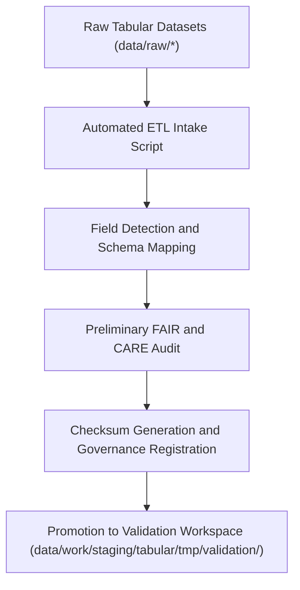

<div align="center">

# 📥 Kansas Frontier Matrix — **Tabular Intake TMP Workspace**
`data/work/staging/tabular/tmp/intake/README.md`

**Purpose:** Temporary workspace for ingesting and structuring raw tabular datasets before normalization, validation, and FAIR+CARE certification.  
This environment provides automated schema detection, field harmonization, and preliminary quality checks for tabular data entering Kansas Frontier Matrix (KFM) workflows.

[](../../../../../../docs/standards/faircare-validation.md)
[](../../../../../../LICENSE)
[](../../../../../../docs/architecture/repo-focus.md)

</div>

---

## 📚 Overview

The `data/work/staging/tabular/tmp/intake/` directory is the **first stop** for tabular datasets after extraction from raw sources.  
It provides a controlled ingestion layer where CSV, JSON, and Parquet files are structured, standardized, and prepared for validation.  
Here, automated ETL scripts map source fields to standardized schema definitions and run integrity checks.

### Primary Objectives:
- Import raw tabular data into the ETL pipeline for schema alignment.  
- Detect encoding, delimiter, and data type inconsistencies.  
- Apply early FAIR+CARE metadata tagging for traceability and ethics review.  
- Generate intake metadata and runtime logs for governance validation.  

---

## 🗂️ Directory Layout

```plaintext
data/work/staging/tabular/tmp/intake/
├── README.md                             # This file — overview of intake TMP workspace
│
├── hazards_intake_2025.csv               # FEMA + NOAA hazard table imported for staging
├── climate_indices_intake.parquet        # Normalized NOAA climate index data
├── treaties_intake.csv                   # Historical treaty metadata extracted from archives
└── metadata.json                         # Intake runtime and provenance metadata
```

---

## ⚙️ Intake Workflow



### Workflow Steps:
1. **Data Ingestion:** Raw files imported and converted into consistent formats (UTF-8, comma-delimited).  
2. **Schema Detection:** Field names mapped to target schema definitions in `data_contract_ref`.  
3. **Audit Pre-Check:** FAIR+CARE tags applied (license, source, provenance).  
4. **Checksum Logging:** Hashes generated for integrity tracking.  
5. **Promotion:** Intake-ready datasets moved to validation layer for QA.

---

## 🧩 Example Metadata Record

```json
{
  "id": "tabular_intake_climate_indices_v9.3.2",
  "source_files": [
    "data/raw/noaa/temperature_anomalies/kansas_temp_anomalies_2025.csv",
    "data/raw/noaa/drought_monitor/drought_monitor_2025.csv"
  ],
  "records_imported": 54012,
  "schema_detected": true,
  "delimiter": ",",
  "encoding": "UTF-8",
  "created": "2025-10-28T14:10:00Z",
  "validator": "@kfm-etl-ops",
  "checksum": "sha256:3b4e88de94f4a54c8a3c3d9c312cf3c81b7b1a43...",
  "fairstatus": "prelim_compliant",
  "governance_ledger_ref": "data/reports/audit/data_provenance_ledger.json"
}
```

---

## 🧠 FAIR+CARE Compliance in Data Intake

| Principle | Implementation |
|------------|----------------|
| **Findable** | Datasets assigned unique intake IDs and logged in provenance ledger. |
| **Accessible** | Stored as UTF-8 CSV or Parquet; accessible to internal validators. |
| **Interoperable** | Field mappings aligned with JSON Schema and DCAT contracts. |
| **Reusable** | Metadata records include source, checksum, and schema linkage. |
| **Collective Benefit** | Prepares datasets for ethical publication under FAIR+CARE review. |
| **Authority to Control** | Governance Council approves schema definitions and mappings. |
| **Responsibility** | Intake logs must capture all field transformations. |
| **Ethics** | Sensitive columns removed or anonymized during ingestion. |

Audit data linked to:  
`data/reports/fair/data_care_assessment.json` and `data/reports/audit/data_provenance_ledger.json`.

---

## ⚙️ Key Tools Used

| Tool | Function | Output |
|------|-----------|--------|
| **Pandas / Dask** | Tabular data ingestion and field mapping. | CSV / Parquet |
| **Great Expectations** | Data type validation and QA checks. | JSON summary |
| **FAIR+CARE Validator** | Ethical and accessibility pre-audit. | JSON report |
| **Python ETL Framework (src/pipelines/etl/)** | Automated schema normalization. | CSV / Parquet |

---

## ⚖️ Governance & Provenance Integration

| Record | Description |
|---------|-------------|
| `metadata.json` | Captures dataset provenance, checksum, and runtime metadata. |
| `data/reports/audit/data_provenance_ledger.json` | Logs ingestion lineage and FAIR+CARE intake verification. |
| `data/reports/validation/schema_validation_summary.json` | Cross-references schema definitions with ingestion records. |
| `releases/v9.3.2/manifest.zip` | Tracks checksum and manifest entries for reproducibility. |

Governance synchronization performed via `tabular_intake_sync.yml`.

---

## 🧾 Retention Policy

| File Type | Retention Duration | Policy |
|------------|--------------------|--------|
| Intake Files | 7 days | Purged after validation success. |
| Metadata | 365 days | Retained permanently in provenance records. |
| FAIR+CARE Reports | 30 days | Archived for ethics review. |
| Logs | 14 days | Transferred to system logs for historical tracking. |

Automated cleanup handled by `tabular_tmp_cleanup.yml`.

---

## 🧾 Internal Use Citation

```text
Kansas Frontier Matrix (2025). Tabular Intake TMP Workspace (v9.3.2).
Temporary ingestion workspace for schema mapping, FAIR+CARE tagging, and checksum validation of tabular datasets.
Restricted to internal ETL and governance review operations.
```

---

## 🧾 Version Notes

| Version | Date | Notes |
|----------|------|--------|
| v9.3.2 | 2025-10-28 | Added FAIR+CARE pre-audit integration and automated schema detection. |
| v9.2.0 | 2024-07-15 | Introduced data contract linkage and provenance checksum registry. |
| v9.0.0 | 2023-01-10 | Established tabular intake TMP workspace for ETL staging ingestion. |

---

<div align="center">

**Kansas Frontier Matrix** · *Data Integrity × FAIR+CARE Ethics × Reproducible Schema Mapping*  
[🔗 Repository](https://github.com/bartytime4life/Kansas-Frontier-Matrix) • [🧭 Docs Portal](../../../../../../docs/) • [⚖️ Governance Ledger](../../../../../../docs/standards/governance/)

</div>
