<div align="center">

# 📥 Kansas Frontier Matrix — **Tabular Intake TMP Workspace**
`data/work/staging/tabular/tmp/intake/README.md`

**Purpose:** Temporary workspace for ingesting and structuring raw tabular datasets before normalization, validation, and FAIR+CARE certification.  
Provides automated schema detection, field harmonization, checksum creation, and preliminary ethical tagging for tabular data entering Kansas Frontier Matrix (KFM) workflows.

[](../../../../../../docs/standards/faircare-validation.md)
[](../../../../../../LICENSE)
[](../../../../../../docs/architecture/repo-focus.md)

</div>

---

## 📚 Overview

The `data/work/staging/tabular/tmp/intake/` directory is the **first stop** for tabular datasets after extraction from raw sources.  
It provides a controlled ingestion layer where CSV, JSON, and Parquet files are structured, standardized, and prepared for validation.  
Automated ETL scripts map source fields to standardized schema definitions and run integrity checks.

### Primary Objectives
- Import raw tabular data and align to **data contracts**.  
- Detect encoding, delimiter, and data type inconsistencies.  
- Apply early FAIR+CARE metadata tagging for traceability and ethics review.  
- Generate intake metadata, checksums, and runtime logs for governance validation.  
- Emit **telemetry** for intake runtime, row counts, and basic anomaly metrics.

---

## 🗂️ Directory Layout

```plaintext
data/work/staging/tabular/tmp/intake/
├── README.md
│
├── hazards_intake_2025.csv               # FEMA + NOAA hazard table imported for staging
├── climate_indices_intake.parquet        # NOAA climate indices prepared for staging
├── treaties_intake.csv                   # Historical treaty metadata extracted from archives
└── metadata.json                         # Intake runtime, checksum, and telemetry metadata
```

---

## ⚙️ Intake Workflow

```mermaid
flowchart TD
    A["Raw Tabular Datasets (data/raw/*)"] --> B["Automated ETL Intake Script"]
    B --> C["Field Detection & Schema Mapping → data_contract_ref"]
    C --> D["Preliminary FAIR+CARE Audit & License Tagging"]
    D --> E["Checksum Generation & Governance Registration"]
    E --> F["Promotion → Validation (data/work/staging/tabular/tmp/validation/) + Telemetry"]
```



### Workflow Steps
1. **Data Ingestion:** Convert raw files to consistent encodings (UTF-8) and formats (CSV/Parquet).  
2. **Schema Detection:** Map source fields to target schema defined by **data_contract_ref**.  
3. **Ethics Pre-Check:** Apply FAIR+CARE tags (license, provenance, accessibility).  
4. **Checksum Logging:** Generate cryptographic hashes for integrity tracking.  
5. **Promotion:** Move intake-ready datasets to validation for structural QA; register telemetry.

---

## 🧩 Example Metadata Record

```json
{
  "id": "tabular_intake_climate_indices_v9.4.0",
  "source_files": [
    "data/raw/noaa/temperature_anomalies/kansas_temp_anomalies_2025.csv",
    "data/raw/noaa/drought_monitor/drought_monitor_2025.csv"
  ],
  "records_imported": 56321,
  "schema_detected": true,
  "delimiter": ",",
  "encoding": "UTF-8",
  "created": "2025-11-02T15:55:00Z",
  "validator": "@kfm-etl-ops",
  "checksum": "sha256:3b4e88de94f4a54c8a3c3d9c312cf3c81b7b1a43...",
  "fairstatus": "prelim_compliant",
  "telemetry_link": "releases/v9.4.0/focus-telemetry.json",
  "governance_ledger_ref": "data/reports/audit/data_provenance_ledger.json"
}
```

---

## 🧠 FAIR+CARE Compliance in Data Intake

| Principle | Implementation |
|------------|----------------|
| **Findable** | Datasets assigned unique intake IDs; logged with checksum and telemetry. |
| **Accessible** | UTF-8 CSV/Parquet formats accessible to validators and CI. |
| **Interoperable** | Field mappings aligned with JSON Schema and DCAT/DCAT-AP. |
| **Reusable** | Intake metadata includes provenance, license, and schema linkage. |
| **Collective Benefit** | Prepares datasets for ethical publication under FAIR+CARE review. |
| **Authority to Control** | Governance Council approves contract mappings and intake policies. |
| **Responsibility** | Intake logs capture all field transformations and issues. |
| **Ethics** | Sensitive columns masked/anonymized during ingestion. |

Audit linked to:  
`data/reports/fair/data_care_assessment.json` • `data/reports/audit/data_provenance_ledger.json`

---

## ⚙️ Key Tools Used

| Tool | Function | Output |
|------|-----------|--------|
| **Pandas / Dask** | Tabular data ingestion and schema mapping. | CSV / Parquet |
| **Great Expectations** | Type validation and data QA checks. | JSON summaries |
| **FAIR+CARE Validator** | Ethical and accessibility pre-audit. | JSON report |
| **ETL Pipelines (src/pipelines/etl/)** | Automated normalization and logging. | CSV / Parquet |

---

## ⚖️ Governance & Provenance Integration

| Record | Description |
|---------|-------------|
| `metadata.json` | Captures intake runtime metadata, checksum, and telemetry pointer. |
| `data/reports/audit/data_provenance_ledger.json` | Logs ingestion lineage and FAIR+CARE intake verification. |
| `data/reports/validation/schema_validation_summary.json` | Cross-references schema definitions with ingestion records. |
| `releases/v9.4.0/manifest.zip` | Tracks checksum and manifest entries for reproducibility. |

Synchronization performed via **`tabular_intake_sync.yml`** automation.

---

## 🧾 Retention Policy

| File Type | Retention Duration | Policy |
|------------|--------------------|--------|
| Intake Files | 7 days | Purged after validation success. |
| Metadata | 365 days | Retained permanently in provenance and telemetry records. |
| FAIR+CARE Reports | 30 days | Archived for ethics review. |
| Logs | 14 days | Transferred to system logs for historical tracking. |

Cleanup handled by **`tabular_tmp_cleanup.yml`**.

---

## 🧾 Internal Use Citation

```text
Kansas Frontier Matrix (2025). Tabular Intake TMP Workspace (v9.4.0).
Temporary ingestion workspace for schema mapping, FAIR+CARE tagging, telemetry logging, and checksum validation of tabular datasets.
Restricted to internal ETL and governance review operations.
```

---

## 🧾 Version Notes

| Version | Date | Notes |
|----------|------|--------|
| v9.4.0 | 2025-11-02 | Added telemetry integration, enhanced intake schema detection, and automated governance sync. |
| v9.3.2 | 2025-10-28 | Added FAIR+CARE pre-audit integration and automated schema detection. |
| v9.2.0 | 2024-07-15 | Introduced data contract linkage and provenance checksum registry. |
| v9.0.0 | 2023-01-10 | Established tabular intake TMP workspace for ETL staging ingestion. |

---

<div align="center">

**Kansas Frontier Matrix** · *Data Integrity × FAIR+CARE Ethics × Reproducible Schema Mapping × Telemetry Traceability*  
[🔗 Repository](https://github.com/bartytime4life/Kansas-Frontier-Matrix) • [🧭 Docs Portal](../../../../../../docs/) • [⚖️ Governance Ledger](../../../../../../docs/standards/governance/)

</div>
