<div align="center">

# 💎📥 Kansas Frontier Matrix — **Tabular Intake TMP Layer**  
`data/work/staging/tabular/tmp/intake/`

### *“Every dataset enters the matrix through a gate of validation, provenance, and precision.”*  

**Purpose:** The **Intake TMP Layer** is the first point of contact for tabular data within the KFM pipeline.  
It performs AI-assisted validation, FAIR+CARE compliance checks, and provenance tracking before promotion to the normalized layer.

[](../../../../../../docs/architecture/repo-focus.md)
[](../../../../../../LICENSE)
[]()
[](../../../../../../docs/standards/)
[]()
[]()

</div>

---

## 🧭 Overview

The **Tabular Intake TMP Layer** is a **controlled staging environment** for CSV, XLSX, TSV, and JSON inputs.  
Its objective is to ensure **deterministic intake, metadata normalization, and AI-assisted integrity validation**.  

Every incoming dataset:
- Is cataloged and hashed (SHA-256)  
- Undergoes schema validation (STAC/DCAT compliance)  
- Passes through **AI anomaly detection and summarization pipelines**  
- Is logged to the **MCP Provenance Ledger** for reproducibility  

This aligns with **Master Coder Protocol (MCP-DL v6.3)** principles: *Reproducibility, Traceability, Integrity.*

---

## 🗂️ Directory Layout

```plaintext
data/work/staging/tabular/tmp/intake/
├── incoming/                 # Incoming tabular files awaiting verification
├── logs/                     # AI + ETL logs (JSONL)
├── validation/               # Schema validation outputs (.json)
├── reports/                  # FAIR/CARE & audit summaries
├── checksums/                # SHA-256 digests for each accepted dataset
├── quarantine/               # Non-conforming or anomalous datasets
├── ai/                       # AI-generated reports (summaries, anomaly tags)
└── README.md                 # This document
````

---

## ⚙️ Workflow Integration

```mermaid
flowchart TD
    A["📤 External Source\n(CSV / XLSX / JSON)"] --> B["📥 Intake TMP Layer"]
    B --> C["🧾 Schema Validation\n(STAC/DCAT/CIDOC Rules)"]
    C --> D["🔒 Checksum & Provenance Registration"]
    D --> E["🤖 AI-Assisted Integrity Scan\n(Anomaly Detection + NER Summary)"]
    E --> F["📜 FAIR+CARE & MCP Validation Reports"]
    F --> G["✅ Promotion to Normalized Dataset\n(data/work/staging/tabular/normalized/)"]
    G --> H["🏛 Governance Ledger / FAIR+CARE Council"]
```



---

## 🧠 AI / ML Integration

The **AI Tabular Intake Pipeline** (`src/nlp/ai_tabular_intake_pipeline.py`) augments validation through automated anomaly detection, metadata enrichment, and summarization.

| AI Function              | Description                                                                                                                     | Output                                     |
| ------------------------ | ------------------------------------------------------------------------------------------------------------------------------- | ------------------------------------------ |
| **NER & Entity Linking** | Identifies and links entities (people, locations, events) from tabular fields using `spaCy + custom lexicons`.                  | `ai/entities.tabular.json`                 |
| **Anomaly Detection**    | Uses statistical outlier models (IsolationForest, z-score analysis) to flag irregularities (e.g. missing year, invalid county). | `ai/anomalies.tabular.json`                |
| **Summarization**        | LLM summarization of dataset content and provenance for quick review.                                                           | `ai_summaries/tabular-intake.summary.json` |
| **Confidence Scoring**   | Assigns confidence values to data entries; flagged low-confidence items are quarantined.                                        | `reports/audit/ai_tabular_ledger.json`     |

All AI outputs are versioned and linked to the **Audit Ledger**, ensuring traceable interpretability of automated decisions.

---

## 🧩 Governance & Provenance

Every intake dataset appends a record to the **Intake Provenance Ledger** (`governance/tabular_intake_ledger.jsonld`):

| Field         | Description             | Example                            |
| ------------- | ----------------------- | ---------------------------------- |
| `source_id`   | Dataset identifier      | `ks_agriculture_1870`              |
| `origin_url`  | Source URL              | `https://data.agriculture.gov/...` |
| `license`     | License or usage rights | `CC-BY 4.0`                        |
| `received_by` | Process or user ID      | `etl-batch-2025-10`                |
| `checksum`    | SHA-256 checksum        | `a4f8b8e13f99b9a...`               |
| `ai_score`    | Confidence metric (0–1) | `0.972`                            |
| `timestamp`   | UTC time of intake      | `2025-10-26T13:22:15Z`             |

---

## 🧪 Validation Protocol

| Phase                         | Description                       | Tool / Schema                     | Output                                  |
| ----------------------------- | --------------------------------- | --------------------------------- | --------------------------------------- |
| **1️⃣ Schema Validation**     | STAC/DCAT schema alignment        | `schemas/tabular-intake-v13.json` | `/validation/*.json`                    |
| **2️⃣ Checksum Verification** | Integrity validation              | `make checksums`                  | `/checksums/manifest.json`              |
| **3️⃣ FAIR+CARE Review**      | Ethical and accessibility review  | `fair-audit.yml`                  | `/reports/fair/tabular_summary.json`    |
| **4️⃣ AI Audit**              | Outlier + anomaly inspection      | `ai_tabular_intake_pipeline.py`   | `/reports/audit/ai_tabular_ledger.json` |
| **5️⃣ Curator Gate**          | Human verification and acceptance | Manual                            | `/logs/review.log`                      |

---

## 🧱 Data Flow Context


---

## 🧾 Compliance Matrix

| Standard                 | Scope                            | Validator       |
| ------------------------ | -------------------------------- | --------------- |
| **STAC 1.0 / DCAT 3.0**  | Geospatial & metadata compliance | `stac-validate` |
| **CIDOC CRM / OWL-Time** | Temporal-semantic alignment      | `graph-lint`    |
| **FAIR+CARE**            | Open science & ethics            | `fair-audit`    |
| **MCP-DL v6.3**          | Documentation-first governance   | `docs-validate` |
| **ISO 19115 / 19157**    | Spatial metadata & data quality  | `geojson-lint`  |

---

## 🧮 Common Commands

```bash
# Full ETL workflow
make etl-tabular-intake

# Run schema validation and AI checks
make validate-tabular && make ai-tabular-checks

# Generate FAIR+CARE compliance report
make fair-report

# Export metadata to STAC catalog
make export-tabular-meta
```

> 💡 *All results are logged under `/reports/` and cross-referenced in the provenance ledger.*

---

## 🪶 Version History

| Version    | Date       | Author              | Notes                                                                                             |
| ---------- | ---------- | ------------------- | ------------------------------------------------------------------------------------------------- |
| **v9.0.0** | 2025-10-26 | `@kfm-architecture` | Initial release — includes AI pipeline reference, checksum registry, and FAIR+CARE certification. |

---

<div align="center">

### 🜂 Kansas Frontier Matrix — *Data Provenance · Integrity · Reproducibility*

**“All data tells a story — our task is to ensure it’s heard clearly.”**

[]()
[]()
[]()
[]()
[]()

[⬆ Back to Top](#-kansas-frontier-matrix--tabular-intake-tmp-layer)

</div>
```
