<div align="center">

# 📥 Kansas Frontier Matrix — **Tabular Intake TMP Workspace**
`data/work/staging/tabular/tmp/intake/README.md`

**Purpose:**  
Transient workspace for **ingesting, profiling, and preparing raw tabular datasets** for schema alignment and FAIR+CARE pre-validation.  
Handles detection, structuring, and ethical preprocessing of CSV, JSON, and Parquet files under transparent, auditable governance.

[](../../../../../../docs/architecture/README.md)
[](../../../../../../docs/standards/faircare-validation.md)
[]()
[](../../../../../../LICENSE)

</div>

---

## 📘 Overview

The **Tabular Intake TMP Workspace** is the **initial entry point** for raw tabular data entering the Kansas Frontier Matrix (KFM) ecosystem.  
It performs automated ingestion, schema inference, and ethics-aware validation to ensure all data entering the pipeline are FAIR+CARE-compliant.

### Core Responsibilities
- Ingest and profile raw tabular data under open governance.  
- Detect field names, encodings, and data types for contract compliance.  
- Conduct preliminary FAIR+CARE ethics checks and source validation.  
- Generate checksum and metadata records for reproducibility.  

---

## 🗂️ Directory Layout

```plaintext
data/work/staging/tabular/tmp/intake/
├── README.md
├── hazards_intake_2025.csv
├── climate_indices_intake.parquet
├── treaties_intake.csv
└── metadata.json
```

---

## ⚙️ Intake Workflow

```mermaid
flowchart TD
    A["Raw Tabular Data (data/raw/tabular/*)"] --> B["Automated ETL Intake"]
    B --> C["Schema Detection & Field Normalization"]
    C --> D["FAIR + CARE Pre-Audit Validation"]
    D --> E["Checksum Logging + Governance Ledger Sync"]
    E --> F["Promotion → Validation TMP (tmp/validation/)"]
```



### Steps
1. **Ingestion:** Extract and convert data into UTF-8 CSV/Parquet formats.  
2. **Schema Detection:** Infer column names, types, and encodings automatically.  
3. **Ethics Pre-Audit:** Validate FAIR+CARE alignment and source licensing.  
4. **Checksum Generation:** Compute hashes for provenance registry.  
5. **Promotion:** Hand off compliant data to the **validation TMP** layer.

---

## 🧩 Example Intake Metadata Record

```json
{
  "id": "tabular_intake_hazards_v9.7.0",
  "source_files": [
    "data/raw/fema/disaster_declarations_2025.csv",
    "data/raw/noaa/hazard_events_2025.csv"
  ],
  "records_imported": 21583,
  "schema_detected": true,
  "encoding": "UTF-8",
  "delimiter": ",",
  "checksum_sha256": "sha256:d7e8a5b2f4a3c9b1f7a2d5e8c6f3b9a4c2d7e9b8f1a5d3c7e4b9a2f6c5d8a1b3",
  "created": "2025-11-06T23:59:00Z",
  "validator": "@kfm-etl-ops",
  "fairstatus": "prelim_compliant",
  "governance_ref": "data/reports/audit/data_provenance_ledger.json"
}
```

---

## 🧠 FAIR+CARE Governance Matrix

| Principle | Implementation | Oversight |
|-----------|----------------|-----------|
| **Findable** | Intake records indexed by source, schema, and checksum. | `@kfm-data` |
| **Accessible** | CSV and Parquet retained under UTF-8 FAIR+CARE compliance. | `@kfm-accessibility` |
| **Interoperable** | Schema aligned with FAIR+CARE and JSON Schema contract. | `@kfm-architecture` |
| **Reusable** | Metadata includes source provenance and lineage hash. | `@kfm-design` |
| **Collective Benefit** | Promotes open and ethical intake for all data sources. | `@faircare-council` |
| **Authority to Control** | FAIR+CARE Council approves schema onboarding. | `@kfm-governance` |
| **Responsibility** | Ingestion engineers log schema maps and QA notes. | `@kfm-security` |
| **Ethics** | Sensitive fields anonymized pre-validation. | `@kfm-ethics` |

**Audit refs:**  
`data/reports/audit/data_provenance_ledger.json` · `data/reports/fair/data_care_assessment.json`

---

## ⚙️ Validation & Logging Artifacts

| Artifact | Description | Format |
|-----------|--------------|--------|
| `metadata.json` | Intake checksum + provenance record. | JSON |
| `etl_intake_run.log` | Runtime log for ETL ingestion tasks. | Text |
| `schema_preview.json` | Auto-detected schema & datatype summary. | JSON |
| `faircare_pre_audit.json` | FAIR+CARE pre-validation results. | JSON |

**Automation:** `tabular_intake_sync.yml`

---

## ♻️ Retention & Lifecycle Policy

| File Type | Retention | Policy |
|-----------|----------:|--------|
| Intake Files | 7 Days | Purged post-validation. |
| Validation Logs | 14 Days | Archived for QA/audit. |
| FAIR+CARE Pre-Audits | 30 Days | Retained for ethics review. |
| Metadata Records | 365 Days | Stored for lineage & certification. |

**Telemetry:** `../../../../../../releases/v9.7.0/focus-telemetry.json`

---

## 🌱 Sustainability Metrics

| Metric | Value | Verified By |
|--------|------:|-------------|
| Energy Use (per intake run) | 5.9 Wh | `@kfm-sustainability` |
| Carbon Output | 6.8 gCO₂e | `@kfm-security` |
| Renewable Power | 100% (RE100 Verified) | `@kfm-infrastructure` |
| FAIR+CARE Pre-Audit Compliance | 100% | `@faircare-council` |

---

## 🧾 Internal Citation

```text
Kansas Frontier Matrix (2025). Tabular Intake TMP Workspace (v9.7.0).
Transient FAIR+CARE-governed ingestion environment for tabular datasets, enabling schema detection, checksum verification, and ethics pre-validation under MCP-DL v6.3 governance protocols.
```

---

## 🕰️ Version History

| Version | Date | Author | Summary |
|--------:|------|--------|---------|
| v9.7.0 | 2025-11-06 | `@kfm-tabular` | Upgraded telemetry schema, retention matrix, and FAIR+CARE automation. |
| v9.6.0 | 2025-11-03 | `@kfm-tabular` | Added ethics pre-validation and checksum synchronization. |

---

<div align="center">

**Kansas Frontier Matrix**  
*Data Intake × FAIR+CARE Ethics × Provenance Accountability*  
© 2025 Kansas Frontier Matrix — Internal · FAIR+CARE Certified · Diamond⁹ Ω / Crown∞Ω Ultimate Certified  

[Back to Tabular TMP](../README.md) · [Governance Charter](../../../../../../docs/standards/governance/DATA-GOVERNANCE.md)

</div>