<div align="center">

# 💎📥 Kansas Frontier Matrix — **Tabular Intake TMP Layer**  
`data/work/staging/tabular/tmp/intake/`

### *“Every dataset enters the matrix through a gate of validation, provenance, and precision.”*

**Purpose:** The **Intake TMP Layer** is the entrypoint for tabular data (CSV, TSV, XLSX, JSON) into the KFM pipeline.  
It performs deterministic validation, AI-assisted anomaly detection, FAIR+CARE compliance checks, and provenance tracking before promotion to the normalized layer.

[](../../../../../../docs/architecture/repo-focus.md)
[](../../../../../../LICENSE)
[]()
[](../../../../../../docs/standards/)
[]()
[]()

</div>

---

## 🧭 Overview

The **Tabular Intake TMP Layer** is a **controlled staging zone** for ingesting external tabular datasets.  
Its mission is to transform incoming data into a consistent, validated, and traceable format.

### Each dataset undergoes:

1. **Cataloging and hashing (SHA-256)**  
2. **Schema validation** (STAC/DCAT/CIDOC alignment)  
3. **AI anomaly detection + summarization**  
4. **FAIR+CARE review and ethical compliance**  
5. **Provenance registration in the Governance Ledger**

This ensures reproducibility, transparency, and integrity throughout the entire KFM data lifecycle.

---

## 🗂️ Directory Layout

```plaintext
data/work/staging/tabular/tmp/intake/
├── incoming/                 # Newly uploaded tabular datasets
├── logs/                     # AI & ETL logs (.jsonl)
├── validation/               # Schema validation outputs
├── reports/                  # FAIR+CARE & audit summaries
├── checksums/                # SHA-256 hashes and manifests
├── quarantine/               # Datasets failing validation/anomaly thresholds
├── ai/                       # AI-generated entity and anomaly reports
└── README.md                 # This document
````

---

## ⚙️ Workflow Integration

```mermaid
flowchart TD
    A["📤 External Source\n(CSV / XLSX / JSON)"] --> B["📥 Intake TMP Layer"]
    B --> C["🧾 Schema Validation\n(STAC/DCAT/CIDOC Rules)"]
    C --> D["🔒 Checksum & Provenance Registration"]
    D --> E["🤖 AI-Assisted Integrity Scan\n(Anomaly Detection + NER Summary)"]
    E --> F["📜 FAIR+CARE & MCP Validation Reports"]
    F --> G["✅ Promotion to Normalized Dataset\n(data/work/staging/tabular/normalized/)"]
    G --> H["🏛 Governance Ledger / FAIR+CARE Council"]
```



---

## 🧠 AI & ML Integration

**AI Tabular Intake Pipeline:** `src/nlp/ai_tabular_intake_pipeline.py`

| AI Function            | Description                                                                                                  | Output                                     |
| ---------------------- | ------------------------------------------------------------------------------------------------------------ | ------------------------------------------ |
| **NER & Linking**      | Extracts named entities (places, persons, events) and aligns them with the KFM knowledge graph.              | `ai/entities.tabular.json`                 |
| **Anomaly Detection**  | Uses Isolation Forest and z-score heuristics to flag irregularities (missing dates, invalid counties, etc.). | `ai/anomalies.tabular.json`                |
| **Summarization**      | Produces natural-language summaries of dataset content and provenance.                                       | `ai_summaries/tabular-intake.summary.json` |
| **Confidence Scoring** | Assigns reliability scores to each record; low-confidence entries are quarantined.                           | `reports/audit/ai_tabular_ledger.json`     |

---

## 🧩 Governance & Provenance

**Provenance Ledger:** `governance/tabular_intake_ledger.jsonld`

| Field        | Description             | Example                            |
| ------------ | ----------------------- | ---------------------------------- |
| `source_id`  | Dataset identifier      | `ks_hydro_1874`                    |
| `origin_url` | Source URL              | `https://data.agriculture.gov/...` |
| `license`    | SPDX-compatible license | `CC-BY-4.0`                        |
| `checksum`   | SHA-256 hash            | `a4f8b8e13f99b9a...`               |
| `ai_score`   | Confidence metric       | `0.972`                            |
| `timestamp`  | UTC intake time         | `2025-10-26T13:22:15Z`             |

All records are cryptographically verifiable and appended immutably to the governance ledger.

---

## 🧱 Intake Contract (Validation Rules)

| Requirement           | Specification                                                        |
| --------------------- | -------------------------------------------------------------------- |
| Encoding              | UTF-8 only                                                           |
| Header Row            | Required; snake_case columns                                         |
| Date Format           | ISO-8601 (`YYYY-MM-DD`) UTC                                          |
| Null Values           | `""` or `NA`; no `null` or `N/A` strings                             |
| Primary Key           | Declared in `.meta.json` and enforced unique                         |
| Units                 | Explicit unit column or in metadata                                  |
| County/Location Names | Must match canonical TIGER/USGS spelling                             |
| License               | SPDX string required                                                 |
| Provenance Metadata   | Must include `origin_url`, `citation`, `checksum`, and `received_by` |
| PII/PHI               | Not permitted; violations trigger quarantine + audit alert           |

> 🧩 Validation pipeline halts on any rule violation; noncompliant data moves automatically to `quarantine/`.

---

## 🧪 Validation Protocol

| Phase                         | Description                       | Tool / Schema                     | Output                                  |
| ----------------------------- | --------------------------------- | --------------------------------- | --------------------------------------- |
| **1️⃣ Schema Validation**     | STAC/DCAT schema alignment        | `schemas/tabular-intake-v13.json` | `/validation/*.json`                    |
| **2️⃣ Checksum Verification** | Integrity check                   | `make checksums`                  | `/checksums/manifest.json`              |
| **3️⃣ FAIR+CARE Review**      | Ethical review                    | `fair-audit.yml`                  | `/reports/fair/tabular_summary.json`    |
| **4️⃣ AI Audit**              | Outlier detection                 | `ai_tabular_intake_pipeline.py`   | `/reports/audit/ai_tabular_ledger.json` |
| **5️⃣ Curator Gate**          | Human verification and acceptance | Manual                            | `/logs/review.log`                      |

---

## 📦 Sample Intake Example

**Dataset:** `ks_hydro_1874.csv`

```csv
site_id,county,river,obs_date,flow_cfs
HYS-001,Ellis,Big Creek,1874-08-03,112
HYS-001,Ellis,Big Creek,1874-08-04,117
HYS-002,Russell,Smoky Hill,1874-08-03,291
```

**Metadata:**

```json
{
  "source_id": "ks_hydro_1874",
  "license": "CC-BY-4.0",
  "origin_url": "https://archive.ks.gov/hydro/1874.csv",
  "primary_key": ["site_id", "obs_date"],
  "date_format": "YYYY-MM-DD"
}
```

**Checksum Manifest (`checksums/manifest.json`):**

```json
{
  "dataset": "ks_hydro_1874",
  "sha256": "4c4925bbf65b9e1a5f8e7f0b67d7b5e9a8a8a2c1c7f7a0f0..."
}
```

---

## 🧮 Common Commands

```bash
# Run full ETL workflow
make etl-tabular-intake

# Run AI validation and anomaly scan
make ai-tabular-checks

# Generate FAIR+CARE report
make fair-report

# Export metadata to STAC catalog
make export-tabular-meta
```

> 🧾 All logs are timestamped and mirrored to `telemetry_ref` for audit traceability.

---

## 🧯 Quarantine & Rollback Procedure

1. Dataset fails validation → moved to `/quarantine/`
2. Automated issue created (`INTAKE-###`) with validation + AI logs
3. Curator options:

   * Fix & resubmit (`make intake-retry dataset=...`)
   * Transform → update schema, regenerate checksum
   * Reject → close issue with rationale
4. Rollback if promoted dataset fails post-factum:

   ```bash
   make rollback-tabular dataset=ks_hydro_1874 version=v9.0.0
   ```

---

## ☑️ Acceptance Checklist

* [x] Schema Validation Passed
* [x] FAIR+CARE Report: Green
* [x] AI Audit: All anomalies reviewed/resolved
* [x] Provenance Ledger Updated
* [x] STAC Export Validated
* [ ] Curator Sign-off Logged

---

## 🧭 Data Flow Context

```mermaid
flowchart LR
    A["data/raw/tabular/*.csv, *.json"] --> B["data/work/staging/tabular/tmp/intake/"]
    B --> C["data/work/staging/tabular/validation/tmp/"]
    C --> D["data/work/staging/tabular/normalized/"]
    D --> E["data/checksums/tabular/"]
    E --> F["data/processed/tabular/"]
    F --> G["data/stac/tabular/"]
    G --> H["🏛 Blockchain Ledger / FAIR+CARE Council"]
```



---

## 🧾 Compliance Matrix

| Standard                 | Scope                            | Validator       |
| ------------------------ | -------------------------------- | --------------- |
| **STAC 1.0 / DCAT 3.0**  | Geospatial & metadata compliance | `stac-validate` |
| **CIDOC CRM / OWL-Time** | Temporal-semantic alignment      | `graph-lint`    |
| **FAIR+CARE**            | Ethics and openness              | `fair-audit`    |
| **MCP-DL v6.3**          | Documentation-first governance   | `docs-validate` |
| **ISO 19115 / 19157**    | Spatial metadata & quality       | `geojson-lint`  |

---

## 🧩 Telemetry & Ownership

| Metric                | Target            | Owner           |
| --------------------- | ----------------- | --------------- |
| Intake runtime (100k) | < 10 min          | `@kfm-etl`      |
| Curator triage SLA    | ≤ 24 hours        | `@kfm-curation` |
| Quarantine resolution | ≤ 5 business days | `@kfm-curation` |
| Telemetry heartbeat   | hourly            | `@kfm-ops`      |

---

## 🪶 Version History

| Version    | Date       | Author              | Notes                                                                   |
| ---------- | ---------- | ------------------- | ----------------------------------------------------------------------- |
| **v9.0.1** | 2025-10-26 | `@kfm-architecture` | Expanded with intake contracts, quarantine policy, and AI log examples. |

---

<div align="center">

### 🜂 Kansas Frontier Matrix — *Integrity · Provenance · Reproducibility*

**“All data tells a story — our task is to ensure it’s heard clearly.”**

[]()
[]()
[]()
[]()
[]()

[⬆ Back to Top](#-kansas-frontier-matrix--tabular-intake-tmp-layer)

</div>
```
