<div align="center">

# 📥 Kansas Frontier Matrix — **Tabular Intake TMP Workspace**
`data/work/staging/tabular/tmp/intake/README.md`

**Purpose:**  
Transient workspace for **ingesting, profiling, and preparing raw tabular datasets** for schema alignment and FAIR+CARE pre-validation.  
Handles field detection, encoding harmonization, and checksum registration for fully auditable ingestion pipelines under governance **telemetry v2**.

[](../../../../../../docs/architecture/README.md)
[](../../../../../../docs/standards/faircare-validation.md)
[]()
[](../../../../../../LICENSE)

</div>

---

## 📘 Overview
The **Tabular Intake TMP Workspace** is the **entry point for structured data** entering the Kansas Frontier Matrix.  
It manages ingestion, field profiling, and initial FAIR+CARE pre-validation for CSV, JSON, and Parquet datasets.

**v10 Enhancements**
- Integrated telemetry v2 (energy & carbon metrics).  
- Improved JSON-LD lineage for dataset onboarding governance.  
- Expanded auto-schema detection coverage and audit linkage.  

### Core Responsibilities
- Ingest and profile raw tabular data under transparent governance.  
- Detect and standardize field names, encodings, and data types.  
- Conduct FAIR+CARE ethics and licensing pre-validation.  
- Compute checksums and register provenance for reproducibility.  

---

## 🗂️ Directory Layout
```plaintext
data/work/staging/tabular/tmp/intake/
├── README.md
├── hazards_intake_2025.csv
├── climate_indices_intake.parquet
├── treaties_intake.csv
└── metadata.json
```

---

## ⚙️ Intake Workflow

```mermaid
flowchart TD
    A["Raw Tabular Data (data/raw/tabular/*)"] --> B["Automated ETL Intake"]
    B --> C["Schema Detection & Field Normalization"]
    C --> D["FAIR + CARE Pre-Audit Validation"]
    D --> E["Checksum Logging + Telemetry Capture"]
    E --> F["Governance Ledger Sync → Promotion → Validation TMP"]
```


### Steps
1. **Ingestion:** Extract and standardize data into UTF-8 CSV/Parquet formats.  
2. **Schema Detection:** Auto-detect columns, types, and encodings.  
3. **Ethics Pre-Audit:** Evaluate FAIR+CARE conformance and source integrity.  
4. **Checksum Generation:** Compute hashes, log metadata, and telemetry metrics.  
5. **Promotion:** Forward compliant outputs to the **validation TMP** layer.

---

## 🧩 Example Intake Metadata Record
```json
{
  "id": "tabular_intake_hazards_v10.0.0",
  "source_files": [
    "data/raw/fema/disaster_declarations_2025.csv",
    "data/raw/noaa/hazard_events_2025.csv"
  ],
  "records_imported": 21714,
  "schema_detected": true,
  "encoding": "UTF-8",
  "delimiter": ",",
  "telemetry": {
    "energy_wh": 5.8,
    "carbon_gco2e": 6.5,
    "validation_coverage_pct": 100
  },
  "checksum_sha256": "sha256:d7e8a5b2f4a3c9b1f7a2d5e8c6f3b9a4c2d7e9b8f1a5d3c7e4b9a2f6c5d8a1b3",
  "created": "2025-11-09T23:59:00Z",
  "validator": "@kfm-etl-ops",
  "fairstatus": "prelim_compliant",
  "governance_ref": "data/reports/audit/data_provenance_ledger.json"
}
```

---

## 🧠 FAIR+CARE Governance Matrix
| Principle | Implementation | Oversight |
|------------|----------------|------------|
| **Findable** | Indexed via checksum + schema contract lineage. | `@kfm-data` |
| **Accessible** | UTF-8 CSV/Parquet formats retained under open audit. | `@kfm-accessibility` |
| **Interoperable** | Auto-schema aligns to DCAT 3.0 + FAIR+CARE JSON schema. | `@kfm-architecture` |
| **Reusable** | Checksum, provenance, and FAIR+CARE flags embedded. | `@kfm-design` |
| **Collective Benefit** | Enables equitable and transparent data onboarding. | `@faircare-council` |
| **Authority to Control** | FAIR+CARE Council certifies schema onboarding. | `@kfm-governance` |
| **Responsibility** | ETL engineers maintain audit and QA notes. | `@kfm-security` |
| **Ethics** | Sensitive fields redacted or masked before validation. | `@kfm-ethics` |

**Governance refs:**  
`data/reports/audit/data_provenance_ledger.json`  
`data/reports/fair/data_care_assessment.json`

---

## ⚙️ Validation & Logging Artifacts
| Artifact | Description | Format |
|-----------|-------------|--------|
| `metadata.json` | Intake checksum + provenance + telemetry record. | JSON |
| `etl_intake_run.log` | Runtime trace of ingestion operations. | Text |
| `schema_preview.json` | Auto-detected schema & field summary. | JSON |
| `faircare_pre_audit.json` | FAIR+CARE pre-validation ethics check. | JSON |

**Automation Workflow:** `tabular_intake_sync.yml`

---

## ♻️ Retention & Lifecycle Policy
| File Type | Retention | Policy |
|-----------|-----------:|--------|
| Intake Files | 7 Days | Cleared post-validation promotion. |
| Validation Logs | 14 Days | Retained for audit reproducibility. |
| FAIR+CARE Pre-Audits | 30 Days | Archived for ethics traceability. |
| Metadata | 365 Days | Immutable ledger retention. |

**Telemetry Source:**  
`../../../../../../releases/v10.0.0/focus-telemetry.json`

---

## 🌱 Sustainability Metrics
| Metric | Value | Verified By |
|--------|------:|-------------|
| Energy Use (per intake cycle) | 5.8 Wh | `@kfm-sustainability` |
| Carbon Output | 6.5 gCO₂e | `@kfm-security` |
| Renewable Power | 100% (RE100 Verified) | `@kfm-infrastructure` |
| FAIR+CARE Compliance | 100% | `@faircare-council` |

---

## 🧾 Internal Citation
```text
Kansas Frontier Matrix (2025). Tabular Intake TMP Workspace (v10.0.0).
Transient FAIR+CARE-governed ingestion workspace for tabular datasets — schema detection, ethics pre-validation, and telemetry v2 tracking under MCP-DL v6.3.
```

---

## 🕰️ Version History
| Version | Date | Author | Summary |
|----------|------|--------|----------|
| v10.0.0 | 2025-11-09 | `@kfm-tabular` | Upgraded to v10; telemetry v2 integration, lineage linking, and governance retention audit. |
| v9.7.0 | 2025-11-06 | `@kfm-tabular` | Aligned telemetry schema; retention matrix updated. |

---

<div align="center">

**Kansas Frontier Matrix**  
*Data Intake × FAIR+CARE Ethics × Provenance Accountability*  
© 2025 Kansas Frontier Matrix — Internal · FAIR+CARE Certified · Diamond⁹ Ω / Crown∞Ω Ultimate Certified  

[Back to Tabular TMP](../README.md) · [Governance Charter](../../../../../../docs/standards/governance/DATA-GOVERNANCE.md)

</div>