<div align="center">

# 🤖 Kansas Frontier Matrix — **AI Validation Layer**  
`data/work/staging/tabular/tmp/intake/ai/`

### *“Machine intelligence is powerful only when it explains itself.”*

**Purpose:**  
This directory hosts the **AI-assisted validation and analytics modules** for the Kansas Frontier Matrix (KFM) tabular intake process.  
It integrates automated reasoning, anomaly detection, semantic analysis, and explainable AI diagnostics into the validation and quarantine pipelines — ensuring that every AI judgment is **traceable, reproducible, and ethically governed**.

[](../../../../../../../../../docs/architecture/repo-focus.md)  
[](../../../../../../../../../LICENSE)  
[]()  
[]()  
[]()

</div>

---

## 🧭 Overview

The **AI Validation Layer** acts as the **intelligent auditor** of all tabular intake operations in KFM.  
AI models continuously scan datasets for:
- Statistical irregularities and numerical outliers  
- Semantic mismatches and ontology misalignments  
- FAIR+CARE governance gaps or ethical violations  
- Data drift, encoding inconsistencies, and schema evolution patterns  

Each detection is stored with **AI-generated interpretability data**, ensuring that no decision is made without human-readable context.

This layer complements the **schema, checksum, and FAIR+CARE validators** by adding reasoning capabilities and explainability to the validation workflow.

---

## 🗂️ Directory Layout

```text
data/work/staging/tabular/tmp/intake/ai/
├── models/                              # AI and ML model artifacts (trained checkpoints, metadata)
│   ├── anomaly_detector_v3.2/
│   ├── semantic_analyzer_v2.7/
│   └── faircare_evaluator_v1.5/
├── runs/                                # Execution logs and inference results
│   ├── anomaly_detections.json
│   ├── ai_reasoning_log.json
│   └── ai_performance_metrics.json
├── explainability/                      # SHAP, LIME, and interpretability outputs
│   ├── shap_values.json
│   ├── feature_importances.json
│   └── ai_explanation_reports.json
├── governance/                          # Provenance, ethical validation, and ledger mappings
│   ├── ai_governance_audit.json
│   ├── ai_ethics_alignment.json
│   └── ai_decision_ledger.jsonld
├── telemetry/                           # AI model performance, drift, and lifecycle monitoring
│   ├── drift_metrics.json
│   ├── validation_latency.json
│   └── retraining_activity_log.json
└── README.md                            # This document
````

---

## 🔁 AI Validation Workflow

```mermaid
flowchart TD
    A["Dataset Enters Intake Validation"] --> B["AI Model Scans for Anomalies & Patterns"]
    B --> C["Classify: Outlier / Semantic / FAIR+CARE / Structural"]
    C --> D["Generate Reasoning → ai_reasoning_log.json"]
    D --> E["Store Results & Confidence Scores → anomaly_detections.json"]
    E --> F["Trigger Remediation or Curator Review"]
    F --> G["Log Provenance & FAIR+CARE Context → ai_decision_ledger.jsonld"]
```



---

## 🧩 Model & Report Schema

| Field                   | Description                            | Example                                                               |
| ----------------------- | -------------------------------------- | --------------------------------------------------------------------- |
| `model_name`            | Name of the AI validation model        | `anomaly_detector_v3.2`                                               |
| `dataset_id`            | Dataset analyzed                       | `ks_agriculture_1880`                                                 |
| `anomaly_type`          | Type of issue detected                 | `Statistical Outlier`                                                 |
| `field_name`            | Affected data field                    | `yield_per_acre`                                                      |
| `detected_value`        | Irregular or mismatched value          | `9452`                                                                |
| `ai_confidence`         | Confidence in detection (0–1)          | `0.987`                                                               |
| `ai_explanation`        | LLM-generated human-readable reasoning | `"Value exceeds 3σ from regional baseline; potential unit mismatch."` |
| `action_recommendation` | Next step or remediation proposal      | `"Flag for curator review or normalize to metric tons per hectare."`  |
| `timestamp`             | UTC time of detection                  | `2025-10-26T16:29:43Z`                                                |

---

## 🤖 AI Governance Modules

| Module                                           | Function                                            | Output                        |
| ------------------------------------------------ | --------------------------------------------------- | ----------------------------- |
| **Anomaly Detector (Isolation Forest / DBSCAN)** | Detects statistical or numerical outliers           | `anomaly_detections.json`     |
| **Semantic Analyzer (LLM / Graph Reasoner)**     | Validates ontology and field-level consistency      | `ai_reasoning_log.json`       |
| **FAIR+CARE Evaluator**                          | Checks ethical completeness and governance metadata | `ai_ethics_alignment.json`    |
| **Explainability Engine (SHAP / LIME)**          | Produces interpretable AI reasoning and weights     | `ai_explanation_reports.json` |
| **Drift Monitor**                                | Detects model drift and degradation                 | `drift_metrics.json`          |
| **Governance Integrator**                        | Logs all AI actions in the provenance ledger        | `ai_decision_ledger.jsonld`   |

> 🧠 *Each AI decision is accompanied by interpretability data, audit logs, and provenance context — ensuring no black-box operations occur within KFM.*

---

## ⚙️ Curator Workflow

Curators and governance reviewers should:

1. Inspect AI detection results in `runs/anomaly_detections.json`.
2. Review explanations in `explainability/ai_explanation_reports.json`.
3. Confirm or reject AI findings with human oversight.
4. Record verification outcomes in `governance/ai_governance_audit.json`.
5. When false positives are identified, flag for model retraining:

   ```bash
   make ai-retrain
   ```
6. Sync updated AI validation metadata to the governance ledger:

   ```bash
   make governance-update
   ```

---

## 📈 AI Performance & Governance Metrics

| Metric                         | Description                                  | Target  |
| ------------------------------ | -------------------------------------------- | ------- |
| **Detection Precision**        | % of AI-detected anomalies verified as valid | ≥ 90%   |
| **False Positive Rate**        | % of invalid detections                      | < 5%    |
| **Explainability Coverage**    | % of AI actions with interpretable logs      | 100%    |
| **FAIR+CARE Alignment Score**  | AI governance compliance rating              | ≥ 0.95  |
| **Retraining Cycle Frequency** | Periodic AI retraining interval              | 30 days |

---

## 🧾 Compliance Matrix

| Standard               | Scope                                       | Validator       |
| ---------------------- | ------------------------------------------- | --------------- |
| **FAIR+CARE**          | Ethical and explainable AI operation        | `fair-audit`    |
| **MCP-DL v6.3**        | Documentation-based AI lifecycle governance | `docs-validate` |
| **ISO/IEC 23053:2022** | AI lifecycle transparency and control       | `ai-validate`   |
| **CIDOC CRM / PROV-O** | Provenance and process lineage mapping      | `graph-lint`    |
| **STAC / DCAT 3.0**    | AI output metadata interoperability         | `stac-validate` |

---

## 🪶 Version History

| Version | Date       | Author              | Notes                                                                                           |
| ------- | ---------- | ------------------- | ----------------------------------------------------------------------------------------------- |
| v9.0.0  | 2025-10-26 | `@kfm-architecture` | Initial creation of AI Validation Layer documentation under Diamond⁹ Ω / Crown∞Ω certification. |

---

<div align="center">

### 🜂 Kansas Frontier Matrix — *Intelligence · Explainability · Governance*

**“Every AI detection must come with its own evidence — and a reason you can trust.”**

[]()
[]()
[]()
[]()
[]()

<br><br> <a href="#-kansas-frontier-matrix--ai-validation-layer-autonomous-intelligence--oversight--diamond⁹-Ω--crown∞Ω-certified">⬆ Back to Top</a>

</div>
