<div align="center">

# 🧠 Kansas Frontier Matrix — **AI Explainability**  
`data/work/staging/tabular/tmp/intake/ai/explainability/`

### *“A model without explanation isn’t intelligence — it’s automation.”*

**Purpose:**  
This directory provides the **explainability artifacts** generated by KFM’s AI Validation Layer during tabular intake.  
These artifacts make every model decision — from anomaly detection to ethical compliance scoring — **human-interpretable**, **governance-linked**, and **scientifically reproducible**.

[](../../../../../../../../../docs/architecture/repo-focus.md)  
[](../../../../../../../../../LICENSE)  
[]()  
[]()  
[]()

</div>

---

## 🧭 Overview

The **Explainability Layer** is where KFM’s AI models document **why** they make specific validation decisions.  
By combining **XAI (eXplainable AI)** techniques and **LLM narrative reasoning**, this layer produces structured outputs that bridge the gap between model computation and human understanding.  

Explainability artifacts generated here:
- Describe each model’s decision in plain language.  
- Quantify feature-level influence using SHAP/LIME.  
- Document drift, confidence intervals, and ethical risk factors.  
- Store provenance metadata to ensure complete FAIR+CARE alignment.  

---

## 🗂️ Directory Layout

```text
data/work/staging/tabular/tmp/intake/ai/explainability/
├── shap_values.json                  # SHAP (feature importance) results
├── feature_importances.json          # Model feature ranking and weight attribution
├── lime_explanations.json            # LIME interpretability reports for selected records
├── ai_explanation_reports.json       # Aggregated natural-language summaries for AI outputs
├── ethical_explanations.json         # Narrative context for FAIR+CARE and ethics scoring
├── drift_analysis_explanations.json  # Interpretations of model or dataset drift
├── visualization_specs.json          # Configuration for explainability dashboards
└── README.md                         # This document
```

---

## 🔁 Explainability Workflow

```mermaid
flowchart TD
    A["AI Model Executes Validation"] --> B["Generate SHAP / LIME Attribution Scores"]
    B --> C["Compute Confidence + Influence Metrics"]
    C --> D["Translate Insights → ai_explanation_reports.json"]
    D --> E["Add Ethical Context → ethical_explanations.json"]
    E --> F["Register Provenance & Audit Data → Governance Ledger"]
```



---

## 🧩 Explainability Artifact Schema

| Field | Description | Example |
|-------|--------------|----------|
| `explanation_id` | Unique identifier for explainability record | `exp_2025_10_26_0034` |
| `model_name` | AI model responsible for explanation | `Anomaly Detector v3.2` |
| `dataset_id` | Dataset analyzed | `ks_agriculture_1870` |
| `record_context` | Contextual reference for the explanation | `"Field: 'yield_per_acre' – anomaly score: 0.987"` |
| `feature_weights` | Weighted SHAP/LIME feature contributions | `{ "soil_type": 0.42, "precipitation": 0.27 }` |
| `ai_reasoning_summary` | Narrative explanation in natural language | `"Detected unusually high yield given historical precipitation trend."` |
| `ethical_context` | FAIR+CARE alignment commentary | `"Supports equitable data access; no ethical violation detected."` |
| `confidence_score` | AI model’s internal confidence (0–1) | `0.973` |
| `timestamp` | Time explanation was generated | `2025-10-26T16:34:55Z` |

---

## 🤖 Explainability Modules

| Module | Function | Output |
|---------|-----------|---------|
| **SHAP Engine** | Computes feature attribution for each AI decision | `shap_values.json` |
| **LIME Explainer** | Produces local explanations for dataset samples | `lime_explanations.json` |
| **LLM Summarizer** | Converts reasoning vectors into human-readable text | `ai_explanation_reports.json` |
| **Ethical Context Generator** | Provides governance-aware interpretation of AI outputs | `ethical_explanations.json` |
| **Visualization Builder** | Prepares JSON specs for explainability dashboards | `visualization_specs.json` |

> 🧠 *Every AI decision is paired with interpretability metadata, ensuring compliance with FAIR+CARE and MCP-DL explainability mandates.*

---

## ⚙️ Curator & Governance Workflow

Curators and governance officers should:
1. Review feature attribution data (`shap_values.json`, `lime_explanations.json`).  
2. Verify AI reasoning and ethical explanations in `ai_explanation_reports.json`.  
3. Identify and flag cases of low interpretability confidence for retraining.  
4. Generate validation dashboards for governance review:
   ```bash
   make explainability-visualize
   ```
5. Sync interpretability data with the governance ledger:
   ```bash
   make governance-update
   ```

---

## 📈 Explainability Metrics

| Metric | Description | Target |
|---------|-------------|---------|
| **Interpretability Coverage** | % of AI predictions with explanations | 100% |
| **Ethical Trace Completeness** | % of reasoning logs with FAIR+CARE metadata | 100% |
| **Explanation Confidence Mean** | Average model confidence in generated reasoning | ≥ 0.90 |
| **Human-AI Agreement Rate** | Curator validation alignment with AI reasoning | ≥ 0.85 |
| **Visualization Integrity** | Dashboard vs. JSON parity accuracy | 100% |

---

## 🧾 Compliance Matrix

| Standard | Scope | Validator |
|-----------|--------|-----------|
| **FAIR+CARE** | Ethical and interpretability governance | `fair-audit` |
| **MCP-DL v6.3** | Documentation-first explainability standard | `docs-validate` |
| **ISO/IEC 23053:2022** | AI transparency and lifecycle interpretability | `ai-validate` |
| **CIDOC CRM / PROV-O** | Provenance traceability of explainable outputs | `graph-lint` |
| **STAC / DCAT 3.0** | Interoperability of explainability metadata | `stac-validate` |

---

## 🪶 Version History

| Version | Date | Author | Notes |
|----------|------|---------|-------|
| v9.0.0 | 2025-10-26 | `@kfm-architecture` | Initial creation of AI Explainability documentation under Diamond⁹ Ω / Crown∞Ω certification. |

---

<div align="center">

### 🜂 Kansas Frontier Matrix — *Clarity · Transparency · Governance*  
**“Explainability is how AI earns trust — one reason at a time.”**

[]()
[]()
[]()
[]()
[]()

<br><br>
<a href="#-kansas-frontier-matrix--ai-explainability-transparency--interpretability-layer--diamond⁹-Ω--crown∞Ω-certified">⬆ Back to Top</a>

</div>
