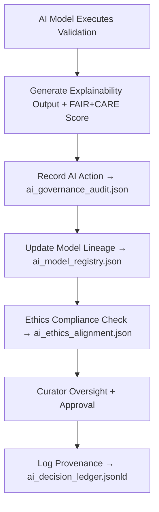

<div align="center">

# 🏛️ Kansas Frontier Matrix — **AI Governance**  
`data/work/staging/tabular/tmp/intake/ai/governance/`

### *“Governance is not control — it’s accountability in action.”*

**Purpose:**  
This directory is the **ethical and operational ledger layer** for all AI validation activities within the Kansas Frontier Matrix (KFM).  
It ensures every AI model, decision, and explanation is **traceable, auditable, and ethically reviewed** according to FAIR+CARE and MCP-DL governance standards.

[](../../../../../../../../../docs/architecture/repo-focus.md)  
[](../../../../../../../../../LICENSE)  
[]()  
[]()  
[]()

</div>

---

## 🧭 Overview

The **AI Governance Layer** records all **AI lifecycle metadata**, including validation runs, model lineage, explainability artifacts, ethical reviews, and curator interventions.  
Its primary goal is to provide **transparent provenance for every AI action** within the intake system — ensuring compliance, accountability, and reproducibility.

Governance records are automatically created whenever:
- A dataset is validated by AI.  
- An anomaly or ethical alert is logged.  
- A model is retrained or updated.  
- A curator reviews, approves, or rejects AI decisions.  

Each record links AI processes to **provenance graphs**, **FAIR+CARE audits**, and **ethical compliance histories**.

---

## 🗂️ Directory Layout

```text
data/work/staging/tabular/tmp/intake/ai/governance/
├── ai_governance_audit.json           # Records of model and AI validation activities
├── ai_ethics_alignment.json           # FAIR+CARE ethical compliance assessments
├── ai_model_registry.json             # Model versioning and lineage tracking
├── ai_decision_ledger.jsonld          # Provenance graph for AI actions
├── curator_review_log.json            # Manual approvals and governance oversight entries
├── ai_policy_register.json            # References to AI usage policies and compliance templates
└── README.md                          # This document
```

---

## 🔁 Governance Workflow



---

## 🧩 Governance Record Schema

| Field | Description | Example |
|-------|--------------|----------|
| `record_id` | Unique governance entry identifier | `gov_2025_10_26_001` |
| `model_name` | AI model responsible for decision | `Semantic Analyzer v2.7` |
| `dataset_id` | Dataset under validation | `ks_population_1890` |
| `decision_summary` | Short explanation of AI decision | `"Detected semantic mismatch: City mislabeled as County."` |
| `ai_confidence` | Model confidence score | `0.953` |
| `curator_action` | Human review response | `"Confirmed and corrected ontology mapping"` |
| `ethical_alignment` | FAIR+CARE compliance rating | `{ "fair": 0.94, "care": 0.90 }` |
| `timestamp` | Governance event time (UTC) | `2025-10-26T16:37:14Z` |
| `ledger_ref` | Link to provenance graph node | `ai_decision_ledger.jsonld#gov_2025_10_26_001` |

---

## 🤖 Governance Modules

| Module | Function | Output |
|---------|-----------|---------|
| **AI Governance Auditor** | Tracks and logs AI validation activities | `ai_governance_audit.json` |
| **Ethics Alignment Engine** | Evaluates FAIR+CARE compliance of AI outputs | `ai_ethics_alignment.json` |
| **Model Registry Tracker** | Manages versioning, drift, and retraining lineage | `ai_model_registry.json` |
| **Decision Ledger Generator** | Creates PROV-O compatible JSON-LD provenance graphs | `ai_decision_ledger.jsonld` |
| **Policy Compliance Register** | Stores and validates AI usage and retraining policies | `ai_policy_register.json` |
| **Curator Review Logger** | Captures human oversight notes and audit trails | `curator_review_log.json` |

> 🧠 *Governance data is structured for machine readability (PROV-O) and human interpretability (JSON narratives), ensuring ethical accountability in AI-driven validation.*

---

## ⚙️ Curator Oversight Protocol

Curators and auditors must:
1. Review each new governance entry in `ai_governance_audit.json`.  
2. Check AI model lineage and ensure version consistency in `ai_model_registry.json`.  
3. Confirm ethical alignment values meet FAIR+CARE thresholds.  
4. Document manual reviews in `curator_review_log.json`.  
5. Sync finalized governance records with provenance ledger:
   ```bash
   make governance-update
   ```
6. Archive completed entries after quarterly audit cycles.

---

## 📈 Governance Metrics

| Metric | Description | Target |
|---------|-------------|---------|
| **AI Governance Coverage** | % of AI actions with governance records | 100% |
| **FAIR+CARE Compliance Rate** | % of AI validations meeting ethical criteria | ≥ 0.95 |
| **Model Lineage Completeness** | % of models tracked in registry | 100% |
| **Human Oversight Participation** | % of AI events reviewed by curators | ≥ 90% |
| **Audit Sync Frequency** | Governance-to-ledger update cadence | Daily |

---

## 🧾 Compliance Matrix

| Standard | Scope | Validator |
|-----------|--------|-----------|
| **FAIR+CARE** | Ethical accountability and data governance framework | `fair-audit` |
| **MCP-DL v6.3** | Documentation-first AI governance protocol | `docs-validate` |
| **ISO/IEC 23053:2022** | AI lifecycle and governance management | `ai-validate` |
| **CIDOC CRM / PROV-O** | Semantic provenance and data lineage tracking | `graph-lint` |
| **STAC / DCAT 3.0** | Interoperable governance record publishing | `stac-validate` |

---

## 🪶 Version History

| Version | Date | Author | Notes |
|----------|------|---------|-------|
| v9.0.0 | 2025-10-26 | `@kfm-architecture` | Initial creation of AI Governance documentation under Diamond⁹ Ω / Crown∞Ω certification. |

---

<div align="center">

### 🜂 Kansas Frontier Matrix — *Transparency · Accountability · Provenance*  
**“AI governance doesn’t slow progress — it guarantees trust.”**

[]()
[]()
[]()
[]()
[]()

<br><br>
<a href="#-kansas-frontier-matrix--ai-governance-accountability--provenance-layer--diamond⁹-Ω--crown∞Ω-certified">⬆ Back to Top</a>

</div>
