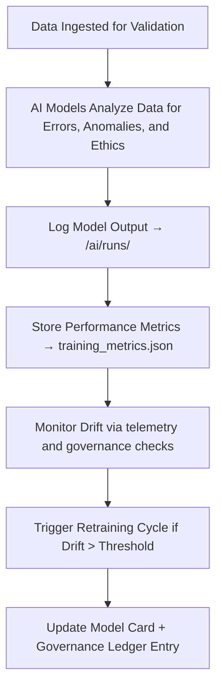

<div align="center">

# 🧠 Kansas Frontier Matrix — **AI Models (Validation Intelligence Sub-Layer)**  
`data/work/staging/tabular/tmp/intake/ai/models/`

### *“A model is only as strong as the clarity of its reasoning.”*

**Purpose:**  
This directory stores all **machine learning and AI model artifacts** used during the tabular data intake and validation process of the Kansas Frontier Matrix (KFM).  
It serves as the operational backbone of AI-driven validation — encompassing anomaly detection, semantic reasoning, ethical governance scoring, and schema alignment intelligence.

[](../../../../../../../../../../../../../../../docs/architecture/repo-focus.md)  
[](../../../../../../../../../../../../../../../LICENSE)  
[]()  
[]()  
[]()

</div>

---

## 🧭 Overview

The **AI Models Sub-Layer** houses trained models that power KFM’s intelligent validation ecosystem.  
Each model is:
- Versioned, checksum-verified, and documented  
- Governed under FAIR+CARE and MCP-DL explainability requirements  
- Monitored for drift, ethical performance, and data lineage  
- Reproducible across environments via deterministic seeds and structured metadata  

AI models in this layer ensure that validation remains **adaptive, interpretable, and ethically auditable** across all intake operations.

---

## 🗂️ Directory Layout

```text
data/work/staging/tabular/tmp/intake/ai/models/
├── anomaly_detector_v3.2/               # Outlier and numerical deviation detection model
│   ├── model.pt                         # Trained model checkpoint
│   ├── model_card.json                  # Metadata and explainability documentation
│   ├── training_metrics.json            # Model accuracy, precision, recall statistics
│   └── drift_report.json                # Model drift and retraining schedule
├── semantic_analyzer_v2.7/              # LLM-based field and ontology alignment engine
│   ├── weights/                         # Model weights (vectorized embeddings)
│   ├── config.yaml                      # Configuration parameters
│   ├── model_card.json                  # Model documentation and alignment metrics
│   └── reasoning_examples.json          # Human-readable validation scenarios
├── faircare_evaluator_v1.5/             # AI governance and ethics scoring model
│   ├── faircare_weights.bin             # Model parameters for ethical assessment
│   ├── evaluation_protocol.json         # Scoring methodology documentation
│   ├── model_card.json                  # FAIR+CARE transparency record
│   └── compliance_metrics.json          # Evaluation statistics and curator feedback
└── README.md                            # This document
````

---

## 🔁 Model Lifecycle Workflow



---

## 🧩 Model Card Schema

| Field                   | Description                             | Example                                                       |
| ----------------------- | --------------------------------------- | ------------------------------------------------------------- |
| `model_name`            | AI model identifier                     | `anomaly_detector_v3.2`                                       |
| `model_type`            | Category of model                       | `Unsupervised Isolation Forest`                               |
| `framework`             | Library or framework used               | `PyTorch`                                                     |
| `training_dataset`      | Data source used for training           | `tabular_intake_v9_training_set.parquet`                      |
| `training_timestamp`    | Time of last model training             | `2025-09-12T10:20:11Z`                                        |
| `performance_metrics`   | Key validation statistics               | `{ "precision": 0.94, "recall": 0.91 }`                       |
| `explainability_method` | XAI technique used for interpretability | `SHAP (SHapley Additive exPlanations)`                        |
| `ethical_review_status` | FAIR+CARE governance approval state     | `Approved`                                                    |
| `checksum`              | SHA-256 of model file                   | `0f9a3beab7b1de4a998...`                                      |
| `governance_reference`  | Link to ledger entry                    | `governance/tabular_intake_ai_models_ledger.jsonld#model-032` |

---

## 🤖 Model Roles & Functions

| Model                        | Function                                            | Core Output                |
| ---------------------------- | --------------------------------------------------- | -------------------------- |
| **Anomaly Detector v3.2**    | Detects statistical and numerical deviations        | `anomaly_detections.json`  |
| **Semantic Analyzer v2.7**   | Evaluates field semantics and ontology consistency  | `ai_reasoning_log.json`    |
| **FAIR+CARE Evaluator v1.5** | Calculates ethical and metadata completeness scores | `ai_ethics_alignment.json` |

> 🧠 *All models in this layer adhere to deterministic seeding and logging, ensuring explainability and reproducibility under MCP-DL.*

---

## ⚙️ Governance & Retraining Workflow

1. Review performance metrics in `training_metrics.json`.
2. Evaluate model drift reports (`drift_report.json`) and ethical audit outcomes.
3. Approve or schedule retraining using:

   ```bash
   make ai-retrain
   ```
4. After retraining, regenerate model cards and update:

   ```bash
   make ai-metadata-update
   ```
5. Sync all changes to the governance ledger:

   ```bash
   make governance-update
   ```

---

## 📈 Model Monitoring Metrics

| Metric                      | Description                                             | Target            |
| --------------------------- | ------------------------------------------------------- | ----------------- |
| **Precision**               | Correct anomaly predictions / total predicted anomalies | ≥ 0.92            |
| **Recall**                  | Detected anomalies / total true anomalies               | ≥ 0.88            |
| **Explainability Coverage** | % of model outputs with XAI documentation               | 100%              |
| **Ethical Alignment Score** | FAIR+CARE compliance of model decisions                 | ≥ 0.95            |
| **Drift Rate**              | % model degradation over time                           | < 5% per 3 months |

---

## 🧾 Compliance Matrix

| Standard               | Scope                                                     | Validator       |
| ---------------------- | --------------------------------------------------------- | --------------- |
| **FAIR+CARE**          | Ethical transparency and reproducibility in AI governance | `fair-audit`    |
| **MCP-DL v6.3**        | AI explainability and documentation standard              | `docs-validate` |
| **ISO/IEC 23053:2022** | AI system lifecycle and risk management                   | `ai-validate`   |
| **CIDOC CRM / PROV-O** | Provenance linkage of AI model versions                   | `graph-lint`    |
| **STAC / DCAT 3.0**    | Metadata interoperability for AI assets                   | `stac-validate` |

---

## 🪶 Version History

| Version | Date       | Author              | Notes                                                                                 |
| ------- | ---------- | ------------------- | ------------------------------------------------------------------------------------- |
| v9.0.0  | 2025-10-26 | `@kfm-architecture` | Initial creation of AI Models documentation under Diamond⁹ Ω / Crown∞Ω certification. |

---

<div align="center">

### 🜂 Kansas Frontier Matrix — *Learning · Transparency · Accountability*

**“A responsible model is one that teaches us as much as it predicts.”**

[]()
[]()
[]()
[]()
[]()

<br><br> <a href="#-kansas-frontier-matrix--ai-models-validation-intelligence-sub-layer--diamond⁹-Ω--crown∞Ω-certified">⬆ Back to Top</a>

</div>
