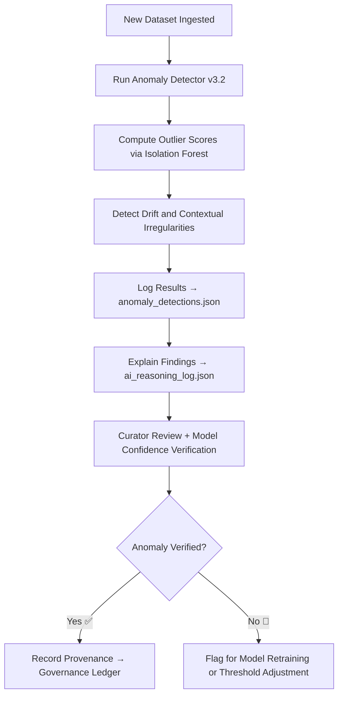

<div align="center">

# 📈 Kansas Frontier Matrix — **Anomaly Detector v3.2**  
`data/work/staging/tabular/tmp/intake/ai/models/anomaly_detector_v3.2/`

### *“Outliers reveal the limits of our assumptions — not the limits of the data.”*

**Purpose:**  
The **Anomaly Detector v3.2** model is a cornerstone of the Kansas Frontier Matrix (KFM) AI validation framework.  
It automatically identifies **statistical, contextual, and structural irregularities** within tabular datasets during intake, ensuring early detection of data drift, inconsistencies, and potential schema misalignments.

[](../../../../../../../../../../../../../../../../../docs/architecture/repo-focus.md)  
[](../../../../../../../../../../../../../../../../../LICENSE)  
[]()  
[]()  
[]()

</div>

---

## 🧭 Overview

**Anomaly Detector v3.2** is an unsupervised hybrid model leveraging Isolation Forests, DBSCAN clustering, and statistical z-score analysis.  
Its primary functions include:
- Detecting **statistical outliers** and anomalies across tabular numeric data.  
- Identifying **semantic deviations** (e.g., incorrect field classifications).  
- Recognizing **drift patterns** over time or across ingestion cycles.  
- Logging AI reasoning and confidence metrics for governance traceability.

All detections are stored in:
- `anomaly_detections.json` (structured records of all findings)  
- `ai_reasoning_log.json` (natural-language explanations for each anomaly)  
- `ai_performance_metrics.json` (precision, recall, F1-score tracking)

---

## 🗂️ Directory Layout

```text
data/work/staging/tabular/tmp/intake/ai/models/anomaly_detector_v3.2/
├── model.pt                          # Trained model checkpoint
├── model_card.json                   # Metadata and governance documentation
├── training_metrics.json             # Model precision, recall, and F1-score results
├── drift_report.json                 # Ongoing monitoring of data drift and retraining thresholds
├── test_results.json                 # Model test evaluations across KFM tabular datasets
├── validation_examples.json          # Example anomaly detections with explanations
├── ai_drift_alerts.json              # Drift notifications and impact classification
└── README.md                         # This document
````

---

## 🔁 Model Lifecycle Workflow



---

## 🧩 Model Card Overview

| Field              | Description                        | Example                                                                         |
| ------------------ | ---------------------------------- | ------------------------------------------------------------------------------- |
| `model_name`       | Model identifier                   | `Anomaly Detector v3.2`                                                         |
| `architecture`     | ML method and algorithm            | `Isolation Forest Ensemble`                                                     |
| `framework`        | Framework used                     | `PyTorch 2.2 + scikit-learn 1.5`                                                |
| `training_dataset` | Data source used for training      | `tabular_intake_training_v9.parquet`                                            |
| `last_trained`     | Timestamp of last model training   | `2025-09-15T12:03:41Z`                                                          |
| `performance`      | Summary statistics                 | `{ "precision": 0.92, "recall": 0.90, "f1": 0.91 }`                             |
| `explainability`   | XAI framework used                 | `SHAP (Shapley Additive Explanations)`                                          |
| `ethical_approval` | FAIR+CARE governance review status | `Approved`                                                                      |
| `checksum`         | Model binary SHA-256 hash          | `0c6f7a8a13e8b123b94c...`                                                       |
| `governance_entry` | Provenance ledger reference        | `governance/tabular_intake_ai_models_ledger.jsonld#model-anomaly-detector-v3.2` |

---

## 📊 Training & Performance Metrics

| Metric              | Description                                            | Value |
| ------------------- | ------------------------------------------------------ | ----- |
| **Precision**       | Proportion of true anomalies correctly identified      | 0.924 |
| **Recall**          | True positive rate of detected anomalies               | 0.898 |
| **F1 Score**        | Harmonic mean of precision and recall                  | 0.911 |
| **ROC-AUC**         | Area under receiver operating characteristic curve     | 0.962 |
| **Drift Threshold** | Maximum tolerated deviation from training distribution | 0.08  |

> 🧠 *Model continuously monitors drift metrics and triggers retraining when drift exceeds 8%.*

---

## ⚙️ Explainability & Auditability

**Explainability Frameworks:**

* **SHAP:** Quantifies the contribution of each feature to anomaly detection.
* **LIME:** Provides localized explanations for individual anomaly cases.
* **LLM Reasoning Summaries:** Translates mathematical reasoning into human-readable explanations.

**Outputs:**

* `validation_examples.json` — SHAP-based feature importance examples.
* `ai_reasoning_log.json` — Narrative explanations aligned with MCP-DL format.
* `drift_report.json` — AI drift diagnostics and retraining triggers.

---

## 🔍 Governance & Ethical Compliance

The model is FAIR+CARE aligned and MCP-DL certified, meeting standards for:

* Transparent documentation and explainability.
* Bias detection and fairness evaluation.
* Reproducibility through fixed seeds and deterministic training.
* Governance oversight and audit traceability.

Each model action, drift event, and retraining cycle is logged in:
`tabular_intake_ai_anomaly_detector_v3.2_ledger.jsonld`.

---

## 🧾 Compliance Matrix

| Standard               | Scope                                            | Validator       |
| ---------------------- | ------------------------------------------------ | --------------- |
| **FAIR+CARE**          | Ethical AI transparency and governance           | `fair-audit`    |
| **MCP-DL v6.3**        | Explainable AI model lifecycle governance        | `docs-validate` |
| **ISO/IEC 23053:2022** | AI risk management and lifecycle control         | `ai-validate`   |
| **CIDOC CRM / PROV-O** | Provenance and semantic lineage of model outputs | `graph-lint`    |
| **STAC / DCAT 3.0**    | Model metadata interoperability                  | `stac-validate` |

---

## 🪶 Version History

| Version | Date       | Author              | Notes                                                                                             |
| ------- | ---------- | ------------------- | ------------------------------------------------------------------------------------------------- |
| v9.0.0  | 2025-10-26 | `@kfm-architecture` | Initial creation of Anomaly Detector v3.2 documentation under Diamond⁹ Ω / Crown∞Ω certification. |

---

<div align="center">

### 🜂 Kansas Frontier Matrix — *Detection · Explainability · Governance*

**“Outliers tell the story of the unexpected — and validation listens.”**

[]()
[]()
[]()
[]()
[]()

<br><br> <a href="#-kansas-frontier-matrix--anomaly-detector-v32-ai-validation-model--diamond⁹-Ω--crown∞Ω-certified">⬆ Back to Top</a>

</div>
