<div align="center">

# ⚖️ Kansas Frontier Matrix — **FAIR+CARE Evaluator v1.5**  
`data/work/staging/tabular/tmp/intake/ai/models/faircare_evaluator_v1.5/`

### *“Ethics is not an afterthought — it’s an algorithm.”*

**Purpose:**  
The **FAIR+CARE Evaluator v1.5** model enforces **ethical governance, metadata completeness, and open-science standards** for all tabular datasets within the Kansas Frontier Matrix (KFM).  
It provides automated scoring and validation based on the **FAIR (Findable, Accessible, Interoperable, Reusable)** and **CARE (Collective Benefit, Authority to Control, Responsibility, Ethics)** principles.

[](../../../../../../../../../../../../../../../../../docs/architecture/repo-focus.md)  
[](../../../../../../../../../../../../../../../../../LICENSE)  
[]()  
[]()  
[]()

</div>

---

## 🧭 Overview

The **FAIR+CARE Evaluator v1.5** serves as the **ethical validation engine** of KFM’s intake workflow.  
It ensures that each dataset adheres to metadata standards and social governance obligations by evaluating:
- FAIR metadata completeness and interoperability  
- CARE ethical compliance and community authority documentation  
- Provenance and license transparency  
- Governance record linkage and ethical reproducibility  

This model acts as both an **automated compliance verifier** and an **AI ethics auditor**, producing quantitative metrics and narrative summaries for each dataset analyzed.

---

## 🗂️ Directory Layout

```text
data/work/staging/tabular/tmp/intake/ai/models/faircare_evaluator_v1.5/
├── faircare_weights.bin                 # Trained ethical assessment model weights
├── evaluation_protocol.json             # FAIR+CARE scoring methodology and thresholds
├── model_card.json                      # Model documentation and governance info
├── training_metrics.json                # Performance statistics on benchmark datasets
├── compliance_metrics.json              # Live evaluation results and curator feedback
├── ethical_review_report.json           # Summary of bias audits and interpretability analysis
├── interpretability_outputs.json        # Explainable AI reasoning logs
└── README.md                            # This document
````

---

## 🔁 Ethical Validation Workflow

```mermaid
flowchart TD
    A["Dataset Submitted to Intake Validation"] --> B["FAIR+CARE Evaluator v1.5 Processes Metadata"]
    B --> C["Compute FAIR + CARE Compliance Scores"]
    C --> D["Generate AI Reasoning & Explainability Output"]
    D --> E["Flag Non-Compliant Fields → Quarantine/faircare_incomplete/"]
    E --> F["Record Compliance Report → compliance_metrics.json"]
    F --> G["Link Scores & Ethics Context → Governance Ledger"]
```



---

## 🧩 Model Card Overview

| Field                   | Description                         | Example                                                                                  |
| ----------------------- | ----------------------------------- | ---------------------------------------------------------------------------------------- |
| `model_name`            | AI model identifier                 | `FAIR+CARE Evaluator v1.5`                                                               |
| `architecture`          | Model class and reasoning base      | `Explainable Transformer + Rule-Based Validator`                                         |
| `framework`             | ML framework                        | `PyTorch 2.2`                                                                            |
| `training_dataset`      | Dataset used for model training     | `KFM_faircare_training_v6`                                                               |
| `training_timestamp`    | Last training event                 | `2025-09-08T09:44:12Z`                                                                   |
| `metrics`               | FAIR+CARE evaluation results        | `{ "fair_score": 0.94, "care_score": 0.92 }`                                             |
| `bias_audit_result`     | Summary of bias testing             | `"No systemic bias detected"`                                                            |
| `ethical_review_status` | FAIR+CARE governance audit approval | `Approved`                                                                               |
| `checksum`              | SHA-256 hash of model binary        | `a5d4b2f9962ce9a108f9e3...`                                                              |
| `governance_entry`      | Provenance record                   | `governance/tabular_intake_ai_faircare_evaluator_v1.5_ledger.jsonld#model-faircare-v1.5` |

---

## 📊 FAIR+CARE Scoring Criteria

| Principle | Category             | Weight | Description                                      |
| --------- | -------------------- | ------ | ------------------------------------------------ |
| **F1**    | Findable             | 0.25   | Dataset discoverability and DOI assignment       |
| **A1**    | Accessible           | 0.20   | Open-access metadata and repository compliance   |
| **I1**    | Interoperable        | 0.20   | Schema and format standardization                |
| **R1**    | Reusable             | 0.15   | Clear licensing and provenance references        |
| **C1**    | Collective Benefit   | 0.10   | Societal and communal utility of data            |
| **A2**    | Authority to Control | 0.05   | Proper documentation of ownership and consent    |
| **R2**    | Responsibility       | 0.03   | Clear data curation accountability               |
| **E1**    | Ethics               | 0.02   | Compliance with ethical data handling principles |

> 🧠 *Scoring thresholds are dynamically adjusted via calibration with curated governance benchmarks.*

---

## ⚙️ Explainability & Ethics Review

**Explainability Mechanisms:**

* **LIME (Local Interpretable Model-agnostic Explanations):** Explains field-level FAIR+CARE decisions.
* **LLM Summarization:** Provides curator-readable summaries of ethical context.
* **Rule Trace Logging:** Captures which compliance rules triggered warnings or passes.

**Audit Artifacts:**

* `interpretability_outputs.json` — XAI reason logs for transparency
* `ethical_review_report.json` — Governance-level FAIR+CARE audit record

---

## 🧩 Model Governance & Retraining Workflow

1. **Evaluate Model Drift:** Review `compliance_metrics.json` and `ethical_review_report.json`.
2. **Trigger Retraining (if drift ≥ 5%):**

   ```bash
   make ai-retrain
   ```
3. **Generate New Model Card:**

   ```bash
   make ai-modelcard-update
   ```
4. **Log Governance Entry & FAIR+CARE Approval:**

   ```bash
   make governance-update
   ```

---

## 📈 Ethical Governance Metrics

| Metric                          | Description                                          | Target |
| ------------------------------- | ---------------------------------------------------- | ------ |
| **FAIR Score**                  | Weighted FAIR compliance score                       | ≥ 0.90 |
| **CARE Score**                  | Weighted CARE compliance score                       | ≥ 0.90 |
| **Bias Index**                  | Measure of detected bias across datasets             | ≤ 0.05 |
| **Explainability Coverage**     | % of compliance decisions with interpretability logs | 100%   |
| **Governance Ledger Sync Rate** | Frequency of updates to provenance record            | Daily  |

---

## 🧾 Compliance Matrix

| Standard               | Scope                                           | Validator       |
| ---------------------- | ----------------------------------------------- | --------------- |
| **FAIR+CARE**          | Ethical AI validation and governance framework  | `fair-audit`    |
| **MCP-DL v6.3**        | Documentation-first AI transparency standard    | `docs-validate` |
| **ISO/IEC 23053:2022** | AI lifecycle accountability and risk governance | `ai-validate`   |
| **CIDOC CRM / PROV-O** | Provenance traceability of governance actions   | `graph-lint`    |
| **STAC / DCAT 3.0**    | Interoperable metadata compliance               | `stac-validate` |

---

## 🪶 Version History

| Version | Date       | Author              | Notes                                                                                                |
| ------- | ---------- | ------------------- | ---------------------------------------------------------------------------------------------------- |
| v9.0.0  | 2025-10-26 | `@kfm-architecture` | Initial creation of FAIR+CARE Evaluator v1.5 documentation under Diamond⁹ Ω / Crown∞Ω certification. |

---

<div align="center">

### 🜂 Kansas Frontier Matrix — *Ethics · Accountability · Reproducibility*

**“An ethical system doesn’t just validate data — it validates responsibility.”**

[]()
[]()
[]()
[]()
[]()

<br><br> <a href="#-kansas-frontier-matrix--faircare-evaluator-v15-ethical-ai-validation-model--diamond⁹-Ω--crown∞Ω-certified">⬆ Back to Top</a>

</div>
