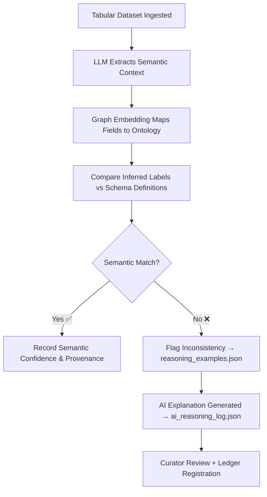

<div align="center">

# 🧩 Kansas Frontier Matrix — **Semantic Analyzer v2.7**  
`data/work/staging/tabular/tmp/intake/ai/models/semantic_analyzer_v2.7/`

### *“When meaning drifts, governance restores understanding.”*

**Purpose:**  
The **Semantic Analyzer v2.7** is a language-and-graph-based AI model responsible for **detecting semantic inconsistencies, ontology misalignments, and contextual metadata drift** within tabular datasets in the Kansas Frontier Matrix (KFM).  
It bridges natural language reasoning and graph logic to ensure semantic integrity and ontology coherence across FAIR+CARE-aligned data.

[](../../../../../../../../../../../../../../../../../docs/architecture/repo-focus.md)  
[](../../../../../../../../../../../../../../../../../LICENSE)  
[]()  
[]()  
[]()

</div>

---

## 🧭 Overview

The **Semantic Analyzer v2.7** model validates the **meaning, context, and relationships** within tabular data fields by leveraging graph embeddings and large language model reasoning.  
It ensures:
- Proper alignment of data fields with ontology classes (CIDOC CRM, DCAT, schema.org).  
- Detection of semantic mismatches (e.g., `"Wichita"` labeled as `County` instead of `City`).  
- Identification of metadata ambiguity or context drift.  
- Generation of natural language explanations for every semantic validation decision.  

The model directly supports **intake**, **quarantine**, and **remediation** phases within KFM’s pipeline, enhancing AI explainability and curator efficiency.

---

## 🗂️ Directory Layout

```text
data/work/staging/tabular/tmp/intake/ai/models/semantic_analyzer_v2.7/
├── weights/                           # Transformer model weights and embeddings
│   ├── vocab.txt
│   ├── model_config.json
│   └── semantic_graph_embeddings.bin
├── config.yaml                        # Model hyperparameters and ontology references
├── model_card.json                    # Model metadata and documentation summary
├── training_metrics.json              # Evaluation metrics and alignment precision
├── drift_report.json                  # Semantic drift and ontology mismatch analysis
├── reasoning_examples.json            # Human-readable interpretation examples
├── ontology_alignment_map.json        # CIDOC / DCAT / schema.org mapping file
├── ethical_review_report.json         # FAIR+CARE alignment and bias analysis
└── README.md                          # This document
````

---

## 🔁 Semantic Validation Workflow



---

## 🧩 Model Card Overview

| Field                   | Description                          | Example                                                                                          |
| ----------------------- | ------------------------------------ | ------------------------------------------------------------------------------------------------ |
| `model_name`            | Model identifier                     | `Semantic Analyzer v2.7`                                                                         |
| `architecture`          | Base model and graph system          | `Transformer + Graph Embedding`                                                                  |
| `framework`             | ML and reasoning frameworks used     | `Transformers 5.4 / Neo4j 5.2`                                                                   |
| `ontology_sources`      | Reference ontologies used            | `CIDOC CRM, DCAT 3.0, schema.org`                                                                |
| `training_dataset`      | Source of semantic pairs             | `KFM_ontology_training_corpus_v7`                                                                |
| `training_timestamp`    | Last training event                  | `2025-08-14T11:22:30Z`                                                                           |
| `semantic_precision`    | Correct ontology matches rate        | `0.935`                                                                                          |
| `contextual_recall`     | True positive contextual inferences  | `0.917`                                                                                          |
| `explainability_method` | AI reasoning transparency technique  | `LIME + LLM Narrative Justifications`                                                            |
| `checksum`              | SHA-256 hash of primary model binary | `a38d0e9fbe2459b1c...`                                                                           |
| `governance_entry`      | Provenance ledger reference          | `governance/tabular_intake_ai_semantic_analyzer_v2.7_ledger.jsonld#model-semantic-analyzer-v2.7` |

---

## 📊 Model Performance Summary

| Metric                          | Description                                         | Value |
| ------------------------------- | --------------------------------------------------- | ----- |
| **Semantic Precision**          | % of correct ontology mappings                      | 93.5% |
| **Contextual Recall**           | % of accurately inferred contexts                   | 91.7% |
| **Drift Detection Sensitivity** | Ability to detect semantic shifts                   | 88.9% |
| **Bias Deviation Index**        | Fairness and neutrality measure                     | 0.04  |
| **Explainability Coverage**     | % of predictions with human-readable justifications | 100%  |

> 🧠 *Semantic Analyzer v2.7 provides both machine-readable graph explanations and curator-facing summaries for every decision.*

---

## ⚙️ Explainability Framework

* **Graph Alignment Reports:** Generated by `ontology_alignment_map.json`, detailing all ontology relationships.
* **LLM Justifications:** Captures plain-language AI reasoning for each detected semantic issue.
* **Ethical Context Reports:** Located in `ethical_review_report.json`, providing governance transparency.
* **Drift Detection Logs:** `drift_report.json` measures semantic consistency degradation across training cycles.

Outputs feed directly into:

* `/ai/runs/ai_reasoning_log.json`
* `/governance/ai_ethics_alignment.json`

---

## 🧩 Ethical & FAIR+CARE Governance Alignment

The Semantic Analyzer undergoes continuous **ethical review** to ensure:

* No cultural, geographic, or linguistic bias in field classification.
* Transparency of decision-making through open model cards.
* FAIR+CARE completeness in ontology alignment documentation.
* Full provenance traceability for each decision logged in the governance ledger.

**Compliance Artifacts:**

* `ethical_review_report.json` — bias evaluation and transparency statement
* `model_card.json` — FAIR+CARE-compliant model documentation
* `tabular_intake_ai_semantic_analyzer_v2.7_ledger.jsonld` — governance linkage file

---

## 🧾 Compliance Matrix

| Standard                              | Scope                                             | Validator       |
| ------------------------------------- | ------------------------------------------------- | --------------- |
| **FAIR+CARE**                         | Ethical AI and semantic documentation standards   | `fair-audit`    |
| **MCP-DL v6.3**                       | Documentation and interpretability governance     | `docs-validate` |
| **ISO/IEC 23053:2022**                | AI lifecycle transparency                         | `ai-validate`   |
| **CIDOC CRM / DCAT 3.0 / schema.org** | Ontological semantic consistency                  | `graph-lint`    |
| **STAC / DCAT 3.0**                   | Metadata interoperability for semantic validation | `stac-validate` |

---

## 🪶 Version History

| Version | Date       | Author              | Notes                                                                                              |
| ------- | ---------- | ------------------- | -------------------------------------------------------------------------------------------------- |
| v9.0.0  | 2025-10-26 | `@kfm-architecture` | Initial creation of Semantic Analyzer v2.7 documentation under Diamond⁹ Ω / Crown∞Ω certification. |

---

<div align="center">

### 🜂 Kansas Frontier Matrix — *Meaning · Alignment · Accountability*

**“Semantics are not about language — they’re about preserving meaning through governance.”**

[]()
[]()
[]()
[]()
[]()

<br><br> <a href="#-kansas-frontier-matrix--semantic-analyzer-v27-ai-validation-model--diamond⁹-Ω--crown∞Ω-certified">⬆ Back to Top</a>

</div>
