<div align="center">

# 🧮 Kansas Frontier Matrix — **Semantic Analyzer v2.7 Model Weights**  
`data/work/staging/tabular/tmp/intake/ai/models/semantic_analyzer_v2.7/weights/`

### *“Weights carry memory — governance ensures it’s remembered responsibly.”*

**Purpose:**  
This directory stores the **core model parameters, embeddings, and configuration files** that power the Semantic Analyzer v2.7 module of the Kansas Frontier Matrix (KFM).  
Each file within this repository is **checksum-verified, version-tracked, and FAIR+CARE governed**, forming the reproducible basis of semantic validation across KFM’s AI validation pipeline.

[](../../../../../../../../../../../../../../../../../../docs/architecture/repo-focus.md)  
[](../../../../../../../../../../../../../../../../../../LICENSE)  
[]()  
[]()  
[]()

</div>

---

## 🧭 Overview

The **weights** stored in this directory form the numerical foundation of the **Semantic Analyzer v2.7** model — responsible for linking tabular data semantics to ontological structures (CIDOC CRM, DCAT, schema.org).  
Each weight file and embedding vector set is:
- **Checksum-verified** to ensure reproducibility  
- **Cross-referenced** with the model card for audit traceability  
- **Monitored** for drift, corruption, or version divergence  
- **Linked** to governance metadata and FAIR+CARE alignment records  

---

## 🗂️ Directory Layout

```text
data/work/staging/tabular/tmp/intake/ai/models/semantic_analyzer_v2.7/weights/
├── vocab.txt                            # Token vocabulary used by transformer layers
├── model_config.json                    # Model architecture configuration file
├── semantic_graph_embeddings.bin        # Graph embeddings for ontology mapping
├── transformer_weights.pt               # Core transformer layer weights
├── weights_manifest.json                # Metadata record of file hashes and verification timestamps
└── README.md                            # This document
````

---

## 🔁 Weight Generation & Validation Workflow

```mermaid
flowchart TD
    A["Model Trained on Semantic Corpus"] --> B["Generate Vocabulary + Embeddings"]
    B --> C["Save Model Parameters → transformer_weights.pt"]
    C --> D["Export Graph Embeddings → semantic_graph_embeddings.bin"]
    D --> E["Record Hash & Metadata → weights_manifest.json"]
    E --> F["Register Provenance Entry → AI Weights Ledger"]
```



---

## 🧩 Weights Manifest Schema

| Field                  | Description                           | Example                                                                  |
| ---------------------- | ------------------------------------- | ------------------------------------------------------------------------ |
| `file_name`            | Weight or embedding file name         | `transformer_weights.pt`                                                 |
| `file_size_bytes`      | Size of weight file                   | `183042984`                                                              |
| `checksum_algorithm`   | Algorithm used for validation         | `SHA-256`                                                                |
| `checksum_value`       | Computed hash                         | `9c87fa1c5b81a239be4d9f...`                                              |
| `created_at`           | Timestamp of file generation          | `2025-08-14T11:21:03Z`                                                   |
| `verified_at`          | Last integrity verification timestamp | `2025-10-20T09:13:44Z`                                                   |
| `training_dataset_ref` | Dataset used to generate weights      | `KFM_semantic_training_v7`                                               |
| `linked_model_card`    | Reference to model card file          | `../model_card.json`                                                     |
| `governance_reference` | FAIR+CARE provenance link             | `tabular_intake_ai_semantic_analyzer_v2.7_weights_ledger.jsonld#weights` |

---

## ⚙️ Validation & Governance Procedures

1. **Checksum Verification:**
   All weight files are validated during each pipeline deployment using:

   ```bash
   make ai-weights-verify
   ```
2. **Integrity Drift Monitoring:**
   Drift analysis is logged in `telemetry/drift_metrics.json` — any deviations trigger curator review.
3. **Model Update & Ledger Sync:**
   Upon retraining, new weights are registered in the governance ledger:

   ```bash
   make governance-update
   ```
4. **AI Ethical Oversight:**
   Weight files are reviewed for provenance accuracy and data lineage compliance per FAIR+CARE ethical traceability.

---

## 📈 Integrity Metrics

| Metric                              | Description                                          | Target |
| ----------------------------------- | ---------------------------------------------------- | ------ |
| **Checksum Validation Rate**        | % of verified files passing cryptographic validation | 100%   |
| **File Drift Incidence**            | % of weight deltas outside checksum tolerance        | < 0.1% |
| **Model Card Linkage Completeness** | % of weights with cross-referenced model cards       | 100%   |
| **Governance Traceability**         | % of weights recorded in provenance ledger           | 100%   |

---

## 🧾 Compliance Matrix

| Standard               | Scope                                                      | Validator       |
| ---------------------- | ---------------------------------------------------------- | --------------- |
| **FAIR+CARE**          | Transparent provenance and ethical data model traceability | `fair-audit`    |
| **MCP-DL v6.3**        | Documentation-first model weight governance                | `docs-validate` |
| **ISO/IEC 23053:2022** | AI lifecycle integrity and version control                 | `ai-validate`   |
| **CIDOC CRM / PROV-O** | Semantic traceability of model parameter lineage           | `graph-lint`    |
| **STAC / DCAT 3.0**    | Metadata interoperability for model artifacts              | `stac-validate` |

---

## 🪶 Version History

| Version | Date       | Author              | Notes                                                                                                      |
| ------- | ---------- | ------------------- | ---------------------------------------------------------------------------------------------------------- |
| v9.0.0  | 2025-10-26 | `@kfm-architecture` | Initial creation of Semantic Analyzer v2.7 Weights documentation under Diamond⁹ Ω / Crown∞Ω certification. |

---

<div align="center">

### 🜂 Kansas Frontier Matrix — *Memory · Integrity · Accountability*

**“Weights define intelligence — governance defines wisdom.”**

[]()
[]()
[]()
[]()
[]()

<br><br> <a href="#-kansas-frontier-matrix--semantic-analyzer-v27-weights-model-parameter-repository--diamond⁹-Ω--crown∞Ω-certified">⬆ Back to Top</a>

</div>
