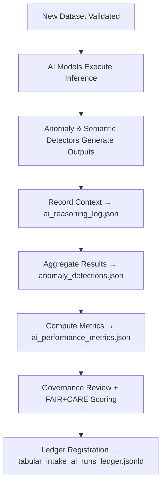

<div align="center">

# 🧮 Kansas Frontier Matrix — **AI Runs**  
`data/work/staging/tabular/tmp/intake/ai/runs/`

### *“Every AI judgment is just data — until it’s explained and proven.”*

**Purpose:**  
This directory contains the **output artifacts, inference logs, and validation reports** generated by KFM’s AI models during tabular intake.  
It acts as the operational record of every AI validation cycle, ensuring that anomaly detections, semantic checks, and FAIR+CARE compliance evaluations are **traceable, interpretable, and governed**.

[](../../../../../../../../../docs/architecture/repo-focus.md)  
[](../../../../../../../../../LICENSE)  
[]()  
[]()  
[]()

</div>

---

## 🧭 Overview

The **AI Runs Layer** is the execution and results hub for all AI-driven validation processes during dataset intake.  
Each AI model run produces structured output containing:
- **Detections:** Statistical anomalies, semantic inconsistencies, or ethical compliance gaps  
- **Reasoning:** AI-generated natural language explanations  
- **Performance:** Precision, recall, F1, and drift scores  
- **Provenance:** Ledger-linked traceability and timestamped validation context  

This directory ensures that all AI actions are reproducible, explainable, and logged under governance review.

---

## 🗂️ Directory Layout

```text
data/work/staging/tabular/tmp/intake/ai/runs/
├── anomaly_detections.json            # Outlier and irregularity records per dataset
├── ai_reasoning_log.json              # LLM explanations and contextual justifications
├── ai_performance_metrics.json        # Accuracy, drift, and inference timing statistics
├── ai_retraining_flags.json           # Files or models requiring retraining
├── validation_summaries.json          # Combined post-validation summaries
├── ai_drift_alerts.json               # Detected shifts in data distributions or model confidence
└── README.md                          # This document
```

---

## 🔁 AI Run Lifecycle



---

## 🧩 AI Run Output Schema

| Field | Description | Example |
|-------|--------------|----------|
| `run_id` | Unique AI execution identifier | `ai_run_2025_10_26_001` |
| `model_name` | AI model used | `Semantic Analyzer v2.7` |
| `dataset_id` | Dataset being validated | `ks_census_1890` |
| `detected_issues` | Summary of AI detections | `[ "Missing license", "Semantic mismatch: 'County' vs 'City'" ]` |
| `ai_explanation` | Model-generated reasoning | `"Detected semantic inconsistency between field label and ontology mapping."` |
| `confidence_score` | Confidence in AI evaluation (0–1) | `0.967` |
| `curator_review_status` | Human oversight result | `Confirmed` |
| `timestamp` | AI run timestamp | `2025-10-26T16:32:41Z` |

---

## 🤖 AI Output Categories

| Output Type | Description | Generated By | Output File |
|--------------|-------------|---------------|--------------|
| **Anomaly Detection** | Finds statistical outliers and distributional deviations | `Anomaly Detector v3.2` | `anomaly_detections.json` |
| **Semantic Validation** | Ensures field-to-ontology coherence | `Semantic Analyzer v2.7` | `ai_reasoning_log.json` |
| **Ethical Evaluation** | FAIR+CARE scoring and metadata compliance | `FAIR+CARE Evaluator v1.5` | `validation_summaries.json` |
| **Performance Metrics** | Model inference accuracy and drift detection | All models | `ai_performance_metrics.json` |

> 🧠 *Each AI output includes deterministic seeds, timestamp metadata, and contextual explanations for MCP-DL traceability.*

---

## ⚙️ Governance Workflow

Curators and governance teams must:
1. Review all AI results in `anomaly_detections.json` and `ai_reasoning_log.json`.  
2. Validate reasoning summaries and confidence scores.  
3. If errors or drifts are identified, flag retraining by adding entries to:
   ```bash
   ai_retraining_flags.json
   ```
4. Reassess model metrics:
   ```bash
   make ai-validate-runs
   ```
5. Confirm governance updates:
   ```bash
   make governance-update
   ```

---

## 📈 Performance Monitoring

| Metric | Description | Target |
|---------|-------------|---------|
| **Anomaly Precision** | % of anomalies correctly identified | ≥ 0.92 |
| **Semantic Alignment Accuracy** | % of correct ontology mappings | ≥ 0.93 |
| **FAIR+CARE Compliance Rate** | % of datasets passing ethical audit | ≥ 0.95 |
| **AI Drift Incidence** | % of models exceeding drift threshold | < 0.05 |
| **Explainability Coverage** | % of AI detections with reasoning logs | 100% |

---

## 🧾 Compliance Matrix

| Standard | Scope | Validator |
|-----------|--------|-----------|
| **FAIR+CARE** | AI governance and ethical documentation | `fair-audit` |
| **MCP-DL v6.3** | Documentation-first AI lifecycle management | `docs-validate` |
| **ISO/IEC 23053:2022** | Lifecycle and performance management for AI systems | `ai-validate` |
| **CIDOC CRM / PROV-O** | Provenance and interpretability linkage | `graph-lint` |
| **STAC / DCAT 3.0** | Metadata standardization for AI outputs | `stac-validate` |

---

## 🪶 Version History

| Version | Date | Author | Notes |
|----------|------|---------|-------|
| v9.0.0 | 2025-10-26 | `@kfm-architecture` | Initial creation of AI Runs documentation under Diamond⁹ Ω / Crown∞Ω certification. |

---

<div align="center">

### 🜂 Kansas Frontier Matrix — *Inference · Insight · Integrity*  
**“AI doesn’t replace validation — it reveals its patterns.”**

[]()
[]()
[]()
[]()
[]()

<br><br>
<a href="#-kansas-frontier-matrix--ai-runs-model-inference--validation-output-layer--diamond⁹-Ω--crown∞Ω-certified">⬆ Back to Top</a>

</div>
