<div align="center">

# 📡 Kansas Frontier Matrix — **AI Telemetry**  
`data/work/staging/tabular/tmp/intake/ai/telemetry/`

### *“Monitoring makes intelligence measurable — governance makes it meaningful.”*

**Purpose:**  
This directory houses all **AI lifecycle telemetry**, covering performance metrics, drift detection, retraining triggers, latency statistics, and governance analytics for KFM’s AI validation system.  
Telemetry ensures that every AI process is **observable, accountable, and optimized** — aligning performance management with FAIR+CARE governance principles.

[](../../../../../../../../../docs/architecture/repo-focus.md)  
[](../../../../../../../../../LICENSE)  
[]()  
[]()  
[]()

</div>

---

## 🧭 Overview

The **AI Telemetry Layer** continuously monitors all AI models deployed in the KFM validation ecosystem.  
It tracks:
- Model performance and validation accuracy  
- Drift and bias detection events  
- Resource utilization and inference timing  
- Retraining activity and governance synchronization  
- FAIR+CARE compliance trends across validation cycles  

Telemetry is essential for maintaining **operational transparency**, **model reproducibility**, and **ethical AI lifecycle control**.

---

## 🗂️ Directory Layout

```text
data/work/staging/tabular/tmp/intake/ai/telemetry/
├── ai_performance_metrics.json        # Model-level precision, recall, F1, accuracy
├── drift_metrics.json                 # Statistical and semantic drift detection data
├── validation_latency.json            # AI inference and response time logs
├── retraining_activity_log.json       # Records of model retraining and drift corrections
├── ethical_performance_summary.json   # FAIR+CARE compliance over time
├── telemetry_dashboard_config.json    # Visualization specs for governance dashboards
└── README.md                          # This document
```

---

## 🔁 Telemetry Workflow

```mermaid
flowchart TD
    A["AI Model Executes Validation Run"] --> B["Collect Performance & Drift Metrics"]
    B --> C["Log AI Inference Latency → validation_latency.json"]
    C --> D["Aggregate FAIR+CARE and Bias Metrics → ethical_performance_summary.json"]
    D --> E["Detect Drift & Generate Retraining Flags → retraining_activity_log.json"]
    E --> F["Sync Telemetry to Governance Dashboard → telemetry_dashboard_config.json"]
```



---

## 🧩 Telemetry Schema Overview

| Field | Description | Example |
|-------|--------------|----------|
| `model_name` | AI model being monitored | `Anomaly Detector v3.2` |
| `run_id` | Identifier for telemetry collection run | `telemetry_2025_10_26_0045` |
| `metric_type` | Category of monitored metric | `Performance / Drift / FAIR+CARE` |
| `metric_values` | Recorded values (precision, recall, drift score, etc.) | `{ "precision": 0.93, "recall": 0.89, "drift_score": 0.07 }` |
| `retraining_flag` | Indicates whether retraining is required | `true` |
| `governance_status` | Alignment with oversight review | `"Under Review"` |
| `timestamp` | UTC time of telemetry capture | `2025-10-26T16:40:09Z` |

---

## 🤖 Telemetry Monitoring Modules

| Module | Function | Output |
|---------|-----------|---------|
| **AI Performance Monitor** | Tracks accuracy, recall, precision, and F1-score | `ai_performance_metrics.json` |
| **Drift Analyzer** | Detects semantic and statistical drift in AI outputs | `drift_metrics.json` |
| **Latency Profiler** | Monitors inference and processing latency | `validation_latency.json` |
| **Retraining Logger** | Logs retraining events, triggers, and outcomes | `retraining_activity_log.json` |
| **Ethical Compliance Tracker** | Monitors FAIR+CARE governance alignment | `ethical_performance_summary.json` |
| **Governance Dashboard Builder** | Prepares visualization configs for oversight teams | `telemetry_dashboard_config.json` |

> 🧠 *Telemetry ensures AI remains explainable, efficient, and ethically accountable — even as it evolves.*

---

## ⚙️ Curator & Governance Workflow

Curators and AI governance leads should:
1. Review `drift_metrics.json` weekly for signs of semantic drift.  
2. Check `ai_performance_metrics.json` for underperforming models.  
3. Approve or reject automatic retraining actions logged in `retraining_activity_log.json`.  
4. Generate and publish dashboard visualizations:
   ```bash
   make telemetry-dashboard
   ```
5. Sync telemetry data to the governance ledger:
   ```bash
   make governance-update
   ```

---

## 📈 Monitoring Metrics

| Metric | Description | Target |
|---------|-------------|---------|
| **Precision** | Accuracy of anomaly detection | ≥ 0.92 |
| **Recall** | Sensitivity of semantic validation | ≥ 0.90 |
| **Drift Threshold** | Maximum allowed drift score | ≤ 0.10 |
| **Retraining Frequency** | Periodic AI retraining interval | Every 30 days |
| **Governance Sync Rate** | Frequency of telemetry updates to ledger | Daily |

---

## 🧾 Compliance Matrix

| Standard | Scope | Validator |
|-----------|--------|-----------|
| **FAIR+CARE** | Governance-aligned AI performance monitoring | `fair-audit` |
| **MCP-DL v6.3** | Documentation-based transparency and telemetry | `docs-validate` |
| **ISO/IEC 23053:2022** | AI lifecycle performance and governance compliance | `ai-validate` |
| **CIDOC CRM / PROV-O** | Provenance traceability of telemetry events | `graph-lint` |
| **STAC / DCAT 3.0** | Telemetry metadata interoperability | `stac-validate` |

---

## 🪶 Version History

| Version | Date | Author | Notes |
|----------|------|---------|-------|
| v9.0.0 | 2025-10-26 | `@kfm-architecture` | Initial creation of AI Telemetry documentation under Diamond⁹ Ω / Crown∞Ω certification. |

---

<div align="center">

### 🜂 Kansas Frontier Matrix — *Monitoring · Insight · Assurance*  
**“Performance without oversight is potential — oversight turns it into trust.”**

[]()
[]()
[]()
[]()
[]()

<br><br>
<a href="#-kansas-frontier-matrix--ai-telemetry-monitoring--performance-analytics-layer--diamond⁹-Ω--crown∞Ω-certified">⬆ Back to Top</a>

</div>
