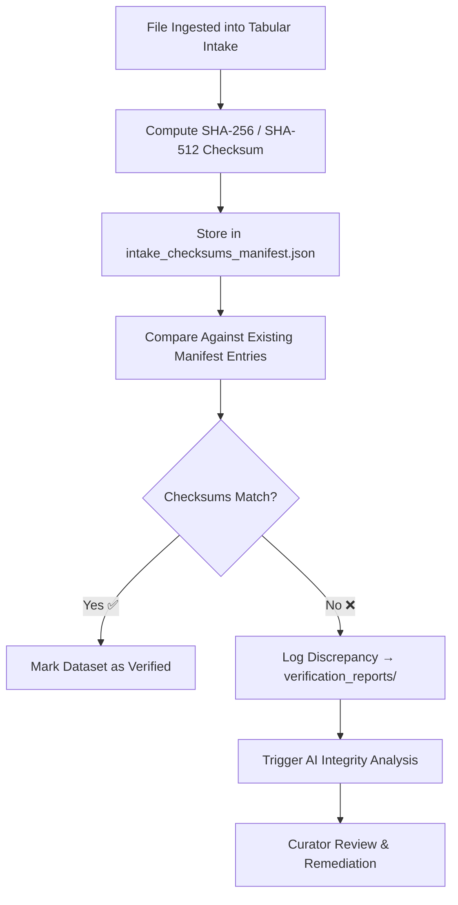

<div align="center">

# 🔑 Kansas Frontier Matrix — **Intake Checksums**  
`data/work/staging/tabular/tmp/intake/checksums/`

### *“Every byte counts — checksum validation makes it accountable.”*

**Purpose:**  
This directory contains all **checksum manifests, verification logs, and integrity reports** generated during the tabular data intake process for the Kansas Frontier Matrix (KFM).  
Checksums ensure **immutability, traceability, and reproducibility** of all tabular datasets moving through the staging and validation pipelines.

[](../../../../../../../../../docs/architecture/repo-focus.md)  
[](../../../../../../../../../LICENSE)  
[]()  
[]()  
[]()

</div>

---

## 🧭 Overview

The **Intake Checksums Layer** is responsible for verifying and documenting the cryptographic integrity of every tabular file ingested into KFM.  
Checksums are computed automatically during ETL ingestion and are validated continuously during downstream transformations, schema validations, and FAIR+CARE audits.

Checksum validation:
- Confirms **data immutability** post-ingestion  
- Detects **unauthorized edits or corruption**  
- Provides **lineage linkages** across provenance chains  
- Enables **auditable reproducibility** of all validation workflows  

---

## 🗂️ Directory Layout

```text
data/work/staging/tabular/tmp/intake/checksums/
├── intake_checksums_manifest.json       # Central manifest of all computed hashes
├── sha256/                              # Individual per-file SHA-256 checksum files
│   ├── ks_population_1890.csv.sha256
│   ├── ks_agriculture_1870.csv.sha256
│   └── ks_treaty_1851.csv.sha256
├── verification_reports/                # Results of automated checksum audits
│   ├── checksum_verification_report.json
│   ├── integrity_diff_report.json
│   └── revalidation_summary.json
├── ai_integrity_analysis.json           # AI-generated insights into checksum discrepancies
├── curator_notes.log                    # Manual verification and investigation notes
└── README.md                            # This document
````

---

## 🔁 Validation Workflow



---

## 🧩 Manifest Schema

| Field                | Description                      | Example                    |
| -------------------- | -------------------------------- | -------------------------- |
| `dataset_id`         | Dataset identifier               | `ks_agriculture_1870`      |
| `file_name`          | Source file name                 | `ks_agriculture_1870.csv`  |
| `checksum_algorithm` | Hash algorithm used              | `SHA-256`                  |
| `computed_checksum`  | Newly calculated checksum        | `a6e83b4efc6f27f5b9d9c...` |
| `expected_checksum`  | Reference checksum from manifest | `a6e83b4efc6f27f5b9d9c...` |
| `status`             | Result of verification           | `Verified`                 |
| `timestamp`          | Time of checksum computation     | `2025-10-26T15:57:11Z`     |

---

## 🤖 AI Integrity & Drift Analysis

| AI Module                  | Function                                                        | Output                                   |
| -------------------------- | --------------------------------------------------------------- | ---------------------------------------- |
| **AI Integrity Validator** | Detects mismatched or outdated hashes                           | `ai_integrity_analysis.json`             |
| **Binary Diff Engine**     | Compares file deltas at byte-level for root cause               | `integrity_diff_report.json`             |
| **Checksum Forecaster**    | Predicts recurring integrity risks based on file age and source | `ai_integrity_analysis.json`             |
| **Governance Mapper**      | Syncs checksum lineage with the provenance ledger               | `tabular_intake_checksums_ledger.jsonld` |

> 🧠 *All AI analyses are fully traceable and compliant with KFM’s explainability policy under MCP-DL v6.3.*

---

## ⚙️ Curator Workflow

Curators must:

1. Verify checksum mismatches in `verification_reports/checksum_verification_report.json`.
2. Confirm AI findings in `ai_integrity_analysis.json`.
3. For verified corruption cases, restore data from prior archive and re-ingest.
4. Run integrity revalidation:

   ```bash
   make checksums-verify
   ```
5. Log actions and outcomes in `curator_notes.log`.
6. Trigger governance sync:

   ```bash
   make governance-update
   ```

---

## 📈 Key Metrics

| Metric                             | Description                                    | Target           |
| ---------------------------------- | ---------------------------------------------- | ---------------- |
| **Checksum Verification Rate**     | % of files successfully verified               | ≥ 99.5%          |
| **Checksum Mismatch Incidence**    | Frequency of detected hash mismatches          | < 0.5%           |
| **Integrity Revalidation Success** | % of restored datasets reverified successfully | ≥ 98%            |
| **AI-Verified Diagnosis Accuracy** | Agreement between AI and curator reports       | ≥ 0.9 confidence |

---

## 🧾 Compliance Matrix

| Standard                           | Scope                                     | Validator         |
| ---------------------------------- | ----------------------------------------- | ----------------- |
| **SHA-256 / SHA-512 (FIPS 180-4)** | Cryptographic data integrity validation   | `checksum-verify` |
| **FAIR+CARE**                      | Provenance and ethical accountability     | `fair-audit`      |
| **MCP-DL v6.3**                    | Documentation-first checksum validation   | `docs-validate`   |
| **CIDOC CRM / PROV-O**             | Provenance graph and lineage verification | `graph-lint`      |
| **ISO 19115 / 19157**              | Metadata and data quality traceability    | `geojson-lint`    |

---

## 🪶 Version History

| Version | Date       | Author              | Notes                                                                                        |
| ------- | ---------- | ------------------- | -------------------------------------------------------------------------------------------- |
| v9.0.0  | 2025-10-26 | `@kfm-architecture` | Initial creation of Intake Checksums documentation under Diamond⁹ Ω / Crown∞Ω certification. |

---

<div align="center">

### 🜂 Kansas Frontier Matrix — *Integrity · Verification · Provenance*

**“Checksums are the language of trust — and verification is how it’s spoken.”**

[]()
[]()
[]()
[]()
[]()

<br><br> <a href="#-kansas-frontier-matrix--intake-checksums-integrity-verification-layer--diamond⁹-Ω--crown∞Ω-certified">⬆ Back to Top</a>

</div>
