<div align="center">

# 🔒 Kansas Frontier Matrix — **SHA-256 Checksum Registry**  
`data/work/staging/tabular/tmp/intake/checksums/sha256/`

### *“Integrity is not assumed — it’s hashed, verified, and recorded.”*

**Purpose:**  
This subdirectory stores all **SHA-256 checksum files** generated during the tabular intake pipeline of the Kansas Frontier Matrix (KFM).  
Each checksum file represents the cryptographic signature of a dataset, ensuring reproducible, tamper-evident verification aligned with FAIR+CARE and MCP-DL v6.3 standards.

[](../../../../../../../../../../../../../../../docs/architecture/repo-focus.md)  
[](../../../../../../../../../../../../../../../LICENSE)  
[]()  
[]()  
[]()

</div>

---

## 🧭 Overview

The **SHA-256 Checksum Registry** is a cornerstone of data integrity verification within KFM’s data governance framework.  
Each checksum provides:
- A **unique fingerprint** for its corresponding dataset file.  
- Verification of **immutability** during validation and transformation steps.  
- Cross-referenced provenance entries in the **KFM Governance Ledger**.  
- Immutable linkage for FAIR+CARE compliance and open-science reproducibility.

Checksums are generated automatically on ingest, revalidated at each ETL stage, and signed under the governance ledger to maintain cryptographic transparency.

---

## 🗂️ Directory Layout

```text
data/work/staging/tabular/tmp/intake/checksums/sha256/
├── ks_population_1890.csv.sha256
├── ks_agriculture_1870.csv.sha256
├── ks_treaty_1851.csv.sha256
├── ks_land_records_1885.csv.sha256
├── intake_sha256_manifest.json           # Manifest linking files to their hash values
└── README.md                             # This document
````

---

## 🔁 Checksum Generation Workflow

```mermaid
flowchart TD
    A["Tabular File Ingested"] --> B["Compute SHA-256 Hash"]
    B --> C["Write <filename>.sha256 File"]
    C --> D["Store Entry → intake_sha256_manifest.json"]
    D --> E["Validate Hash During Each Workflow Stage"]
    E --> F["Register Provenance Entry in Governance Ledger"]
```



---

## 🧩 SHA-256 Manifest Schema

| Field                | Description                     | Example                     |
| -------------------- | ------------------------------- | --------------------------- |
| `dataset_id`         | Unique dataset identifier       | `ks_population_1890`        |
| `file_name`          | Dataset filename                | `ks_population_1890.csv`    |
| `checksum_algorithm` | Algorithm used for hashing      | `SHA-256`                   |
| `checksum_value`     | Cryptographic hash of file      | `f89cde4a9ff120acb3425e...` |
| `file_size_bytes`    | File size at hash time          | `452198`                    |
| `hash_timestamp`     | UTC time of checksum generation | `2025-10-26T15:59:32Z`      |
| `verified_status`    | Integrity check outcome         | `Verified`                  |

---

## 🤖 AI Integrity Support Modules

| Module                  | Function                                                      | Output                                  |
| ----------------------- | ------------------------------------------------------------- | --------------------------------------- |
| **Checksum Generator**  | Computes SHA-256 hashes for all tabular files                 | `<filename>.sha256`                     |
| **Integrity Validator** | Compares stored and recomputed hashes                         | `intake_sha256_manifest.json`           |
| **AI Drift Detector**   | Detects checksum anomalies caused by data drift or corruption | `ai_integrity_analysis.json`            |
| **Governance Mapper**   | Syncs checksums with FAIR+CARE provenance ledger              | `tabular_sha256_checksum_ledger.jsonld` |

> 🧠 *All SHA-256 computations follow deterministic and reproducible cryptographic practices under MCP-DL’s integrity framework.*

---

## ⚙️ Curator Workflow

Curators and data stewards should:

1. Verify checksum entries in `intake_sha256_manifest.json` for consistency.
2. Recompute any questionable hashes using:

   ```bash
   sha256sum <filename>
   ```
3. Cross-verify results with those stored in the governance ledger.
4. Log validation and resolution notes in `curator_notes.log`.
5. Trigger governance synchronization if updates are applied:

   ```bash
   make governance-update
   ```

---

## 📈 Integrity Validation Metrics

| Metric                             | Description                            | Target  |
| ---------------------------------- | -------------------------------------- | ------- |
| **Hash Verification Rate**         | % of files matching expected hashes    | 100%    |
| **Recomputed Integrity Pass Rate** | Success of re-validated SHA-256 checks | ≥ 99.9% |
| **Checksum Drift Incidence**       | Rate of unexpected hash changes        | < 0.1%  |
| **Governance Sync Completeness**   | Checksum ledger linkage success rate   | 100%    |

---

## 🧾 Compliance Matrix

| Standard                 | Scope                                      | Validator         |
| ------------------------ | ------------------------------------------ | ----------------- |
| **SHA-256 / FIPS 180-4** | Cryptographic verification standard        | `checksum-verify` |
| **FAIR+CARE**            | Provenance and ethical integrity           | `fair-audit`      |
| **MCP-DL v6.3**          | Documentation-first verification           | `docs-validate`   |
| **CIDOC CRM / PROV-O**   | Provenance graph and checksum traceability | `graph-lint`      |
| **ISO 19115 / 19157**    | Data lineage and quality tracking          | `geojson-lint`    |

---

## 🪶 Version History

| Version | Date       | Author              | Notes                                                                                                 |
| ------- | ---------- | ------------------- | ----------------------------------------------------------------------------------------------------- |
| v9.0.0  | 2025-10-26 | `@kfm-architecture` | Initial creation of SHA-256 Checksum Registry documentation under Diamond⁹ Ω / Crown∞Ω certification. |

---

<div align="center">

### 🜂 Kansas Frontier Matrix — *Integrity · Verification · Provenance*

**“A checksum is not just a number — it’s the mathematical signature of truth.”**

[]()
[]()
[]()
[]()
[]()

<br><br> <a href="#-kansas-frontier-matrix--sha-256-checksum-registry-integrity-verification-sub-layer--diamond⁹-Ω--crown∞Ω-certified">⬆ Back to Top</a>

</div>
