<div align="center">

# 🧾 Kansas Frontier Matrix — **Checksum Verification Reports**  
`data/work/staging/tabular/tmp/intake/checksums/verification_reports/`

### *“Integrity verified, documented, and proven — down to the last byte.”*

**Purpose:**  
This directory stores the **verification reports, integrity summaries, and audit logs** for all checksum validation processes executed during the tabular intake stage of the Kansas Frontier Matrix (KFM).  
Each report documents validation results for SHA-256 / SHA-512 checksums, identifying verified files, mismatches, and AI-analyzed discrepancies.

[](../../../../../../../../../../../../../../../docs/architecture/repo-focus.md)  
[](../../../../../../../../../../../../../../../LICENSE)  
[]()  
[]()  
[]()

</div>

---

## 🧭 Overview

The **Checksum Verification Reports Layer** is the audit and reporting sub-layer responsible for tracking all integrity validation outcomes within KFM’s intake system.  
It ensures that every dataset checksum computed, stored, or revalidated is documented, cross-verified, and traceable within governance ledgers.

Reports within this directory:
- Record **successful verification events** and **failed integrity checks**  
- Identify **root causes** of mismatches through AI integrity analysis  
- Support **curator audits**, **FAIR+CARE compliance reviews**, and **ledger traceability**  
- Enable continuous monitoring of checksum drift, corruption risk, and data lineage  

---

## 🗂️ Directory Layout

```text
data/work/staging/tabular/tmp/intake/checksums/verification_reports/
├── checksum_verification_report.json      # Primary checksum verification outcomes
├── integrity_diff_report.json             # Detailed analysis of checksum mismatches
├── revalidation_summary.json              # Re-validation results after remediation
├── ai_integrity_review.json               # AI explanations of checksum drift or anomalies
├── validation_statistics.csv              # Quantitative metrics of verification performance
└── README.md                              # This document
````

---

## 🔁 Checksum Verification Workflow

```mermaid
flowchart TD
    A["File Ingested for Validation"] --> B["Compute New SHA-256 / SHA-512"]
    B --> C["Compare Against Manifest Value"]
    C --> D{"Checksum Match?"}
    D -- "Yes ✅" --> E["Log Result in checksum_verification_report.json"]
    D -- "No ❌" --> F["Record Difference → integrity_diff_report.json"]
    F --> G["Run AI Integrity Review for Drift Analysis"]
    G --> H["Append Findings → ai_integrity_review.json"]
    H --> I["Curator Oversight → Governance Ledger Entry"]
```



---

## 🧩 Report Schemas

### ✅ `checksum_verification_report.json`

Summarizes all checksum validation operations performed during intake.

| Field               | Description             | Example                  |
| ------------------- | ----------------------- | ------------------------ |
| `dataset_id`        | Dataset name            | `ks_population_1890`     |
| `file_name`         | File validated          | `ks_population_1890.csv` |
| `expected_checksum` | Checksum from manifest  | `6e54a12cfb...`          |
| `computed_checksum` | Recomputed checksum     | `6e54a12cfb...`          |
| `validation_status` | Result                  | `Verified`               |
| `timestamp`         | Verification time (UTC) | `2025-10-26T16:01:05Z`   |

---

### ⚠️ `integrity_diff_report.json`

Captures mismatched checksum details and potential corruption indicators.

| Field               | Description                | Example                                                     |
| ------------------- | -------------------------- | ----------------------------------------------------------- |
| `dataset_id`        | Dataset name               | `ks_agriculture_1870`                                       |
| `file_name`         | Dataset file path          | `data/.../ks_agriculture_1870.csv`                          |
| `expected_checksum` | Manifest reference         | `a65fdb94...`                                               |
| `computed_checksum` | Current hash               | `b91fcd11...`                                               |
| `difference_type`   | Nature of mismatch         | `Encoding Drift / Partial Truncation`                       |
| `ai_commentary`     | AI interpretation of cause | `"Checksum drift caused by re-encoding (UTF-8 to UTF-16)."` |
| `detected_on`       | Detection timestamp        | `2025-10-26T16:01:18Z`                                      |

---

### 🔁 `revalidation_summary.json`

Provides verification outcomes for rechecked datasets post-remediation.

| Field             | Description              | Example                        |
| ----------------- | ------------------------ | ------------------------------ |
| `dataset_id`      | Dataset name             | `ks_treaty_1851`               |
| `previous_status` | Prior verification state | `Failed`                       |
| `new_status`      | Post-remediation result  | `Verified`                     |
| `checksum_value`  | Corrected hash           | `c29a8e5f...`                  |
| `verified_by`     | Curator or AI module     | `Checksum Auto-Validator v2.5` |
| `timestamp`       | UTC time of revalidation | `2025-10-26T16:02:33Z`         |

---

## 🤖 AI Integrity Engine Modules

| Module                     | Function                                                  | Output                                                |
| -------------------------- | --------------------------------------------------------- | ----------------------------------------------------- |
| **AI Integrity Validator** | Interprets checksum mismatches and detects drift patterns | `ai_integrity_review.json`                            |
| **Binary Diff Inspector**  | Detects file-level differences (bit/encoding deltas)      | `integrity_diff_report.json`                          |
| **Checksum Forecaster**    | Predicts hash instability trends across datasets          | `validation_statistics.csv`                           |
| **Governance Mapper**      | Records checksum validation lineage in provenance ledger  | `tabular_checksum_verification_reports_ledger.jsonld` |

> 🧠 *AI integrity analyses ensure explainability, linking every checksum validation decision to deterministic reasoning under MCP-DL.*

---

## ⚙️ Curator Workflow

Curators should:

1. Review `checksum_verification_report.json` for validation outcomes.
2. Investigate mismatches listed in `integrity_diff_report.json`.
3. Review AI analysis in `ai_integrity_review.json` for probable causes.
4. Run checksum revalidation after remediation:

   ```bash
   make checksums-verify
   ```
5. Document corrective actions and update governance ledgers via:

   ```bash
   make governance-update
   ```

---

## 📈 Integrity Verification Metrics

| Metric                         | Description                                          | Target           |
| ------------------------------ | ---------------------------------------------------- | ---------------- |
| **Checksum Pass Rate**         | % of datasets passing verification                   | ≥ 99.5%          |
| **Checksum Drift Incidence**   | % of checksum mismatches detected                    | < 0.5%           |
| **AI Interpretation Accuracy** | Agreement between AI and curator diagnosis           | ≥ 0.9 confidence |
| **Ledger Sync Completeness**   | % of validation entries linked to governance records | 100%             |

---

## 🧾 Compliance Matrix

| Standard                 | Scope                                      | Validator         |
| ------------------------ | ------------------------------------------ | ----------------- |
| **SHA-256 / FIPS 180-4** | Cryptographic integrity verification       | `checksum-verify` |
| **FAIR+CARE**            | Provenance and open-science accountability | `fair-audit`      |
| **MCP-DL v6.3**          | Documentation-first AI interpretability    | `docs-validate`   |
| **CIDOC CRM / PROV-O**   | Provenance linkage for integrity events    | `graph-lint`      |
| **ISO 19115 / 19157**    | Metadata lineage and integrity tracking    | `geojson-lint`    |

---

## 🪶 Version History

| Version | Date       | Author              | Notes                                                                                                     |
| ------- | ---------- | ------------------- | --------------------------------------------------------------------------------------------------------- |
| v9.0.0  | 2025-10-26 | `@kfm-architecture` | Initial creation of Checksum Verification Reports documentation under Diamond⁹ Ω / Crown∞Ω certification. |

---

<div align="center">

### 🜂 Kansas Frontier Matrix — *Integrity · Transparency · Accountability*

**“Checksum verification doesn’t just ensure trust — it records it.”**

[]()
[]()
[]()
[]()
[]()

<br><br> <a href="#-kansas-frontier-matrix--checksum-verification-reports-integrity-assurance-sub-layer--diamond⁹-Ω--crown∞Ω-certified">⬆ Back to Top</a>

</div>
