<div align="center">

# 📥 Kansas Frontier Matrix — **Intake Incoming Directory**  
`data/work/staging/tabular/tmp/intake/incoming/`

### *“Where all new tabular datasets begin their journey into the Matrix.”*

**Purpose:**  
The **Incoming Directory** is the drop zone for new tabular datasets (CSV, TSV, XLSX, JSON) awaiting validation and intake processing.  
All files placed here are automatically cataloged, hashed, validated, and logged through the **Intake TMP pipeline**.

[](../../../../../../../docs/architecture/repo-focus.md)
[](../../../../../../../LICENSE)
[]()
[]()
[]()
[]()

</div>

---

## 🧭 Overview

This directory acts as the **entrypoint** for all external tabular submissions entering the KFM ecosystem.  
Files here are **temporary**, remaining only until successfully validated and promoted to the `/validation/` directory.

All items within `incoming/` are processed by the **Intake TMP Workflow** (`make etl-tabular-intake`) which performs:
- **Schema detection** and validation (`schemas/tabular-intake-v13.json`)
- **Checksum generation** (SHA-256)
- **FAIR+CARE and ethical review**
- **AI-assisted anomaly detection and summarization**
- **Provenance ledger entry creation**

---

## 📦 Expected Package Structure

Each dataset submitted to this directory must include:

```plaintext
data/work/staging/tabular/tmp/intake/incoming/<dataset_id>/
├── <dataset_id>.csv|.tsv|.xlsx|.json   # Main data file (tabular)
├── <dataset_id>.meta.json              # Metadata and validation contract
├── LICENSE.txt                         # SPDX-compatible license file
└── README_SOURCE.md                    # Source description, citation, provenance
````

> 💡 *Files must follow the naming convention `{dataset_id}.{ext}` using lowercase snake_case.*

---

## 🧾 Example Dataset Package

**Folder:** `ks_hydro_1874/`

```plaintext
ks_hydro_1874/
├── ks_hydro_1874.csv
├── ks_hydro_1874.meta.json
├── LICENSE.txt
└── README_SOURCE.md
```

**Sample `ks_hydro_1874.meta.json`:**

```json
{
  "source_id": "ks_hydro_1874",
  "origin_url": "https://archive.ks.gov/hydro/1874.csv",
  "license": "CC-BY-4.0",
  "citation": "Kansas Hydrology Survey (1874)",
  "schema_version": "tabular-intake-v13",
  "encoding": "utf-8",
  "delimiter": ",",
  "primary_key": ["site_id", "obs_date"],
  "columns": {
    "site_id": "string",
    "county": "string",
    "river": "string",
    "obs_date": "date",
    "flow_cfs": "number"
  },
  "date_format": "YYYY-MM-DD",
  "time_zone": "UTC",
  "provenance": {
    "received_by": "etl-batch-2025-10",
    "checksum_method": "SHA-256"
  }
}
```

---

## ⚙️ Intake Workflow

```mermaid
flowchart TD
    A["📤 External Source\n(CSV / XLSX / JSON)"] --> B["📥 Incoming Directory"]
    B --> C["🧾 Schema Validation\n(STAC/DCAT/CIDOC Rules)"]
    C --> D["🔒 Checksum & Provenance Logging"]
    D --> E["🤖 AI Audit & Anomaly Detection"]
    E --> F["📜 FAIR+CARE Validation & Reports"]
    F --> G["✅ Promotion to Validation TMP Layer"]
```



---

## 🧩 Submission Requirements

| Requirement          | Description                                                      |
| -------------------- | ---------------------------------------------------------------- |
| **Format**           | `.csv`, `.tsv`, `.xlsx`, or `.json`                              |
| **Encoding**         | UTF-8 only                                                       |
| **Headers**          | Mandatory first row; `snake_case` names                          |
| **Date Format**      | ISO-8601 (`YYYY-MM-DD`)                                          |
| **License**          | SPDX identifier (MIT, CC-BY-4.0, PDDL-1.0, etc.)                 |
| **Metadata**         | `.meta.json` with schema, keys, and provenance                   |
| **README_SOURCE.md** | Summary of source, citation, and notes                           |
| **PII/PHI**          | Not allowed; auto-quarantine on detection                        |
| **File Size**        | ≤ 2 GB (large files go to `data/raw/` and referenced by pointer) |

---

## 🧮 Commands

```bash
# Validate all incoming datasets
make validate-tabular

# Process a specific dataset
make etl-tabular-intake dataset=ks_hydro_1874

# Generate checksums for all incoming files
make checksums

# Move verified datasets to validation TMP
make promote-intake
```

---

## 🧠 AI Augmentation

During processing, all datasets are analyzed by the **AI Tabular Intake Pipeline** (`src/nlp/ai_tabular_intake_pipeline.py`):

* Performs **NER and semantic linking** to match entity names (counties, rivers, persons)
* Runs **IsolationForest anomaly scans**
* Generates **summaries** (`ai_summaries/*.json`)
* Flags **uncertain entries** for curator review

> 🧩 AI logs and summaries are stored in `/ai/` after processing.

---

## 🧯 Quarantine Policy

Datasets failing validation or AI audits are moved to:

`data/work/staging/tabular/tmp/intake/quarantine/`

Each quarantined dataset triggers:

* Automated issue ticket: `INTAKE-###`
* Snapshot of logs and anomalies
* Ledger entry marked `"status": "quarantined"`

Curators may:

1. Fix and resubmit
2. Transform data to match schema
3. Permanently reject with rationale

---

## ☑️ Intake Readiness Checklist

* [ ] `.meta.json` present and valid schema
* [ ] License file and citation included
* [ ] No PII or sensitive fields
* [ ] Passes schema and checksum validation
* [ ] AI anomaly rate < policy threshold
* [ ] Curator review complete

---

## 🧾 Provenance Recording

Once a dataset passes intake, its details are appended to the **Intake Provenance Ledger**:

```json
{
  "dataset": "ks_hydro_1874",
  "status": "validated",
  "checksum": "4c4925bbf65b9e1a5f8e7f0b67d7b5e9a8a8a2c1c7f7a0f0...",
  "ai_confidence": 0.94,
  "timestamp": "2025-10-26T13:45:22Z",
  "curator": "@kfm-etl"
}
```

---

## 🪶 Version History

| Version    | Date       | Author              | Notes                                                                                                |
| ---------- | ---------- | ------------------- | ---------------------------------------------------------------------------------------------------- |
| **v9.0.1** | 2025-10-26 | `@kfm-architecture` | Initial release for automated intake packages, including validation schema and AI audit integration. |

---

<div align="center">

### 🜂 Kansas Frontier Matrix — *Integrity · Provenance · Automation*

**“All datasets enter the matrix through the gate of truth.”**

[]()
[]()
[]()
[]()
[]()

[⬆ Back to Top](#-kansas-frontier-matrix--intake-incoming-directory)

</div>
```
