<div align="center">

# 🤖 Kansas Frontier Matrix — **Tabular Intake AI Logs**  
`data/work/staging/tabular/tmp/intake/logs/ai/`

### *“Where intelligence meets integrity — every prediction, every anomaly, every summary logged.”*

**Purpose:**  
The **AI Logs Directory** records outputs, inferences, and diagnostic traces from the **AI Tabular Intake Pipeline**.  
These logs document automated anomaly detection, entity extraction, summarization, and confidence scoring performed during tabular data validation.

[](../../../../../../../../docs/architecture/repo-focus.md)
[](../../../../../../../../LICENSE)
[]()
[]()
[]()

</div>

---

## 🧭 Overview

The **AI Logs** are a structured record of all automated AI-driven analyses applied to tabular datasets during intake.  
Each dataset processed through the pipeline generates a set of AI logs covering four key analytical functions:

1. **Named Entity Recognition (NER)** — detects entities like people, counties, rivers, or events.  
2. **Anomaly Detection** — identifies outlier patterns, missing values, or unusual correlations.  
3. **Summarization** — generates dataset-level human-readable summaries.  
4. **Confidence Scoring** — assigns certainty levels to all extracted results and flags low-confidence data.

All entries are stored as JSON Lines (`.jsonl`) for consistency, enabling downstream visualization and auditing.

---

## 🗂️ Directory Layout

```plaintext
data/work/staging/tabular/tmp/intake/logs/ai/
├── ai-entities-ks_hydro_1874.jsonl          # NER entity recognition log
├── ai-anomalies-ks_hydro_1874.jsonl         # Outlier and anomaly log
├── ai-summarizer-ks_hydro_1874.jsonl        # Summarization engine log
├── ai-confidence-ks_hydro_1874.jsonl        # Confidence scoring log
└── README.md                                # This document
````

---

## 🧱 Log Schema (AI Event Model)

Each line in an AI log file is a self-contained JSON record representing one inference event.

```json
{
  "timestamp": "2025-10-26T13:54:11Z",
  "dataset": "ks_hydro_1874",
  "ai_module": "anomaly_detector",
  "component": "IsolationForest",
  "stage": "ai",
  "message": "Detected one medium-severity outlier in field 'flow_cfs'.",
  "field": "flow_cfs",
  "row": 2,
  "severity": "medium",
  "ai_confidence": 0.94,
  "status": "warning",
  "run_id": "ai-2025-10-26-1354Z",
  "trace_id": "b6d72ef3-3fbc-4a73-b6d0-b1b6afdfa29f"
}
```

---

## ⚙️ AI Subsystem Categories

| Type                         | Description                                                             | Log File Pattern        |
| ---------------------------- | ----------------------------------------------------------------------- | ----------------------- |
| **Entity Recognition (NER)** | Extracts entities and aligns them with KFM Knowledge Graph (via spaCy). | `ai-entities-*.jsonl`   |
| **Anomaly Detection**        | Detects irregular patterns in numeric or categorical data.              | `ai-anomalies-*.jsonl`  |
| **Summarization**            | LLM or Transformer-based summaries describing dataset content.          | `ai-summarizer-*.jsonl` |
| **Confidence Scoring**       | Assigns overall reliability metrics to AI findings.                     | `ai-confidence-*.jsonl` |

---

## 🧪 Example Logs

**File:** `ai-anomalies-ks_hydro_1874.jsonl`

```json
{"timestamp":"2025-10-26T13:54:11Z","dataset":"ks_hydro_1874","ai_module":"anomaly_detector","field":"flow_cfs","row":2,"severity":"medium","value":117,"ai_confidence":0.94,"status":"warning"}
{"timestamp":"2025-10-26T13:54:15Z","dataset":"ks_hydro_1874","ai_module":"anomaly_detector","field":"obs_date","row":5,"severity":"low","value":"1874-08-05","ai_confidence":0.98,"status":"ok"}
```

**File:** `ai-entities-ks_hydro_1874.jsonl`

```json
{"timestamp":"2025-10-26T13:54:22Z","dataset":"ks_hydro_1874","ai_module":"ner","entity_type":"PLACE","entity_text":"Ellis","canonical":"Ellis County, KS","confidence":0.99}
{"timestamp":"2025-10-26T13:54:23Z","dataset":"ks_hydro_1874","ai_module":"ner","entity_type":"HYDRO_FEATURE","entity_text":"Smoky Hill","canonical":"Smoky Hill River","confidence":0.97}
```

**File:** `ai-summarizer-ks_hydro_1874.jsonl`

```json
{"timestamp":"2025-10-26T13:54:31Z","dataset":"ks_hydro_1874","ai_module":"summarizer","message":"Dataset contains 3 monitoring sites; all columns valid; 1 anomaly flagged.","confidence":0.96}
```

---

## 🧩 AI Workflow Context

```mermaid
flowchart TD
    A["📥 Intake Dataset"] --> B["🤖 AI Pipeline\n(NER, Anomaly, Summary, Confidence)"]
    B --> C["🧾 AI Logs (.jsonl)"]
    C --> D["📊 Audit Reports & FAIR+CARE Summaries"]
    D --> E["🏛 Provenance Ledger Update"]
```



---

## 🧮 Common Commands

```bash
# Run AI analysis on all incoming datasets
make ai-tabular-checks

# Run AI processing for one dataset
make ai-tabular-checks dataset=ks_hydro_1874

# View AI anomaly logs
cat logs/ai/ai-anomalies-ks_hydro_1874.jsonl | jq '.'

# Validate AI log schema
make validate-logs

# Generate AI performance metrics summary
make ai-metrics
```

---

## 🧠 AI System Components

| Component                | Model / Library                 | Purpose                                |
| ------------------------ | ------------------------------- | -------------------------------------- |
| **NER Engine**           | spaCy + Custom Gazetteer        | Entity extraction and semantic linking |
| **Anomaly Detector**     | scikit-learn IsolationForest    | Outlier detection in numeric columns   |
| **Summarizer**           | HuggingFace Transformer (LLM)   | Dataset-level natural language summary |
| **Confidence Evaluator** | Logistic Regression + Heuristic | Combines model and rule-based scoring  |

> 🧩 *All models are versioned under `models/tabular-anomaly-detector-v3/` and tracked by the SBOM manifest.*

---

## 🧾 Governance Integration

AI logs are linked to each dataset’s **Provenance Record** and **Audit Ledger**:

```json
{
  "dataset": "ks_hydro_1874",
  "ai_logs": [
    "logs/ai/ai-anomalies-ks_hydro_1874.jsonl",
    "logs/ai/ai-entities-ks_hydro_1874.jsonl",
    "logs/ai/ai-summarizer-ks_hydro_1874.jsonl"
  ],
  "ai_model_ref": "models/tabular-anomaly-detector-v3/",
  "ai_confidence_mean": 0.95,
  "status": "validated",
  "timestamp": "2025-10-26T13:55:11Z"
}
```

---

## ☑️ AI Quality Checklist

* [x] AI models reproducible (versioned and logged)
* [x] All inferences stored as `.jsonl` with timestamps
* [x] AI confidence ≥ 0.90 on validated datasets
* [x] Linked to ledger and FAIR+CARE reports
* [x] Human review of anomalies completed

---

## 🧯 Troubleshooting

| Symptom                        | Cause                               | Solution                                             |
| ------------------------------ | ----------------------------------- | ---------------------------------------------------- |
| **Missing AI logs**            | Pipeline skipped or failed early    | Run `make ai-tabular-checks` again                   |
| **Low AI confidence (< 0.85)** | Model drift or unusual data pattern | Re-train model or run manual review                  |
| **NER output empty**           | No valid text fields                | Ensure tabular data has string columns               |
| **Summarizer timeout**         | Large dataset                       | Run with `--max-rows` parameter or enable batch mode |

---

## 🪶 Version History

| Version    | Date       | Author              | Notes                                                                                 |
| ---------- | ---------- | ------------------- | ------------------------------------------------------------------------------------- |
| **v9.0.1** | 2025-10-26 | `@kfm-architecture` | Initial release — defines AI log schema, workflow, and ledger integration for intake. |

---

<div align="center">

### 🜂 Kansas Frontier Matrix — *AI · Insight · Integrity*

**“Machines find patterns, but we ensure the truth.”**

[]()
[]()
[]()
[]()

[⬆ Back to Top](#-kansas-frontier-matrix--tabular-intake-ai-logs)

</div>
```

