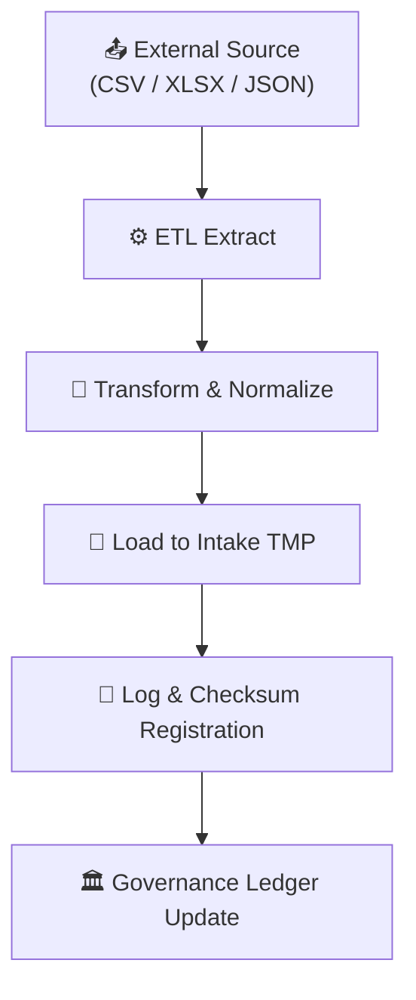

<div align="center">

# ⚙️ Kansas Frontier Matrix — **Tabular Intake ETL Logs**  
`data/work/staging/tabular/tmp/intake/logs/etl/`

### *“Every extraction, transformation, and load leaves its trace in the ledger of reproducibility.”*

**Purpose:**  
This directory contains **ETL (Extract · Transform · Load) process logs** for tabular datasets entering the **Intake TMP layer**.  
These logs record each operational step—from file discovery and schema inference to checksum computation and load completion—ensuring transparency and reproducibility.

[](../../../../../../../../docs/architecture/repo-focus.md)
[](../../../../../../../../LICENSE)
[]()
[]()
[]()

</div>

---

## 🧭 Overview

The **ETL Logs** capture all actions executed by the **Tabular Intake pipeline** during its data flow cycle:  
1️⃣ **Extract** — fetching raw data files from external or internal sources.  
2️⃣ **Transform** — parsing, cleaning, reformatting, and aligning schemas to KFM standards.  
3️⃣ **Load** — writing processed data to validated intake directories and registering provenance entries.  

Each ETL run produces structured JSONL logs (per dataset + per run) containing timestamps, messages, checksums, and processing durations.  
These logs provide a **complete chronological trace** of intake execution, vital for debugging and governance audits.

---

## 🗂️ Directory Layout

```plaintext
data/work/staging/tabular/tmp/intake/logs/etl/
├── etl-ks_hydro_1874.jsonl       # ETL log for specific dataset run
├── etl-ks_population_1890.jsonl  # Example for another dataset
├── etl-batch-2025-10-26.log      # Combined daily batch log
└── README.md                     # This document
````

---

## 🧱 Log Schema

Each ETL log follows the **MCP Structured Logging Schema (v6.3)**:

```json
{
  "timestamp": "2025-10-26T13:41:17Z",
  "dataset": "ks_hydro_1874",
  "stage": "extract",
  "component": "fetcher",
  "message": "Downloaded 3 files from https://archive.ks.gov/hydro/",
  "level": "INFO",
  "status": "ok",
  "records": 3,
  "duration_ms": 1021,
  "checksum": "4c4925bbf65b9e1a5f8e7f0b67d7b5e9a8a8a2c1c7f7a0f0...",
  "run_id": "etl-2025-10-26-1341Z",
  "trace_id": "a12c98fa-274e-4e8d-b91d-02eebc0e26f2"
}
```

---

## ⚙️ ETL Stages and Sub-Logs

| Stage         | Description                                                                                 | Component                   | Typical Output                  |
| ------------- | ------------------------------------------------------------------------------------------- | --------------------------- | ------------------------------- |
| **Extract**   | Locate and pull source files (HTTP, FTP, local, or S3).                                     | `fetcher`, `source_reader`  | `etl-*.jsonl` (stage=extract)   |
| **Transform** | Normalize columns, reformat data, enforce schema.                                           | `transformer`, `cleaner`    | `etl-*.jsonl` (stage=transform) |
| **Load**      | Move validated data into `intake/validation/`, compute SHA-256 hashes, append ledger entry. | `loader`, `checksum_writer` | `etl-*.jsonl` (stage=load)      |

---

## 🧾 Example ETL Log Entries

**Dataset:** `ks_hydro_1874`

```json
{"timestamp":"2025-10-26T13:41:17Z","dataset":"ks_hydro_1874","stage":"extract","component":"fetcher","message":"Fetched 1 CSV from remote archive.","status":"ok"}
{"timestamp":"2025-10-26T13:42:12Z","dataset":"ks_hydro_1874","stage":"transform","component":"schema_parser","message":"Parsed 5 columns, matched schema tabular-intake-v13.","status":"ok"}
{"timestamp":"2025-10-26T13:42:44Z","dataset":"ks_hydro_1874","stage":"load","component":"checksum_writer","message":"Checksum written to checksums/manifest.json.","status":"ok"}
{"timestamp":"2025-10-26T13:43:01Z","dataset":"ks_hydro_1874","stage":"load","component":"ledger_updater","message":"Ledger entry created for ks_hydro_1874.","status":"ok"}
```

---

## 🧩 ETL Workflow Context



---

## 🧮 Common Commands

```bash
# Run ETL on all incoming datasets
make etl-tabular-intake

# Run ETL for a specific dataset
make etl-tabular-intake dataset=ks_hydro_1874

# Tail real-time ETL logs
make tail-intake-logs component=etl

# Validate ETL log schema
make validate-logs
```

---

## 🧠 Best Practices

* **Atomicity:** Each ETL run produces a unique `run_id` ensuring no partial ingestion.
* **Determinism:** Input, output, and checksum must remain identical for reproducible runs.
* **Auditability:** All messages include dataset, stage, and trace identifiers.
* **Security:** Sensitive information (tokens, credentials) must be redacted prior to logging.
* **Synchronization:** Log completion triggers provenance ledger updates and telemetry heartbeat.

---

## 🧯 Troubleshooting

| Symptom                        | Likely Cause                      | Resolution                                               |
| ------------------------------ | --------------------------------- | -------------------------------------------------------- |
| ETL halts mid-run              | Network interruption during fetch | Re-run with `make etl-tabular-intake resume=true`        |
| Validation fails               | Schema drift in source file       | Update `.meta.json` or `schemas/tabular-intake-v13.json` |
| Duplicate ledger entry         | Repeated promotion                | Use `make rollback-tabular` before retry                 |
| Missing checksum               | File not finalized                | Check `loader` component log, then rerun load stage      |
| Permission denied writing logs | File locking issue                | Ensure `chmod -R 775 logs/etl/` and rerun                |

---

## 🧾 Governance Linkage

Every ETL log is registered with its SHA-256 digest in the **Audit Ledger**:

```json
{
  "dataset": "ks_hydro_1874",
  "stage": "etl",
  "log_ref": "logs/etl/etl-ks_hydro_1874.jsonl",
  "log_hash": "7a5f4d9138c9a6a8a8e3b5e8a89a4c1e7d2b8c0f9a6e4d7f...",
  "linked_to": "governance/tabular_intake_ledger.jsonld",
  "status": "completed"
}
```

---

## ☑️ Quality Control Checklist

* [x] Log file created for each dataset
* [x] Schema fields validated (timestamp, dataset, stage, message)
* [x] Checksum entry appended to ledger
* [x] Duration metrics recorded
* [x] AI anomaly threshold ≤ 0.05

---

## 🪶 Version History

| Version    | Date       | Author              | Notes                                                                            |
| ---------- | ---------- | ------------------- | -------------------------------------------------------------------------------- |
| **v9.0.1** | 2025-10-26 | `@kfm-architecture` | Initial release — defines ETL logging schema, structure, and governance linkage. |

---

<div align="center">

### 🜂 Kansas Frontier Matrix — *Automation · Validation · Traceability*

**“If data is life, ETL is its heartbeat.”**

[]()
[]()
[]()
[]()

[⬆ Back to Top](#️-kansas-frontier-matrix--tabular-intake-etl-logs)

</div>
```

